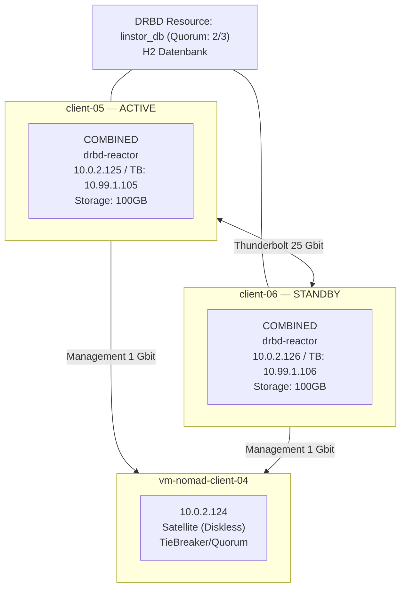
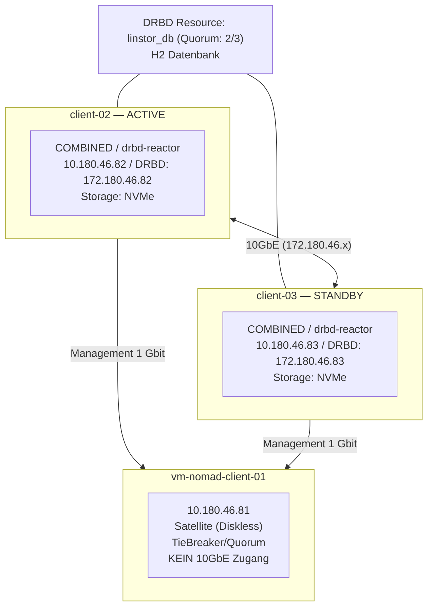
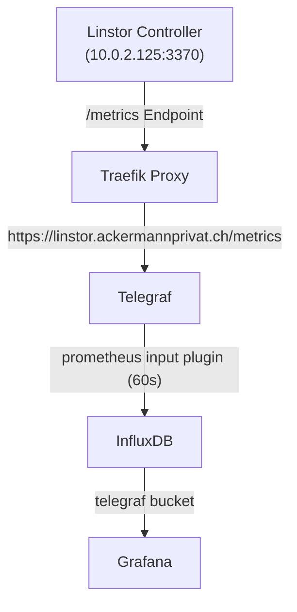
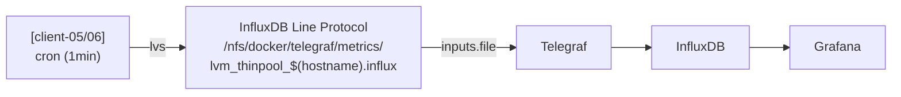

## Uebersicht

Linstor ist eine Management-Schicht fuer DRBD (Distributed Replicated Block Device). DRBD spiegelt Schreibvorgaenge synchron auf Block-Level zwischen Nodes.

| Komponente | Funktion |
|------------|----------|
| DRBD | Kernel-Modul fuer synchrone Block-Replikation |
| Linstor Controller | Management API, Cluster-Koordination (H2 DB) |
| Linstor Satellite | Node-Agent, verwaltet lokale Ressourcen |
| DRBD Reactor | Failover-Manager fuer Controller HA |
| CSI Driver | Integration mit Nomad/Kubernetes |

## Homelab Architektur

### Controller High Availability (HA)

Der Linstor Controller laeuft im Active/Passive HA-Modus mit DRBD Reactor als Failover-Manager. Die Controller-Datenbank (H2) liegt auf einem DRBD-replizierten Volume (`linstor_db`).

**Wichtig:** Linstor Controller ist fuer Active/Passive designed - nur EIN Controller kann gleichzeitig laufen!

**Architektur-Details:**
- **Active/Passive:** Nur ein Controller laeuft gleichzeitig (managed by drbd-reactor)
- **DRBD Reactor:** Ueberwacht DRBD Quorum und startet/stoppt Services automatisch
- **H2 Datenbank:** Schneller als etcd, auf DRBD-Volume repliziert
- **Thunderbolt (25Gbit):** DRBD Replikation zwischen client-05 und client-06
- **Management (1Gbit):** Control Plane, CSI, Satellite-Kommunikation
- **TieBreaker:** client-04 ist diskloser Quorum-Witness (kein Thunderbolt noetig)

### Failover-Verhalten

| Szenario | Verhalten | Failover-Zeit |
|----------|-----------|---------------|
| Controller-Node down | Automatischer Failover zum Standby | ~10-15 Sekunden |
| Netzwerk-Partition | Quorum entscheidet (2-von-3 Nodes) | ~10-15 Sekunden |
| Manueller Failover | `drbd-reactorctl evict linstor_db` | ~20 Sekunden |
| DRBD Split-Brain | Verhindert durch Quorum-Mechanismus | - |

### Netzwerk

| Netzwerk | Verwendung | Bandbreite |
|----------|------------|------------|
| 10.0.2.0/24 | Management, Nomad CSI | 1 Gbit |
| 10.99.1.0/24 | DRBD Replikation | 25 Gbit (Thunderbolt) |

### Storage Nodes

| Node | Disk | Pool | Kapazitaet |
|------|------|------|------------|
| vm-nomad-client-05 | /dev/sdb | linstor_pool | 100 GB |
| vm-nomad-client-06 | /dev/sdb | linstor_pool | 100 GB |

### Quorum

- 3 Nodes im Cluster (2 Storage + 1 Diskless Witness)
- 2 von 3 muessen erreichbar sein fuer Schreiboperationen
- Node 04 ist diskless Witness (nur Quorum, keine Daten)
- Verhindert Split-Brain bei Netzwerkpartitionierung

## DClab Konfiguration

Das DClab verwendet ein separates 10GbE Netzwerk (172.180.46.0/24) fuer DRBD-Replikation zwischen den Storage-Nodes.

### Netzwerk-Topologie

### Netzwerk-Uebersicht

| Node | Management (1GbE) | DRBD-Sync (10GbE) | Rolle |
|------|-------------------|-------------------|-------|
| vm-nomad-client-01 | 10.180.46.81 | - | TieBreaker (Diskless) |
| vm-nomad-client-02 | 10.180.46.82 | 172.180.46.82 | Storage + Controller |
| vm-nomad-client-03 | 10.180.46.83 | 172.180.46.83 | Storage + Controller |

**Wichtig:** client-01 hat NUR Zugang zum Management-Netzwerk (1GbE). Das DRBD-Sync Netzwerk (172.180.46.0/24) ist nur zwischen client-02 und client-03 verfuegbar.

### Connection Paths

Da client-01 das 10GbE-Netzwerk nicht erreichen kann, muessen explizite Connection-Paths konfiguriert werden. Ohne diese wuerde Linstor versuchen, alle Verbindungen ueber das PrefNic-Interface (drbd-sync) aufzubauen.

**Verbindungsmatrix:**

| Verbindung | Netzwerk | Interface |
|------------|----------|-----------|
| client-01 ↔ client-02 | Management (10.180.46.x) | default ↔ default |
| client-01 ↔ client-03 | Management (10.180.46.x) | default ↔ default |
| client-02 ↔ client-03 | DRBD-Sync (172.180.46.x) | drbd-sync ↔ drbd-sync |

### IP-Reservierungen (172.180.46.0/24)

| IP | Verwendung |
|----|------------|
| 172.180.46.1-4 | Reserviert (Netzwerk-Infrastruktur) |
| 172.180.46.82 | vm-nomad-client-02 (DRBD-Sync) |
| 172.180.46.83 | vm-nomad-client-03 (DRBD-Sync) |

### Aktive Resources (DClab)

| Resource | Groesse | Verwendung |
|----------|---------|------------|
| linstor_db | 500 MiB | Controller H2 Datenbank (HA) |
| postgres-data | 10 GiB | PostgreSQL |
| traefik-data | 1 GiB | Traefik Proxy |
| authentik-data | 5 GiB | Authentik SSO |
| uptime-kuma-data | 1 GiB | Uptime Monitoring |
| homepage-data | 500 MiB | Homepage Dashboard |
| flame-data | 500 MiB | Flame Dashboard |
| wikijs-data | 2 GiB | Wiki.js |
| snipeit-data | 1 GiB | Snipe-IT Assets |
| snipeit-db | 2 GiB | Snipe-IT Database |

### Aktive Volumes (Homelab)

| Volume | Groesse | Verwendung |
|--------|---------|------------|
| **linstor_db** | 500 MiB | **Linstor Controller H2 Datenbank (HA)** |
| influxdb-data | 3 GiB | InfluxDB Time Series DB |
| jellyfin-config | 15 GiB | Jellyfin Media Server Config |
| paperless-data | 20 GiB | Paperless-ngx Dokumente |
| postgres-data | 10 GiB | PostgreSQL Datenbank (zentral) |
| sabnzbd-config | 1 GiB | SABnzbd Download Client |
| stash-data | 10 GiB | Stash Media Organizer |
| uptime-kuma-data | 5 GiB | Uptime Kuma Monitoring |
| vaultwarden-data | 1 GiB | Vaultwarden Password Manager |

Alle Volumes sind 2-fach repliziert (client-05 + client-06) mit Diskless TieBreaker auf client-04.

**Hinweis:** `linstor_db` ist ein spezielles Volume fuer die Controller-Datenbank. Es wird von drbd-reactor verwaltet und sollte nicht manuell geaendert werden.

## Installation und Konfiguration

Deployment via Ansible Role `drbd-reactor`. Siehe Repository `homelab-hashicorp-stack/ansible/roles/drbd-reactor/`.

## Nomad CSI Integration

Das CSI Plugin (`system/linstor-csi.nomad`) ermoeglicht die Verwendung von Linstor-Volumes als persistenten Speicher in Nomad Jobs.

**Wichtig:** Das offizielle LINBIT Image (drbd.io) erfordert Login. Stattdessen wird `kvaps/linstor-csi` von Docker Hub verwendet.

### CSI HA via Consul Service Discovery

Um den automatischen Failover des Linstor Controllers ohne manuelle Anpassung des CSI-Plugins zu ermoeglichen, wird Consul Service Discovery genutzt.

**Funktionsweise:**
1. Der aktive Linstor Controller (bestimmt durch drbd-reactor) registriert sich als Service `linstor-controller` in Consul.
2. Das CSI Plugin verwendet `http://linstor-controller.service.consul:3370` als Endpoint.
3. Bei einem Failover registriert der neue aktive Node den Service.
4. Die DNS TTL fuer diesen Service ist auf 0s gesetzt, um Caching-Probleme zu vermeiden.

**Komponenten:**
- **Registration Script:** `/usr/local/bin/linstor-consul-register.sh`
- **Systemd Service:** `linstor-consul-register.service` (haengt von linstor-controller ab)
- **DRBD Reactor:** Startet den Registration-Service zusammen mit dem Controller

## Controller HA mit DRBD Reactor

Der Linstor Controller laeuft im Active/Passive Modus. DRBD Reactor ueberwacht das `linstor_db` DRBD-Volume und startet den Controller automatisch auf dem Node mit DRBD Primary.

Die gesamte Konfiguration (DRBD Reactor Promoter, Systemd Mount Unit, Consul Registration, JVM Memory) wird durch die Ansible Role `drbd-reactor` verwaltet.

**Bei Controller-Ausfall:**
1. DRBD Reactor erkennt Quorum-Verlust auf dem ausgefallenen Node
2. Standby-Node erhaelt Quorum und wird DRBD Primary
3. drbd-reactor mounted `/var/lib/linstor` und startet `linstor-controller`
4. Satellites reconnecten automatisch zum neuen Controller
5. CSI Plugin verbindet automatisch (Consul Service Discovery)
6. Failover dauert ca. 10-15 Sekunden

### Split-Brain Recovery

Ein Split-Brain tritt auf wenn beide Nodes sich als Primary sehen. Dies wird durch den Quorum-Mechanismus (2-von-3) normalerweise verhindert.

Falls es dennoch vorkommt:
1. Bestimmen welcher Node die aktuelleren Daten hat
2. Den anderen Node als Secondary degradieren und seine Daten verwerfen
3. Verbindung wiederherstellen — der Secondary synchronisiert automatisch vom Primary

## Backup

Die Backup-Strategie fuer DRBD-Volumes ist in der [Backup-Strategie](../04-services/core/backup-strategy.md) beschrieben.

## Performance

### Thunderbolt Optimierung

Die DRBD-Replikation laeuft ueber das Thunderbolt-Netzwerk (10.99.1.0/24) mit 25 Gbit/s. Dadurch ist die Latenz fuer synchrone Replikation minimal.

| Metrik | Erwarteter Wert |
|--------|-----------------|
| Latenz | < 0.1 ms |
| Throughput | > 1 GB/s |
| IOPS | > 100k (SSD) |

### PostgreSQL Benchmark (DRBD vs Lokale SSD)

Benchmark durchgefuehrt am 2025-12-29 mit pgbench (Scale 10, 10 Clients, 2 Threads, 60 Sekunden).

| Metrik | DRBD (Netzwerk) | Lokal (SSD) | Differenz |
|--------|-----------------|-------------|-----------|
| TPS | 2,561 | 4,411 | +72% |
| Latenz | 3.91 ms | 2.27 ms | -42% |
| Transaktionen (60s) | 153,379 | 264,633 | +73% |
| Verbindungszeit | 117 ms | 10 ms | -91% |

**Fazit:** Der DRBD-Performance-Overhead ist fuer den Anwendungsfall akzeptabel. Die Vorteile (automatisches Failover, keine manuelle Replikation) ueberwiegen die leicht hoeheren Latenzen. Die meisten Services benoetigen < 100 TPS.

## Monitoring

### Grafana Dashboard

URL: `https://graf.ackermannprivat.ch/d/linstor-storage/linstor-storage`

| Panel | Beschreibung |
|-------|--------------|
| Storage Pool Auslastung | Gauge mit Gesamtauslastung (Schwellwerte: 70% gelb, 90% rot) |
| Storage Pool Total/Frei | Absolute Werte in GB |
| Volumes | Anzahl der Resource Definitions |
| Volume Auslastung | Prozentuale Auslastung pro Volume |
| Volume Allocation | Tatsaechlich belegter Speicher pro Volume |
| Node Status | Online/Offline Status aller Nodes |
| Resource Status | Sync-Status aller Ressourcen |

### Metriken-Pipeline

### Wichtige Metriken

| Metrik | Beschreibung |
|--------|--------------|
| linstor_storage_pool_capacity_total_bytes | Gesamtkapazitaet des Storage Pools |
| linstor_storage_pool_capacity_free_bytes | Freier Speicher im Pool |
| linstor_volume_allocated_size_bytes | Tatsaechlich belegter Speicher pro Volume |
| linstor_volume_definition_size_bytes | Provisionierte Groesse pro Volume |
| linstor_node_state | Node Status (0=Offline, 1=Connected, 2=Online) |
| linstor_resource_state | Resource Status (0=UpToDate, 1=Syncing) |
| linstor_resource_definition_count | Anzahl der definierten Volumes |

### LVM Thin Pool Monitoring

**Warum zusaetzlich zu Linstor-Metriken?** Linstor meldet `storage_pool_capacity_free_bytes`, aber dies bildet die tatsaechliche LVM-Thin-Pool-Auslastung (inkl. Snapshot-Overhead) nicht korrekt ab. Beim Thin-Pool-Overflow-Incident zeigte Linstor noch freien Platz, waehrend LVM bei 100% war.

**Metriken-Pipeline:**

**Metriken:** `lvm_thinpool` mit Tags `host`, `vg`, `pool` und Fields `data_percent`, `metadata_percent`

**CheckMK Safety Net:** Zusaetzlich laeuft ein CheckMK Local Check direkt auf dem Host (75% WARN, 85% CRIT) — funktioniert auch wenn der gesamte Container-Stack ausfaellt.

## LINBIT GUI (Web-Oberflaeche)

| Eigenschaft | Wert |
|---|---|
| URL | `https://linstor-gui.ackermannprivat.ch` |
| Auth | OAuth Admin via Keycloak (`intern-admin-chain-v2`) |
| Backend | `linstor-controller.service.consul:3370` (Consul DNS) |
| Zugang | Nur internes Netzwerk (IP-Whitelist) |

Die GUI verbindet sich automatisch mit dem aktiven Linstor Controller via Consul DNS — bei einem Controller-Failover bleibt die GUI funktional.

## Referenzen

- [LINBIT Linstor User Guide](https://linbit.com/drbd-user-guide/linstor-guide-1_0-en/)
- [DRBD User Guide](https://linbit.com/drbd-user-guide/drbd-guide-9_0-en/)
- [DRBD Reactor (GitHub)](https://github.com/LINBIT/drbd-reactor)
- [DRBD Reactor Promoter Plugin](https://linbit.com/blog/drbd-reactor-promoter/)
- [Linstor HA mit DRBD Reactor](https://docs.piraeus.daocloud.io/books/linstor-10-user-guide/page/21-linstor-high-availability-pWl)
- [Linstor CSI Driver](https://github.com/piraeusdatastore/linstor-csi)

---
*Letztes Update: 21.02.2026*
