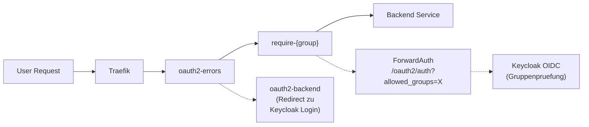

# Security Architecture

## Uebersicht
Der Zugriff auf interne Services wird zentral ueber Traefik gesteuert, welches Authentifizierungsanfragen an Keycloak delegiert.



## Komponenten

### OpenLDAP (Benutzerverzeichnis)

Zentraler Identity Store fuer alle User-Accounts. Keycloak ist per LDAP Federation (WRITABLE) angebunden und synchronisiert Passwort-Aenderungen zurueck nach LDAP. Services wie Jellyfin authentifizieren direkt gegen LDAP.

Details: [OpenLDAP & Benutzerverwaltung](../04-services/core/ldap.md)

### Keycloak (SSO Provider)
- **URL:** `https://sso.ackermannprivat.ch`
- **Realm:** `traefik`
- **Client:** `traefik-forward-auth`
- **Deployment:** Docker Compose auf vm-proxy-dns-01
- **LDAP Federation:** WRITABLE (Aenderungen in Keycloak werden nach LDAP geschrieben)

### oauth2-proxy (v2)
Zentraler oauth2-proxy mit ForwardAuth. Prueft das Session-Cookie und validiert die Gruppenzugehoerigkeit via `allowed_groups` Query-Parameter.

- **Container:** `oauth2-proxy` (einzelne Instanz)
- **Auth-Endpoint:** `/oauth2/auth?allowed_groups=...`
- **Sign-In:** `/oauth2/sign_in?rd={url}`

## Zugriffsgruppen

| Gruppe | Mitglieder | Zugriff |
|--------|------------|---------|
| `admin` | samuel | Voller Zugriff auf alle Services |
| `family` | corinna, + weitere | Familien-Zugriff (Jellyseerr, Jellyfin, etc.) |
| `guest` | Weitere | Limitierter Zugriff |

## CrowdSec (Intrusion Detection)

CrowdSec analysiert Traefik-Logs und blockiert boeswillige IPs per ForwardAuth-Bouncer. In den `public-*-chain-v2` Middleware Chains ist CrowdSec als erste Stufe eingebunden.

Details: [CrowdSec](crowdsec.md)

## Middleware Chains

Detaillierte Beschreibung siehe [Traefik Middleware Chains](traefik-middlewares.md).

### Kurzuebersicht

| Anwendungsfall | Chain | Beschreibung |
|----------------|-------|--------------|
| Oeffentlich, nur Admin | `public-admin-chain-v2@file` | CrowdSec + OAuth2 Admin |
| Oeffentlich, Family | `public-family-chain-v2@file` | CrowdSec + OAuth2 Family |
| Oeffentlich, Guest | `public-guest-chain-v2@file` | CrowdSec + OAuth2 Guest |
| Intern, nur Admin | `intern-admin-chain-v2@file` | OAuth2 Admin + IP-Whitelist |
| Intern, Family | `intern-family-chain-v2@file` | OAuth2 Family + IP-Whitelist |
| Intern, nur IP | `intern-chain@file` | Nur IP-Whitelist |
| API intern | `intern-api-chain@file` | Nur IP-Whitelist |

## Konfiguration neuer Services

Um einen Service zu schuetzen, muss in Traefik (bzw. im Nomad Job) die entsprechende Middleware aktiviert werden:

```hcl
tags = [
  "traefik.http.routers.my-service.middlewares=public-admin-chain-v2@file"
]
```

**Wichtig:** Fuer jeden neuen Service mit OAuth2 muss in der Traefik Dynamic Config eine Callback-Route definiert werden:

```yaml
oauth2-myservice:
  rule: "Host(`myservice.ackermannprivat.ch`) && PathPrefix(`/oauth2/`)"
  service: oauth2-backend
  priority: 1000
```

## Tailscale-Zugriff

Tailscale-Verbindungen nutzen den CGNAT-Bereich `100.64.0.0/10`. Dieser ist in der `intern-chain` IP-Whitelist enthalten, sodass Zugriff ueber Tailscale auf interne Services moeglich ist.

---
*Letztes Update: 22.02.2026*
