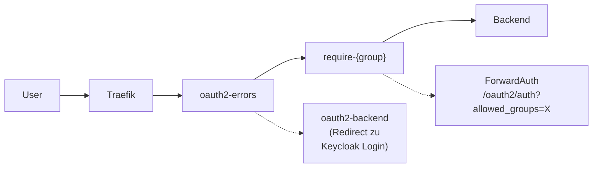

# Traefik Middleware Chains

Diese Dokumentation beschreibt die verfuegbaren Middleware Chains fuer Traefik und deren Verwendung.

## Uebersicht

Alle Services werden ueber Traefik (vm-proxy-dns-01, 10.0.2.1) geroutet. Die Authentifizierung erfolgt ueber OAuth2-Proxy v2 mit Keycloak als Identity Provider.

> **Migration v1 → v2:** Am 21.02.2026 wurden alle Middleware Chains auf v2 migriert.
> Die v2 Chains nutzen einen zentralen oauth2-proxy mit ForwardAuth (`/oauth2/auth?allowed_groups=...`)
> statt separater oauth2-proxy-Instanzen pro Gruppe.

## Middleware Chains

### Fuer externen Zugriff (Public)

Diese Chains erlauben Zugriff von ueberall, erfordern aber OAuth2-Authentifizierung:

| Chain | Komponenten (Reihenfolge) | Beschreibung |
|-------|--------------------------|--------------|
| `public-guest-chain-v2` | crowdsec → oauth2-errors → require-guest | CrowdSec + OAuth2 Guest |
| `public-admin-chain-v2` | crowdsec → oauth2-errors → require-admin | CrowdSec + OAuth2 Admin |
| `public-family-chain-v2` | crowdsec → oauth2-errors → require-family | CrowdSec + OAuth2 Family |

### Fuer internen Zugriff (IP-Whitelist + OAuth2)

Diese Chains erfordern sowohl OAuth2-Authentifizierung als auch eine interne IP:

| Chain | Komponenten (Reihenfolge) | Beschreibung |
|-------|--------------------------|--------------|
| `intern-admin-chain-v2` | oauth2-errors → require-admin → intern-chain | OAuth2 Admin + IP-Whitelist |
| `intern-family-chain-v2` | oauth2-errors → require-family → intern-chain | OAuth2 Family + IP-Whitelist |

### Nur IP-Whitelist (ohne OAuth2)

| Chain | Komponenten | Beschreibung |
|-------|-------------|--------------|
| `intern-chain` | ipWhiteList | Basis IP-Whitelist |
| `intern-api-chain` | intern-chain | Fuer API-Zugriffe (nur IP-Whitelist) |

### IP-Whitelist Ranges

Die `intern-chain` erlaubt folgende IP-Bereiche:
- `10.0.0.0/8` - Internes Netzwerk
- `172.16.0.0/12` - Docker Networks
- `192.168.0.0/16` - VPN und weitere private Netze
- `100.64.0.0/10` - Tailscale CGNAT Range

## v2 Architektur

### Zentraler oauth2-proxy

Statt separater Instanzen pro Gruppe gibt es **einen** oauth2-proxy, der die Gruppenpruefung per `allowed_groups` Query-Parameter macht:

### ForwardAuth Middlewares (require-*)

| Middleware | ForwardAuth URL | Erlaubte Gruppen |
|------------|-----------------|------------------|
| `require-admin` | `/oauth2/auth?allowed_groups=admin` | admin |
| `require-family` | `/oauth2/auth?allowed_groups=admin,family` | admin, family |
| `require-guest` | `/oauth2/auth?allowed_groups=admin,family,guest` | admin, family, guest |

### Error Handling (oauth2-errors)

Die `oauth2-errors` Middleware faengt 401-Antworten von den `require-*` Middlewares ab und leitet den User zur Keycloak-Login-Seite weiter. Die `statusRewrites` Konfiguration (Traefik >= 3.4) schreibt den 401 auf 302 um, damit der Browser dem `Location`-Header folgt. Ohne `statusRewrites` wuerde der Browser "Found." als Text anzeigen statt automatisch weiterzuleiten.

**Reihenfolge:** `oauth2-errors` muss in der Chain **vor** `require-*` stehen, da die `errors` Middleware nur Antworten von Middlewares abfaengt, die **nach** ihr in der Chain kommen.

## Konfiguration neuer Services

Fuer jeden Service mit OAuth2-Middleware muss die entsprechende Chain als Traefik Middleware im Nomad Job aktiviert werden (z.B. `public-admin-chain-v2@file`). Zusaetzlich muss eine OAuth2 Callback-Route in der Traefik Dynamic Config existieren.

Beispiele fuer die Verwendung der Chains stehen in der [Security-Dokumentation](security.md).

## Konfigurationsdateien

- **Traefik Dynamic Config:** `/nfs/docker/traefik/configurations/config.yml` (auf vm-proxy-dns-01, wird live reloaded)
- **OAuth2-Proxy:** `/home/sam/docker-compose.yml` (auf vm-proxy-dns-01)
- **Traefik Static Config:** `/nfs/docker/traefik/traefik.yml` (auf vm-proxy-dns-01)

---
*Aktualisiert: 21.02.2026 (v1 → v2 Migration)*
