# Batch Jobs

Konsolidierte Übersicht aller periodischen Nomad Jobs. Die Job-Dateien liegen im Repository unter `nomad-jobs/batch-jobs/` und `nomad-jobs/monitoring/`.

## Zeitplan

```mermaid
gantt
    title Täglicher Ablauf der Batch Jobs
    dateFormat HH:mm
    axisFormat %H:%M

    section Bereinigung
    docker_prune           :01:00, 15min
    daily_cleanup          :05:00, 30min

    section Backup
    postgres-backup        :03:00, 15min
    influxdb-backup        :03:30, 15min

    section Neustart
    daily_restart_jellyfin :04:00, 5min
    renovate               :05:00, 15min

    section Container
    daily_container_restart:06:00, 5min
```

## Job-Übersicht

### Wartung

| Job | Typ | Schedule | Zweck | Node Constraint | Besonderheiten |
|:----|:----|:---------|:------|:----------------|:---------------|
| `daily_cleanup` | sysbatch | Täglich 05:00 | APT-Bereinigung, Journal-Vacuum, Jellyfin-Caches, /tmp, Docker Prune | Alle Nodes (count=3, distinct_hosts) | raw_exec, Priorität 100 |
| `docker_prune` | sysbatch | Täglich 01:00 | Docker System Prune (Images, Volumes, Container) | Alle Nodes | raw_exec, aggressiv (`-a --volumes`) |

::: warning Überlappung daily_cleanup und docker_prune
`daily_cleanup` enthält ebenfalls `docker system prune -f --volumes`. `docker_prune` läuft zusätzlich mit `-a` (entfernt auch ungenutzte Images). Beide Jobs sind bewusst getrennt, da `docker_prune` aggressiver ist.
:::

### Neustart

| Job | Typ | Schedule | Zweck | Node Constraint | Besonderheiten |
|:----|:----|:---------|:------|:----------------|:---------------|
| `daily_container_restart` | sysbatch | Täglich 06:00 | Jellyfin via `nomad job restart` neustarten | Alle Nodes | raw_exec, Priorität 100 |
| `daily_restart_jellyfin` | batch | Täglich 04:00 | Jellyfin via Nomad HTTP API neustarten | Nur `vm-nomad-client-05` | exec, `curl POST /v1/job/jellyfin/restart` |

::: danger Duplikat: Jellyfin-Neustart
`daily_container_restart` und `daily_restart_jellyfin` starten beide Jellyfin täglich neu -- mit unterschiedlichen Methoden und Zeitpunkten. Zusätzlich startet `daily_reboot` um 04:00 alle Nodes neu, was Jellyfin ebenfalls betrifft. Diese Redundanz sollte konsolidiert werden.
:::

### Backup

| Job | Typ | Schedule | Zweck | Node Constraint | Besonderheiten |
|:----|:----|:---------|:------|:----------------|:---------------|
| `postgres-backup` | batch | Täglich 03:00 | pg_dumpall mit GFS-Rotation nach NFS | `vm-nomad-client-0[456]` (regexp) | Docker, Vault Secrets, Uptime Kuma Push, Retry 2x |
| `influxdb-backup` | batch | Täglich 03:30 | influx backup mit GFS-Rotation nach NFS | `vm-nomad-client-0[456]` (regexp) | Docker, Vault Secrets, Retry 2x |

Details zur Backup-Architektur und zum Restore-Konzept: [Backup-Strategie](../backup/index.md)

### Updates

| Job | Typ | Schedule | Zweck | Node Constraint | Besonderheiten |
|:----|:----|:---------|:------|:----------------|:---------------|
| `renovate` | batch | Täglich 05:00 | Kontrollierte Docker-Image-Updates via GitHub PRs | `vm-nomad-client-0[456]` (regexp) | Docker, Vault Secrets, NFS-Cache, Uptime Kuma Push |

::: info Renovate ersetzt Watchtower
Watchtower (`watchtower.nomad`, `count = 0`) ist deaktiviert. Renovate erstellt Pull Requests für veraltete Images statt sie direkt zu aktualisieren. Patch-Updates werden automatisch gemerged, Major-Updates und stateful Services (Datenbanken, Authentik) erfordern manuelles Review. Details: [Renovate](./renovate.md)
:::

## Reihenfolge und Abhängigkeiten

Die Jobs laufen unabhängig voneinander, aber die zeitliche Staffelung ist bewusst gewählt:

1. **01:00** -- `docker_prune`: Bereinigt Docker-Ressourcen
2. **03:00** -- `postgres-backup`: Datenbank-Backup
3. **03:30** -- `influxdb-backup`: Metriken-Backup (nach PostgreSQL)
4. **04:00** -- `daily_restart_jellyfin`: Jellyfin-Neustart
4. **05:00** -- `renovate`: Docker-Image-Updates via PRs
5. **05:00** -- `daily_cleanup`: System-Bereinigung
6. **06:00** -- `daily_container_restart`: Jellyfin-Neustart (Duplikat, konsolidieren)

## Konsolidierungspotenzial

- **Jellyfin-Neustarts:** Zwei Jobs starten Jellyfin neu (`daily_container_restart`, `daily_restart_jellyfin`). Einer davon würde genügen.
- **Docker Prune:** Läuft sowohl in `docker_prune` als auch in `daily_cleanup`. Könnte in einem Job zusammengefasst werden.

## Verwandte Seiten

- [Backup-Strategie](../backup/index.md) -- PostgreSQL Backup Architektur und Restore-Konzept
- [Kontrolliertes Herunterfahren](./smart-shutdown.md) -- Drain-Prozess bei Wartungsarbeiten
- [Monitoring Stack](../monitoring/index.md) -- Uptime Kuma Push-Monitore für Backup-Status
- [Renovate](./renovate.md) -- Kontrollierte Docker-Image-Updates via GitHub PRs
- [Zot Container Registry](../docker-registry/index.md) -- Registry für gespiegelte Docker Images
