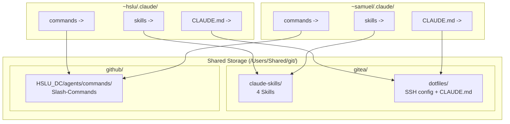

# Claude Code Config-Sync

Zwei macOS-Accounts (`samuel_ackermann` und `hslu_samuel_ackermann`) teilen sich Claude Code Konfiguration ueber Symlinks und zwei Gitea-Repos.

## Architektur

## Was geteilt wird vs. pro User

- **Skills** -- geteilt via Symlink auf `gitea:sam/claude-skills`
- **Commands** -- geteilt via Symlink auf `github:HSLU_DC/agents/commands`
- **CLAUDE.md** -- geteilt via Symlink auf `gitea:sam/dotfiles/claude.md`
- **SSH Config** -- geteilt via `Include`-Direktive auf `gitea:sam/dotfiles/ssh-config-shared`
- **settings.json** -- pro User, manuell synchronisiert
- **.claude.json** -- pro User (MCP Server, State)

## SSH-Key-Verwaltung via 1Password

SSH Keys werden ueber den 1Password SSH Agent bereitgestellt. Keine Key-Dateien auf Disk noetig fuer neue Verbindungen.

- Der SSH Agent erkennt nur Keys im **persoenlichen Vault** ("Persoenlich"/"Private"). Team-Vaults funktionieren nicht.
- Ohne `agent.toml` nutzt der Agent automatisch alle SSH Keys aus dem persoenlichen Vault.
- Jeder User hat eine eigene `~/.ssh/config` mit `Include`-Direktive auf die geteilte Config.

## Berechtigungskonzept

Alle Shared-Verzeichnisse nutzen die Gruppe `github` mit setgid-Bit. Siehe `gitea:sam/dotfiles/setup-permissions.sh`.

- **Verzeichnisse:** 2775 (`drwxrwsr-x`) -- setgid sorgt fuer Gruppen-Vererbung
- **Dateien:** 664 (`-rw-rw-r--`)
- **Scripts:** 775 (`-rwxrwxr-x`)
- **ssh-config-shared:** 644 (`-rw-r--r--`) -- SSH verweigert group-writable Configs
- **`.git/`-Interna:** Nicht manuell aendern, stattdessen `core.sharedRepository = group`
- **safe.directory:** Muss fuer beide User in `.gitconfig` konfiguriert sein

## Neuen Skill hinzufuegen

1. Skill-Verzeichnis mit `SKILL.md` in `gitea:sam/claude-skills/` erstellen
2. Committen und pushen -- beide User sehen den Skill sofort via Symlink

## Neuen SSH Host hinzufuegen

1. Host-Eintrag in `gitea:sam/dotfiles/ssh-config-shared` einfuegen
2. Permissions pruefen: Datei muss 644 bleiben (nicht 664!)
3. Committen und pushen -- beide User haben den Host sofort

## Gitea API Zugang

Die Gitea API ist von lokal nur via SSH-Tunnel erreichbar:

1. Tunnel: `ssh -fN -L 13000:gitea.service.consul:3003 vm-nomad-client-05`
2. API: `curl -u "sam:<passwort>" http://localhost:13000/api/v1/...`
3. Passwort: 1Password Item "Gitea" im Private Vault
