# Service-Abhängigkeiten

## Übersicht

Dieses Diagramm zeigt, welche Services von welchen Infrastruktur-Komponenten und voneinander abhängen.

## Abhängigkeits-Diagramm

```mermaid
flowchart TB
    subgraph Core["Core Infrastructure"]
        TRAEFIK["Traefik"]
        DNS["Pi-hole + Unbound"]
        CONSUL["Consul"]
        VAULT["Vault"]
        KEYCLOAK["Keycloak"]
        LDAP["OpenLDAP"]
        PG["PostgreSQL 16"]
        SMTP["SMTP Relay"]
        NFS["Synology NAS"]
    end

    subgraph Media["Media Stack"]
        JF["Jellyfin"]
        JS["Jellyseerr"]
        SONARR["Sonarr"]
        RADARR["Radarr"]
        PROWLARR["Prowlarr"]
        SAB["SABnzbd"]
        JSTAT["JellyStat"]
        MAINT["Maintainerr"]
        JANI["Janitorr"]
        STASH["Stash"]
        ABS["AudioBookShelf"]
        YTDL["YouTube-DL"]
        SYDL["Special-YT-DLP"]
        VG["Video-Grabber"]
    end

    subgraph Mon["Monitoring"]
        GRAFANA["Grafana"]
        LOKI["Loki"]
        INFLUX["InfluxDB"]
        ALLOY["Alloy"]
        UK["Uptime Kuma"]
        GATUS["Gatus"]
    end

    subgraph Prod["Productivity"]
        VW["Vaultwarden"]
        PL["Paperless"]
        TD["Tandoor"]
        GUA["Guacamole"]
        CD["ChangeDetection"]
        OBS["Obsidian LiveSync"]
        NOTIF["Notifiarr"]
        GITEA["Gitea"]
        N8N["n8n"]
        META["Metabase"]
        SOLID["solidtime"]
    end

    subgraph AI["AI / LLM"]
        OLLAMA["Ollama"]
        OWUI["Open-WebUI"]
        HOLLA["HolLama"]
    end

    subgraph IoT["IoT"]
        Z2M["Zigbee2MQTT"]
        MOSQ["Mosquitto"]
    end

    KEYCLOAK --> LDAP

    SONARR --> PG
    RADARR --> PG
    PROWLARR --> PG
    JS --> PG
    JSTAT --> PG
    JS --> JF
    JSTAT --> JF
    MAINT --> JF
    SONARR --> SAB
    RADARR --> SAB
    SONARR --> PROWLARR
    RADARR --> PROWLARR
    JANI --> SONARR
    JANI --> RADARR
    VG --> SYDL

    VW --> PG
    PL --> PG
    TD --> PG
    GITEA --> PG
    N8N --> PG
    META --> PG
    SOLID --> PG
    VW --> SMTP
    PL --> OLLAMA

    GRAFANA --> INFLUX
    GRAFANA --> LOKI
    GRAFANA --> PG
    ALLOY --> LOKI

    OWUI --> OLLAMA
    HOLLA --> OLLAMA
    N8N --> SOLID
    Z2M --> MOSQ
    NOTIF --> SONARR
    NOTIF --> RADARR

    class TRAEFIK,KEYCLOAK,DNS entry
    class CONSUL,VAULT accent
    class PG,NFS,INFLUX db
    class SMTP,LDAP,JF,JS,SONARR,RADARR,PROWLARR,SAB,JSTAT,MAINT,JANI,STASH,ABS,YTDL,SYDL,VG svc
    class GRAFANA,LOKI,ALLOY,UK,GATUS svc
    class VW,PL,TD,GUA,CD,OBS,NOTIF,GITEA,N8N,META,SOLID svc
    class OLLAMA,OWUI,HOLLA svc
    class Z2M,MOSQ svc

    classDef ext fill:#fef2f2,stroke:#e11d48,stroke-width:1.5px,color:#1e293b
    classDef db fill:#eff6ff,stroke:#3b82f6,stroke-width:1.5px,color:#1e293b
    classDef svc fill:#ecfdf5,stroke:#10b981,stroke-width:1.5px,color:#1e293b
    classDef entry fill:#fefce8,stroke:#eab308,stroke-width:1.5px,color:#1e293b
    classDef accent fill:#ede9fe,stroke:#7c3aed,stroke-width:2px,color:#1e293b
```



## Abhängigkeits-Gruppen

### Alle Services hängen von diesen Komponenten ab

Jeder Service im Nomad Cluster ist implizit abhängig von:

- **Traefik** -- Reverse Proxy und TLS-Terminierung
- **Consul** -- Service Discovery (DNS und Health Checks)
- **Vault** -- Secret Management (Datenbank-Passwörter, API-Keys)
- **NFS** -- Persistenter Storage (`/nfs/docker/`)
- **DNS** -- Pi-hole für Namensauflösung

### PostgreSQL-abhängige Services

Diese Services starten erst nach einem erfolgreichen Health-Check gegen `postgres.service.consul:5432` (via `wait-for-postgres` Init-Task):

- Radarr, Sonarr, Prowlarr, Jellyseerr, JellyStat
- Vaultwarden, Paperless, Gitea, Tandoor
- solidtime, n8n, Metabase

### Keycloak/OAuth2-geschützte Services

Alle Services hinter einer `*-chain-v2@file` Middleware benötigen Keycloak für die Authentifizierung. Fällt Keycloak aus, sind diese Services nicht zugänglich (ausser über Tailscale/intern mit `intern-chain@file`).

### Media-Pipeline

```
Prowlarr (Indexer) --> Sonarr/Radarr (Management)
                              |
                        SABnzbd (Download)
                              |
                        Jellyfin (Playback)
                              |
                   Jellyseerr (Requests) <-- Benutzer
```

Janitorr und Maintainerr automatisieren die Bereinigung (Janitorr loescht, Maintainerr verwaltet Sammlungen).

### Monitoring-Pipeline

```
Alle Container --> Alloy (Log-Collector) --> Loki (Log-Storage)
                                                    |
                                              Grafana (Dashboards)
                                                    |
                                              InfluxDB (Metriken)
```

Uptime Kuma und Gatus überwachen Service-Verfügbarkeit unabhängig.
