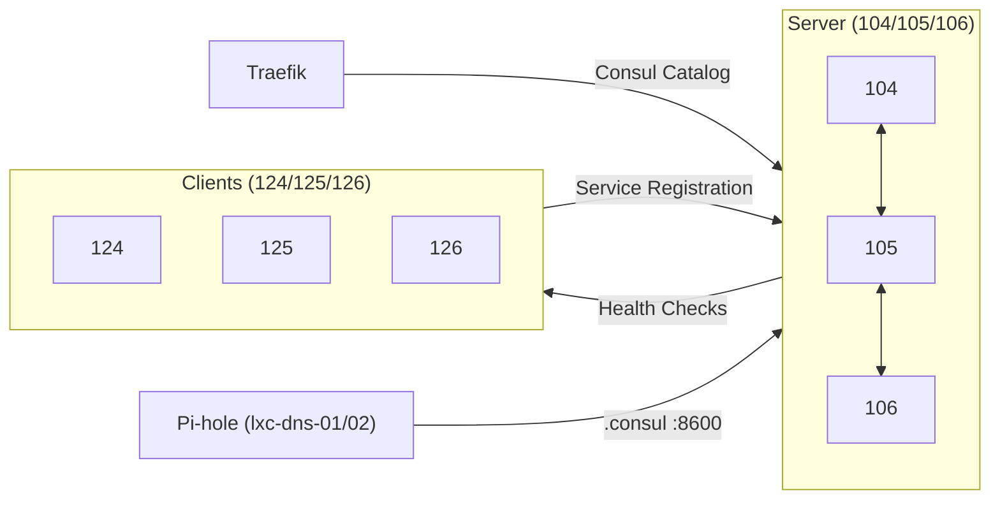

# Consul

## Übersicht

| Eigenschaft | Wert |
|-------------|------|
| Version | v1.21.1 |
| Server | 3 (vm-nomad-server-04/05/06) |
| Clients | 3 (vm-nomad-client-04/05/06) |
| UI | `http://10.0.2.104:8500` |
| IPs | Siehe [Proxmox Cluster](../proxmox/index.md#hashicorp-stack-vms) |

## Rolle im Stack

Consul stellt Service Discovery und DNS für alle Nomad-Services bereit. Jeder Container registriert sich automatisch als Consul Service und ist danach über `<service>.service.consul` erreichbar. Consul verwaltet ausserdem Health Checks und stellt ein Key-Value Store für dynamische Konfiguration bereit.

::: danger Kritischer Service
Bei Consul-Ausfall verlieren alle Dienste ihre Service Discovery und DNS-Auflösung. Traefik kann kein Routing mehr durchführen und alle Web-Dienste werden unerreichbar.
:::

## Architektur

Consul läuft auf denselben VMs wie Nomad und Vault:

- **Server** auf den drei Server-VMs: bilden den Raft-Cluster für Konsens und KV Store
- **Clients** auf den drei Worker-VMs: melden lokale Services und führen Health Checks aus

Jeder Nomad-Client führt auch einen Consul-Client aus. Wenn Nomad einen Container startet, registriert der lokale Consul-Agent diesen Service automatisch im Cluster.

## Service Discovery

Nomad registriert jeden Service mit der `service` Stanza automatisch in Consul. Traefik nutzt den Consul Catalog Provider, um diese Services als Backends zu erkennen und Routen zu konfigurieren.

Der typische Fluss:

1. Nomad startet einen Container auf einem Worker-Node
2. Der lokale Consul-Agent registriert den Service
3. Consul führt Health Checks durch
4. Traefik liest den Consul Catalog und erstellt automatisch Routen
5. Der Service ist unter seiner Domain erreichbar

## DNS-Integration

Consul stellt einen DNS-Server auf Port 8600 bereit. Über diesen können Services nach dem Schema `<service>.service.consul` aufgelöst werden. Pi-hole (lxc-dns-01 10.0.2.1, lxc-dns-02 10.0.2.2) leitet alle DNS-Anfragen für die Domain `.consul` an die drei Consul Server weiter, sodass alle Geräte im Netzwerk Consul-Dienste über DNS erreichen können.

Vollständige DNS-Dokumentation: [DNS-Architektur](../dns/)

## KV Store

Der Consul KV Store wird für dynamische Konfiguration genutzt, die von mehreren Services gelesen werden muss. Beispiel: Traefik Cloudflare Credentials (`traefik/cloudflare/email`, `traefik/cloudflare/api_key`).

::: info Abgrenzung zu Vault
Der Consul KV Store ist kein Secrets-Store. Sensible Daten gehören in [Vault](../vault/). Consul KV ist für nicht-sicherheitskritische Konfiguration gedacht.
:::

## Security

| Massnahme | Status |
|-----------|--------|
| Gossip Encryption | Aktiv |
| ACLs | Aktiviert (`default_policy = "allow"`) |
| TLS | Deaktiviert (Homelab-Entscheidung) |

**Gossip Encryption:** Gesamter Gossip-Traffic zwischen Consul Nodes ist verschlüsselt (symmetrischer Key, auf allen Nodes identisch).

**ACLs:** Aktiviert mit `default_policy = "allow"` -- Services funktionieren ohne Token. Management Token in `infra/.consul-token`.

**TLS deaktiviert:** Kein Expiry-Risiko durch Zertifikate. Gossip Encryption schützt den Cluster-Traffic trotzdem.

## Verwandte Seiten

- [Nomad](../nomad/) -- Workload Scheduler, der Services in Consul registriert
- [Vault](../vault/) -- Secrets Management für den Cluster
- [DNS-Architektur](../dns/) -- DNS-Kette inkl. Consul-Forwarding
- [Traefik](../traefik/) -- Consul Catalog Integration für automatisches Routing
