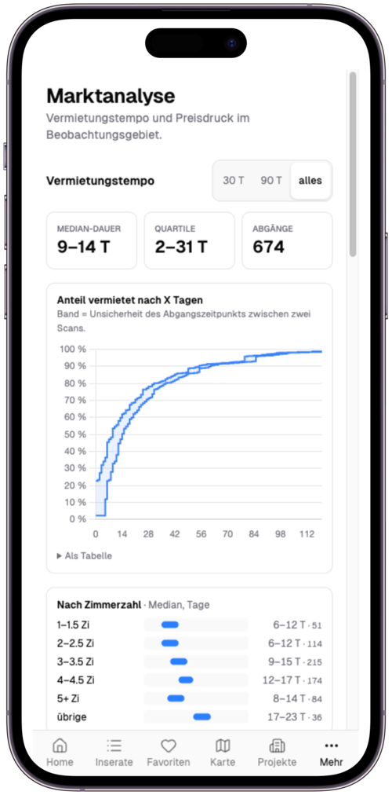
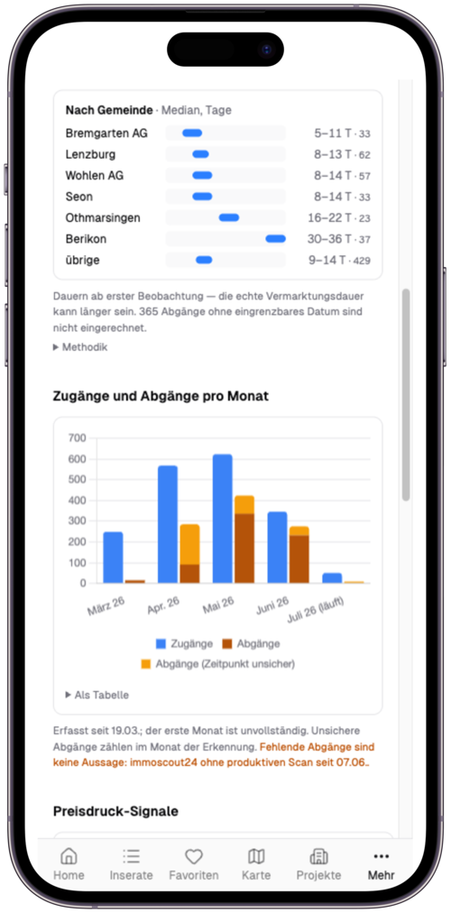
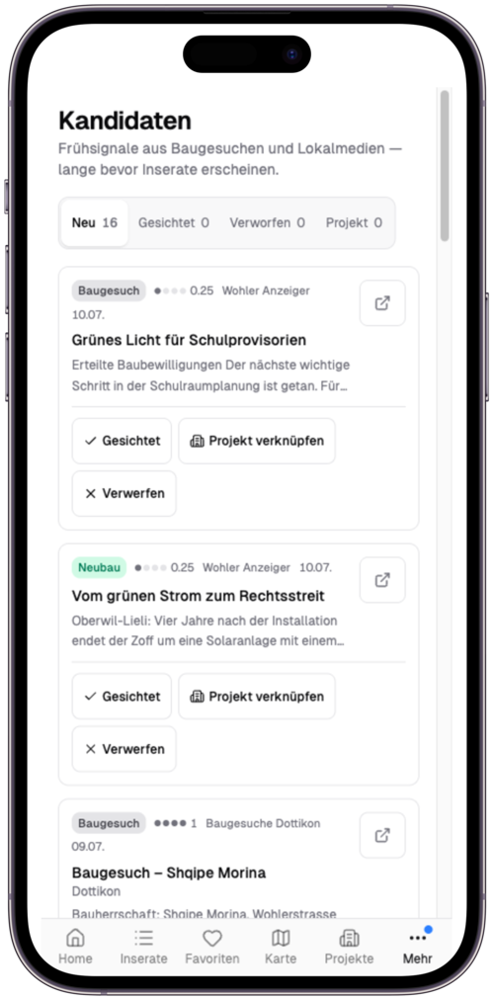

# Immo Monitor

Immo Monitor ist die **Web-App** über dem Mietmarkt-Monitoring rund um Dottikon AG: die Bedienoberfläche für Inserate, Karte, Marktanalyse und Neubau-Recherche. Die dahinterliegende Datenpipeline (Scraper, Enrichment, Foto-Download, Frühsignal-Ingest) beschreibt [Immobilien-Monitoring](../immobilien-monitoring/index.md) -- diese Seite behandelt das Frontend und seine Ableitungslogik.

## Übersicht

| Attribut | Wert |
|----------|------|
| URL | [immo.ackermannprivat.ch](https://immo.ackermannprivat.ch) |
| Deployment | Nomad Job `services/immo-monitor.nomad` |
| Storage | PostgreSQL `immo` -- siehe [Datenbanken](../../_referenz/datenbanken.md) |
| Auth | `intern-auth@file` (intern, Authentik + IP-Allowlist) + `public-auth@file` (extern, Authentik + CrowdSec), Gruppen `admin` und `family` |
| Secrets | `kv/data/immo-monitor` |

## Rolle im Stack

Immo Monitor ersetzt die frühere Kombination aus Metabase + Leaflet + NocoDB durch eine fokussierte SvelteKit-App. Sie liest aus denselben PostgreSQL-Tabellen, die der [Scraper](../immobilien-monitoring/index.md) befüllt, leitet daraus jedoch **jeden angezeigten Zustand selbst** ab (siehe Statusmodell) und schreibt ausschliesslich Nutzer-Daten zurück (Favoriten, Notizen, Ablehnungen, Kandidaten-Sichtung). Der Scraper liefert die Rohdaten, die App verantwortet Interpretation und Darstellung.

## Architektur

Zwei Szenario-Sichten trennen die zwei Ebenen der App: den synchronen Request-Pfad vom Browser bis zu den Datenquellen und den asynchronen Weg vom Scan-Lauf zur angezeigten Status-Aussage. Das Gesamtbild der Datenpipeline dahinter -- CI/CD, Enrichment, Telegram -- zeigt die [Gesamtarchitektur des Immobilien-Monitorings](../immobilien-monitoring/index.md#gesamtarchitektur).

Lese-Konvention für beide Diagramme: Der Pfeil zeigt vom Initiator zum Ziel, das Label nennt Schritt und Inhalt. Durchgezogene Kanten laufen synchron zur Request-Zeit, gestrichelte asynchron im Scan-Rhythmus. Farben kodieren die Wege: Blau der Seiten-Request samt Status-Ableitung, Violett der Bild-Weg ohne Authentik, Ocker der Scan-Schreibweg des Scrapers.

### Request-Pfad durch die drei Router

**Leitfrage:** Über welchen der drei Traefik-Router erreicht ein Request die App -- und warum nehmen Bilder einen eigenen Weg ohne Login?

```d2
classes: {
  node: { style: { border-radius: 8 } }
  container: { style: { border-radius: 8; stroke-dash: 4 } }
  seite: { style: { stroke: "#3b6ea5"; font-color: "#3b6ea5" } }
  bild: { style: { stroke: "#7c3aed"; font-color: "#7c3aed" } }
}

direction: right

browser: Browser { class: node }

traefik: Traefik {
  class: container

  ri: intern-Router {
    class: node
    tooltip: "Host-Regel + ClientIP-Allowlist, Chain intern-auth -- Authentik + IP-Allowlist"
  }
  re: public-Router {
    class: node
    tooltip: "nur Host-Regel, Chain public-auth -- Authentik + CrowdSec"
  }
  rp: Photo-Router {
    class: node
    tooltip: "PathPrefix /api/photos/ mit hoher expliziter Priority -- bewusst ohne Authentik-Middleware"
  }
}

app: Immo Monitor (SvelteKit) {
  class: container

  load: Seiten-Load + Aktionen {
    class: node
    tooltip: "Load-Funktionen und Form-Actions -- jeder angezeigte Zustand läuft durch die Lifecycle-Ableitung"
  }
  photo: Photo-Endpoint {
    class: node
    tooltip: "Path-Traversal-Schutz im Endpoint, keine Datenbank-Abhängigkeit"
  }
}

pg: PostgreSQL immo {
  shape: cylinder
  tooltip: "App liest alle Tabellen, schreibt nur die Nutzer-Tabellen"
}
nfs: NFS Photo-Archiv {
  shape: cylinder
  tooltip: "Read-only Mount -- befüllt vom Scraper der Datenpipeline"
}
cache: Thumbnail-Cache {
  shape: cylinder
  tooltip: "beschreibbarer Pfad ausserhalb des Read-only-Mounts, flüchtig"
}

browser -> traefik.ri: "1a. HTTPS aus LAN/VPN --\nClientIP-Regel greift" { class: seite }
browser -> traefik.re: "1b. HTTPS von extern --\nnur Host-Regel" { class: seite }
traefik.ri -> app.load: "2. Request + Identitäts-Header" { class: seite }
traefik.re -> app.load: "2. Request + Identitäts-Header" { class: seite }
app.load -> pg: "3a. SQL-Lesen für die Ansichten --\nStatus via Lifecycle-Ableitung" { class: seite }
app.load -> pg: "3b. Schreiben nur Nutzer-Daten --\nFavoriten, Notizen, Sichtung" { class: seite }
browser -> traefik.rp: "4. Bilder aus dem HTML --\nGET /api/photos/* mit Breiten-Query" { class: bild }
traefik.rp -> app.photo: "5. ohne Authentik-Chain --\nPriority sticht die Host-Router" { class: bild }
app.photo -> nfs: "6a. Original lesen --\nread-only NFS-Mount" { class: bild }
app.photo -> cache: "6b. skalierte Variante lesen oder\nvia sharp erzeugen und schreiben" { class: bild }
```

**Lesehilfe:**

1. Aus LAN/VPN greift die ClientIP-Regel des intern-Routers (Chain `intern-auth@file`), von extern bleibt der public-Router (`public-auth@file`) -- die Chains dokumentiert die [Traefik Referenz](../../edge/traefik/referenz.md#middleware-chains).
2. Nach bestandener Chain erreicht der Request die Load-Funktion mit Identitäts-Headern; jeder angezeigte Inserats-Zustand läuft dort durch die Lifecycle-Ableitung ([Statusmodell](#statusmodell-die-eine-zustands-ableitung)).
3. Gelesen wird aus allen Tabellen, geschrieben ausschliesslich Nutzer-Daten -- Favoriten, Notizen, Ablehnung, Sichtung ([Rolle im Stack](#rolle-im-stack)).
4. Die Bilder im HTML lädt der Browser separat über `/api/photos/*` -- der Photo-Router sticht mit hoher Priority die Host-Router und trägt bewusst keine Authentik-Middleware ([Traefik-Route ohne Authentik](#traefik-route-ohne-authentik)).
5. Der Photo-Endpoint liest das Original vom read-only NFS-Mount und liefert die per sharp skalierte Variante aus dem Cache ([Thumbnails via sharp](#thumbnails-via-sharp)); befüllt wird das Archiv asynchron vom Scraper ([Photo-Archivierung](../immobilien-monitoring/index.md#photo-archivierung-auf-nfs)).
6. Ausfall PostgreSQL: Seiten-Loads und Nutzer-Schreibungen scheitern, und weil der Health-Check bewusst die Datenbank prüft, meldet Consul den Service als unhealthy und Traefik nimmt das Backend aus dem Routing -- damit fällt auch die selbst DB-freie Bild-Route mit aus.
7. Ausfall NFS: Die Seiten bleiben nutzbar, nur die Bilder fehlen -- der Endpoint prüft vor jedem Cache-Zugriff zuerst das Original auf dem Mount.

### Vom Scan zum angezeigten Status

**Leitfrage:** Wie wird aus Scan-Läufen der angezeigte Inserats-Status -- und warum degradiert die Anzeige bei Scan-Ausfall, statt fälschlich Aktualität zu behaupten?

```d2
classes: {
  node: { style: { border-radius: 8 } }
  container: { style: { border-radius: 8; stroke-dash: 4 } }
  scan: { style: { stroke: "#8f6418"; font-color: "#8f6418" } }
  ableitung: { style: { stroke: "#3b6ea5"; font-color: "#3b6ea5" } }
}

direction: right

batch: Scan-Zeit {
  class: container
  top: 0
  left: 60

  scraper: immoscraper Batch-Job {
    class: node
    top: 110
    left: 150
    tooltip: "Nomad Periodic Batch -- alle 3 Tage Homegate, wöchentlich ImmoScout24"
  }
  scrapfly: Scrapfly API {
    class: node
    top: 110
    left: 560
    tooltip: "umgeht den Anti-Bot-Schutz der Portale serverseitig"
  }
}

pg: PostgreSQL immo {
  class: container
  label.near: top-center
  top: 520
  left: 180

  listing: listing {
    shape: cylinder
    tooltip: "is_active, first_seen_at, last_seen_at, deactivated_at"
  }
  runs: scraper_runs {
    shape: cylinder
    tooltip: "je Lauf: Portal, Startzeit, Anzahl neu und aktualisiert, Fehler"
  }
}

request: Request-Zeit im Immo Monitor {
  class: container
  label.near: top-left
  top: 1020
  left: 60

  load: Load-Funktion der Route {
    class: node
    tooltip: "liest die Zeilen, deutet is_active nie selbst"
  }
  health: loadScanHealth {
    class: node
    tooltip: "src/lib/server/scanHealth.ts -- Scan-Alter je Portal aus scraper_runs"
  }
  derive: deriveLifecycle {
    class: node
    tooltip: "src/lib/server/lifecycle.ts -- SSOT: sieben Präzedenz-Regeln"
  }
}

anzeige: Alle Ansichten {
  class: node
  top: 1560
  left: 480
  tooltip: "KPIs, Filter, Karte, Timeline, Marktanalyse -- alle aus derselben Ableitung"
}

batch.scraper -> batch.scrapfly: "1. Inserate abrufen --\nHTTP GET mit Anti-Bot-Bypass" { class: scan; style.stroke-dash: 3 }
batch.scraper -> pg.listing: "2. UPSERT je Inserat --\nlast_seen_at frisch, Stale-Abgänge markieren" { class: scan; style.stroke-dash: 3 }
batch.scraper -> pg.runs: "3. Lauf protokollieren --\nneu, aktualisiert, Fehler" { class: scan; style.stroke-dash: 3 }
request.load -> pg.listing: "4. Zeilen lesen --\nis_active nur als Rohwert" { class: ableitung }
request.health -> pg.runs: "5. letzter produktiver Lauf je Portal --\nproduktiv heisst neu + aktualisiert über 0" { class: ableitung }
request.load -> request.derive: "6a. Listing-Felder" { class: ableitung }
request.health -> request.derive: "6b. Scan-Gesundheit je Portal" { class: ableitung }
request.derive -> anzeige: "7. Zustand x Konfidenz --\nbei stalem Scan degradiert die Anzeige" { class: ableitung }
```

**Lesehilfe:**

1. Der periodische Batch-Job holt die Inserate über Scrapfly, das den Anti-Bot-Schutz der Portale serverseitig umgeht ([Anti-Bot](../immobilien-monitoring/index.md#anti-bot-scrapfly-statt-browser)); die fünf Phasen eines Laufs beschreibt der [Scan-Ablauf](../immobilien-monitoring/index.md#scan-ablauf-5-phasen).
2. Je Inserat setzt der UPSERT `last_seen_at`; länger nicht gesehene Inserate deaktiviert der Lauf -- ausser der Scan fand gar nichts, dann greift der Schutz gegen Massen-Deaktivierung ([Smart Skipping](../immobilien-monitoring/index.md#smart-skipping)).
3. Jeder Lauf protokolliert sich in `scraper_runs` -- diese Tabelle ist die Grundlage der Scan-Gesundheit.
4. Zur Request-Zeit liest die Load-Funktion die Zeilen, deutet `is_active` aber nie selbst ([Statusmodell](#statusmodell-die-eine-zustands-ableitung)).
5. `loadScanHealth` bestimmt je Portal den letzten produktiven Lauf -- produktiv heisst neue oder aktualisierte Inserate; `errors = 0` allein beweist nichts, tote Läufe waren fehlerfrei.
6. `deriveLifecycle` löst beide Inputs deterministisch zu Zustand und Konfidenz auf; ist der Portal-Scan älter als seine an den Scan-Rhythmus gekoppelte Schwelle, degradiert "aktiv" zur Anzeige "zuletzt bestätigt am" ([Statusmodell](#statusmodell-die-eine-zustands-ableitung)).
7. Ausfall Scrapfly oder Portal-Block: Es entsteht kein produktiver Lauf -- kein Inserat wird fälschlich deaktiviert, das Portal wird stale, die Anzeige degradiert. Die App behauptet weniger Aktualität, verliert aber keine Daten.

## Tech Stack

- **Frontend:** SvelteKit (Svelte 5, Runes) mit adapter-node
- **UI:** shadcn-svelte + Tailwind CSS v4 (Zinc + Amber)
- **ORM:** Drizzle ORM auf PostgreSQL
- **Karten:** Leaflet + CartoDB Positron + `leaflet.markercluster`
- **Bilder:** sharp (serverseitige Thumbnails)
- **Charts:** Chart.js

## Statusmodell: die eine Zustands-Ableitung

Ob ein Inserat aktiv oder weg ist, entscheidet **eine einzige** Funktion -- `deriveLifecycle` in `src/lib/server/lifecycle.ts` -- und kein Frontend-Code liest das rohe `is_active`-Feld selbst. Alle Ansichten (Home-KPIs, Filter, Karte, Marktanalyse, Vergleichsmiete) fragen dieselbe Ableitung, damit Kennzahl und Filter nie auseinanderlaufen.

Der Zustand wird über zwei Achsen beschrieben:

- **Zustand:** aktiv, abgegangen oder unbestimmt
- **Konfidenz:** wie gut der Zustand belegt ist -- `beobachtet` (im Scan gesehen), `recherchiert` (aus externer Quelle) oder `unbestätigt`

Sieben Präzedenz-Regeln lösen die beiden Achsen deterministisch auf. `src/lib/server/scanHealth.ts` liefert dazu das Scan-Alter pro Portal: Ist der Portal-Scan veraltet, degradiert ein "aktiv" bewusst zu "zuletzt bestätigt am" -- die App behauptet nur so viel Aktualität, wie der letzte erfolgreiche Scan hergibt.

::: info Warum eine eigene Ableitung statt `is_active`
Ein leeres `is_active` (`NULL`) galt historisch fälschlich als "verfügbar". Und der Abgangszeitpunkt ist ohnehin unscharf: Zwischen zwei Scans liegt im Median rund eine Woche, ein taggenaues Datum wäre also Schein-Präzision. Darum zeigt die App einen Abgang abgestuft -- bis zwei Tage als Datum mit Tilde, bis sieben Tage als Spanne, darüber als offene Scan-Lücke -- und versieht Dauern mit einer Qualität (exakt, Unter- oder Obergrenze). Erfundene Punktwerte gibt es nicht.
:::

## Seiten

- **Home** (`/`): Dashboard mit KPIs und Überblick-Charts. Die KPIs laufen über dieselbe Lifecycle-Ableitung wie die Filter, nicht über rohe Zählungen.
- **Inserate** (`/inserate`): Filterbarer Card-Grid mit Favorit/Ablehnung/Vergleich. Filter leben im URL-Querystring (teilbare Links), die Liste rendert gefenstert mit Scroll-Erhalt, Titel werden normalisiert.
- **Inserat-Detail** (`/inserate/[id]`): Foto-Galerie, Kerndaten, Amenities, Notizfeld sowie Verlaufs-Timeline und Vergleichsmiete-Benchmark (siehe unten).
- **Favoriten** (`/favoriten`): Gleicher Card-Grid wie Inserate, vorgefiltert auf Favoriten.
- **Karte** (`/karte`): Einzelmarker-Karte mit Cluster nur bei echter Überlappung, farbkodiert nach CHF/m², Kartenausschnitt und Auswahl im URL-Hash, Bottom-Sheet auf Mobil (siehe unten).
- **Marktanalyse** (`/markt`): Vermietungstempo und Preisdruck im Beobachtungsgebiet (siehe unten).
- **Kandidaten** (`/kandidaten`): Frühsignal-Inbox für mögliche neue Projekte (siehe unten).
- **Projekte** (`/projekte`) und **Projekt-Detail** (`/projekte/[id]`): Neubauprojekte mit Status-Chips, Unit-Tabelle, verknüpften Inseraten, Beteiligten und Etappen-Unterprojekten.
- **Firmen/Personen** (`/firmen`, `/personen` und Detailseiten): Beteiligten-Netzwerk der Recherche (siehe Firmen- und Personen-Sektion).
- **Vergleich** (`/vergleich`): Side-by-Side-Tabelle für bis zu drei Inserate; erreichbar über den Zähler-Button im Inserate-Header.
- **About** (`/about`): Methoden-Transparenz -- Datenquellen, Farbskala, Statusherleitung, Bauzonen-Layer.

## Marktanalyse (`/markt`)

Die Marktanalyse verdichtet den Bestand zu Vermietungstempo und Preisdruck -- und macht ihre eigene Unsicherheit sichtbar, statt sie zu glätten.

<div class="mobile-gallery">


</div>

<style>
.mobile-gallery {
  display: flex;
  flex-wrap: wrap;
  gap: 12px;
  justify-content: center;
  margin: 24px 0;
}
.mobile-gallery img {
  height: 420px;
  width: auto;
}
</style>

- **Vermietungstempo:** Eine Kurve "Anteil vermietet nach X Tagen" zeigt, wie schnell Inserate abgehen. Das eingezeichnete Band ist die Unsicherheit des Abgangszeitpunkts zwischen zwei Scans -- die Kurve ist absichtlich ein Korridor, keine scharfe Linie. Median-Dauer und Quartile stehen als Kacheln darüber, wahlweise über 30 / 90 Tage oder den ganzen Bestand.
- **Nach Zimmerzahl und Gemeinde:** Median-Streifen je Klasse, damit einzelne Ausreisser die Aussage nicht dominieren.
- **Absorption pro Monat:** Zugänge und Abgänge je Monat, wobei Abgänge mit nicht eingrenzbarem Zeitpunkt separat ausgewiesen werden. Fehlende Abgänge -- etwa weil ein Portal gerade keinen produktiven Scan hatte -- werden ehrlich als "keine Aussage" gekennzeichnet, nicht als Null.
- **Preisdruck-Signale:** Mietsenkungen (mit Artefakt-Filter oberhalb von 25 %, um Datenfehler von echten Senkungen zu trennen), Wiederinserate, Langläufer über 90 Tage und Aktions-Angebote (mietfrei, Gratismonat -- erkannt über Stichworte in Titel und Beschreibung).

## Frühsignal-Inbox (`/kandidaten`)

Die Kandidaten-Inbox sammelt Frühsignale für mögliche neue Bauprojekte -- Baugesuche und Meldungen aus Lokalmedien, lange bevor ein Inserat erscheint. Der Nav-Eintrag trägt als einziger einen Zähler-Badge mit der Zahl ungesichteter Kandidaten.

<div class="mobile-gallery">

</div>

Jeder Kandidat lässt sich **sichten**, **verwerfen** oder mit einem **bestehenden Projekt verknüpfen**. Die Segmente (neu, gesichtet, verworfen, mit Projekt) leben als URL-Filter, sind also teilbar. Die Signale kommen aus der `project_candidate`-Tabelle, die ein täglicher Ingest-Job befüllt -- Herkunft, Regel-Klassifikation und Konfidenz beschreibt die [Frühsignal-Pipeline](../immobilien-monitoring/fruehsignal.md).

Aus einem Kandidaten wird bewusst **kein** Projekt per Knopfdruck angelegt: Eine Neuanlage entsteht ausschliesslich über den Research-Skill mit seinen Geocode- und Duplikat-Guards, die Inbox verknüpft höchstens auf ein bereits recherchiertes Projekt. So bleibt der Projektbestand frei von ungeprüften Koordinaten und Doubletten.

## Karte

Die Karte zeigt Inserate und Projekte als Einzelmarker; benachbarte Marker werden erst bei echter Überlappung zu einem Cluster zusammengefasst und beim Klick animiert aufgefächert (Spiderfy). Inserate sind nach CHF/m² farbkodiert, Projekte tragen Status-Farben. Ein 7-km-Radius um Dottikon markiert das Beobachtungsgebiet. Als zuschaltbare Ebenen liegen darüber eine Heatmap (Dichte-Einfärbung, standardmässig aus) und zwei Aargauer Fachkarten -- Bauzonen und Überbauungsstand -- vom kantonalen Kartendienst.

Zoom, Kartenmittelpunkt und die aktuelle Auswahl leben im **URL-Hash**: Ein Kartenausschnitt lässt sich damit teilen, und Vor/Zurück im Browser navigiert durch frühere Ausschnitte. Unter der `md`-Breite ersetzt ein Bottom-Sheet die Leaflet-Popups, damit die Detailinfos auf dem Telefon bedienbar bleiben.

## Inserat-Detail: Timeline und Vergleichsmiete

Die Detailseite eines Inserats fasst seinen Verlauf und seine Einordnung zusammen -- beides auf der Lifecycle-Ableitung, nie auf rohem `is_active`.

- **Verlaufs-Timeline:** erstmalige Sichtung mit Quelle (recherchierter Vermarktungsstart, manueller Override oder Scraper-Datum), Preisänderungen und -- falls abgegangen -- das Abgangs-Intervall statt eines Punktdatums.
- **Vergleichsmiete-Benchmark:** ordnet die CHF/m² gegen eine Vergleichsgruppe der gleichen Zimmerklasse im Beobachtungsgebiet ein, die aktiv oder in den letzten zwölf Monaten abgegangen ist. Liegen weniger als 15 Vergleichswerte vor, trifft die App bewusst **keine** Aussage, statt aus zu wenig Daten eine Scheinaussage zu bilden.

## Datenmodell: Listings vs. Projekte

Zwei unabhängige Datenquellen laufen nebeneinander:

- **`listing`** wird vom Scraper befüllt und über `is_active` verwaltet. Für die Anzeige ist nicht dieses Feld massgeblich, sondern die Lifecycle-Ableitung.
- **`project`** und **`project_unit`** werden manuell über den Research-Skill gepflegt. Der Scraper aktualisiert diese Tabellen **nicht**.
- Die `project_listing`-Junction verknüpft Inserate mit Neubauprojekten (etwa alle Mattenpark-Inserate mit ihren beiden Etappen-Projekten).

::: warning Kein automatisches Status-Tracking auf Projektebene
Wird ein Inserat inaktiv, bleibt der verknüpfte `project_unit.status` unverändert. `project.status = completed` heisst "Bau fertig", nicht "vollvermietet". Die Ground Truth auf Unit-Ebene muss über die Projekt-Websites nachgezogen werden.
:::

Die zulässigen Werte für `project_unit.status` und `project.status` stehen in der [Referenz](./referenz.md#status-werte).

### Etappen via `parent_project_id`

Mehrstufige Projekte werden als Parent mit Kindern modelliert; die Detailseite zeigt Kinder-Projekte als klickbare Verknüpfung. Beispiele sind das Mattenpark-Areal (zwei Etappen) und das Furter Areal Im Holzpark (Parent mit Bestands- und Neubau-Etappen).

## Firmen- und Personen-Sektion

Die Routes `/firmen`, `/firmen/[id]`, `/personen` und `/personen/[id]` bilden beteiligte Firmen und Personen ab, bidirektional mit Projekten verknüpft. Auslöser war die Tiefenrecherche zum Furter-Areal in Dottikon: Die textuellen `developer`/`architect`/`general_contractor`-Felder pro Projekt skalieren nicht, weil eine Firma in mehreren Projekten auftaucht und eine Person mehrere Firmen-Mandate hält. Der eigentliche Recherche-Wert ist die Netzwerk-Analyse -- wer sitzt mit wem im Verwaltungsrat. Mit `company`- und `person`-Entitäten lassen sich diese Beziehungen sauber abbilden und auf eigenen Detailseiten visualisieren.

Das Relationen-Datenmodell -- sieben Tabellen in `src/lib/server/db/schema.ts` -- und die Buildkette der Netzwerk-Diagramme stehen in der [Referenz](./referenz.md#relationen-datenmodell).

## Vermarktungsstart-Tracking

Homegate vergibt bei Re-Listings (gleiche Wohnung, neue externe ID) einen neuen `createdAt`-Zeitstempel. Der Scraper-`first_seen_at` entspricht damit nicht dem tatsächlichen Vermarktungsstart -- ein seit Monaten laufendes Inserat wirkt sonst brandneu.

Eine Prioritätskette löst das "erstmals gesehen"-Datum auf:

1. **`listing_external_id_history`** -- recherchierter echter Vermarktungsstart (Projekt-Websites, Wayback Machine, Presse). Exakter Wert.
2. **`listing.first_seen_at_override`** -- schneller manueller Override pro Inserat.
3. **`listing.first_seen_at`** -- Scraper-`createdAt` als Fallback, im Frontend mit `min.`-Prefix markiert, weil der echte Wert älter sein kann.

Die Quelle wird als `firstSeenSource` (`history` / `override` / `scraper`) an die Komponenten weitergereicht; der `min.`-Prefix erscheint nur bei `scraper`. Für Projekt-Units greift zusätzlich `project.marketing_started_at`, sodass sich ganze Etappen auf einmal datieren lassen.

## Foto-Auslieferung

Die Fotos werden nicht vom Homegate-CDN geladen, sondern als lokale Kopie auf der Synology-NFS-Share ausgeliefert. Der Container mountet das Foto-Archiv read-only und liefert die Bilder über die dedizierte Route `/api/photos/*` aus.

::: info Warum lokal archivieren
Homegate-CDN-URLs enthalten signierte Query-Parameter, die nach einigen Tagen ablaufen. Deaktivierte Inserate verlören damit rückwirkend ihre Fotos. Die NFS-Kopie garantiert, dass historische Inserate und Preisverläufe auch nach Monaten mit Bildern angezeigt werden.
:::

### Thumbnails via sharp

Statt jedes Bild in Originalgrösse auszuliefern, skaliert die App es beim ersten Abruf mit sharp. Der Query-Parameter `?w=` wählt eine von vier festen Breiten (160, 480, 960, 1600 px); das Frontend liefert dazu ein `srcset` -- die Varianten, aus denen der Browser die passende Auflösung wählt. Die feste Grössenpalette hält den Cache begrenzt.

Skalierte Varianten liegen in einem Disk-Cache. Weil der Foto-Mount `/photos` read-only ist, schreibt der Nomad-Job den Cache auf einen separaten, beschreibbaren Pfad (`PHOTOS_CACHE_DIR`). Schlägt das Schreiben fehl oder fällt sharp für ein Bild aus, liefert der Endpoint die Variante beziehungsweise das Original trotzdem aus -- die Bildauslieferung bricht nie ab. Details in `src/routes/api/photos/[...path]/+server.ts`.

### Traefik-Route ohne Authentik

Die Route `/api/photos/*` läuft **ohne** Authentik-Middleware, weil Authentik bei jedem Bild-Request einen OIDC-Flow anstossen würde. Der Zugriffsschutz kommt stattdessen aus dem Endpoint selbst: Pfade mit `..` werden abgewiesen (Path-Traversal-Schutz, auch für den Cache-Pfad), und es gibt kein Directory-Listing.

::: warning Router-Priority der Photo-Route
Die Photo-Route braucht eine höhere `priority` als die Host-basierten Default-Router. Ist sie zu niedrig, greift die Authentik-Kette und Bilder werden mit 302 auf den Login umgeleitet. Der Wert ist im Nomad Job gesetzt.
:::

## Mobile-Navigation

Auf dem Telefon trägt die Bottom-Leiste sechs Ziele: fünf Tabs (Home, Inserate, Favoriten, Karte, Projekte) und ein "Mehr"-Sheet. Das Sheet bündelt die sekundären Routen (Marktanalyse, Kandidaten, Firmen, Personen, About) -- die Marktanalyse ist mobil bewusst kein siebter Tab, sondern lebt im Sheet und als Kachel auf der Home-Seite. Der Vergleich sitzt als Icon-Button mit Zähler im Inserate-Header.

## Verwandte Seiten

- [Immo Monitor Referenz](./referenz.md) -- Statuswerte, Relationen-Datenmodell und Netzwerk-Diagramme
- [Immo Monitor Betrieb](./betrieb.md) -- Schema-Migration, Deploy-Gate und Datenbank
- [Immobilien-Monitoring](../immobilien-monitoring/index.md) -- Datenpipeline: Scraper, Enrichment, Foto-Download, Frühsignal-Ingest und DB-Schema
- [NAS Storage](../../storage/nas/index.md) -- NFS-Share für das Photo-Archiv
- [Metabase](../metabase/index.md) -- alternatives BI-Dashboard auf denselben Daten
- [Traefik Referenz](../../edge/traefik/referenz.md) -- Middleware Chains für die Authentifizierung
