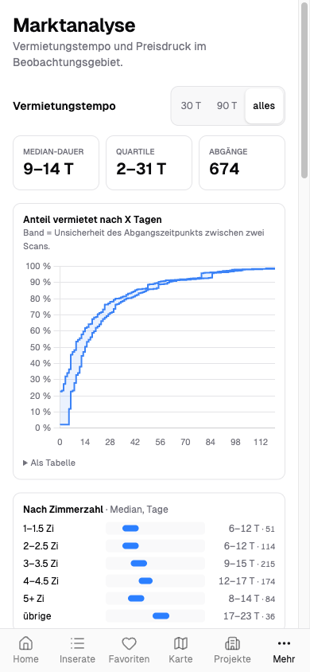
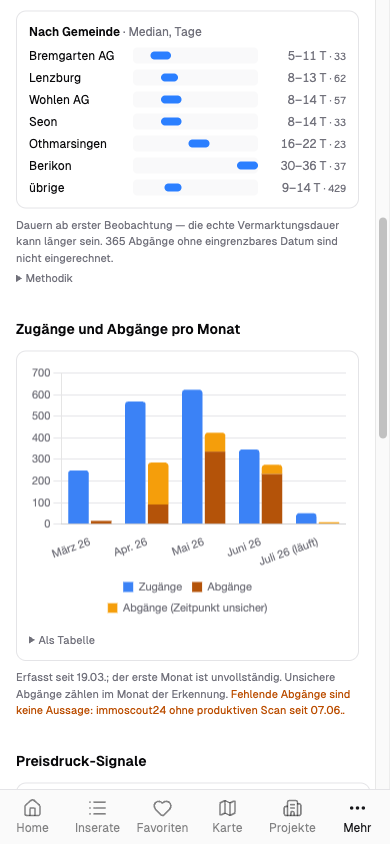
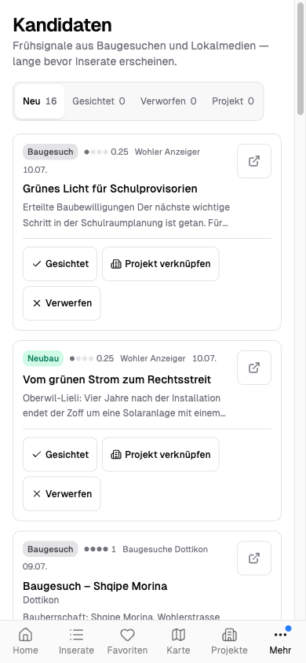

# Immo Monitor

Immo Monitor ist die **Web-App** über dem Mietmarkt-Monitoring rund um Dottikon AG: die Bedienoberfläche für Inserate, Karte, Marktanalyse und Neubau-Recherche. Die dahinterliegende Datenpipeline (Scraper, Enrichment, Foto-Download, Frühsignal-Ingest) beschreibt [Immobilien-Monitoring](../immobilien-monitoring/index.md) -- diese Seite behandelt das Frontend und seine Ableitungslogik.

## Übersicht

| Attribut | Wert |
|----------|------|
| URL | [immo.ackermannprivat.ch](https://immo.ackermannprivat.ch) |
| Deployment | Nomad Job `services/immo-monitor.nomad` |
| Storage | PostgreSQL `immo` -- siehe [Datenbanken](../_referenz/datenbanken.md) |
| Auth | `intern-auth@file` (intern, Authentik + IP-Allowlist) + `public-auth@file` (extern, Authentik + CrowdSec), Gruppen `admin` und `family` |
| Secrets | `kv/data/immo-monitor` |

## Rolle im Stack

Immo Monitor ersetzt die frühere Kombination aus Metabase + Leaflet + NocoDB durch eine fokussierte SvelteKit-App. Sie liest aus denselben PostgreSQL-Tabellen, die der [Scraper](../immobilien-monitoring/index.md) befüllt, leitet daraus jedoch **jeden angezeigten Zustand selbst** ab (siehe Statusmodell) und schreibt ausschliesslich Nutzer-Daten zurück (Favoriten, Notizen, Ablehnungen, Kandidaten-Sichtung). Der Scraper liefert die Rohdaten, die App verantwortet Interpretation und Darstellung.

## Architektur

```d2
vars: {
  d2-config: {
    theme-id: 1
    layout-engine: elk
  }
}

classes: {
  node: { style: { border-radius: 8 } }
  container: { style: { border-radius: 8; stroke-dash: 4 } }
}

direction: right

Browser: Browser { class: node }

Traefik: Traefik {
  class: container
  tooltip: "10.0.2.20"
  RI: "intern-auth@file (LAN/VPN)" { class: node }
  RE: "public-auth@file (extern)" { class: node }
  RP: "Photo Route (ohne Auth, hohe Priority)" { class: node }
}

App: "Immo Monitor (SvelteKit)" {
  class: node
  tooltip: "Drizzle ORM, Leaflet, shadcn-svelte, sharp"
}
PG: "PostgreSQL immo" {
  shape: cylinder
  tooltip: "Lesen; Schreiben nur auf Nutzer-Tabellen"
}
NFS: "NFS Photo-Archiv" {
  shape: cylinder
  tooltip: "Read-only Mount, Original-Fotos"
}
Cache: "Thumbnail-Cache" {
  shape: cylinder
  tooltip: "Schreibbarer Pfad ausserhalb des Read-only-Mounts"
}
Scraper: "immoscraper Batch-Job" { class: node }

Browser -> Traefik.RI: HTTPS intern
Browser -> Traefik.RE: HTTPS extern
Browser -> Traefik.RP: "Bilder /api/photos/*"
Traefik.RI -> App
Traefik.RE -> App
Traefik.RP -> App: "Path-Traversal-Schutz im Endpoint"
App -> PG: "Lesen (listing, project, project_candidate, ...)\nSchreiben (Favoriten, Notizen, Sichtung)"
App -> NFS: "Original-Bilder lesen"
App -> Cache: "Skalierte Varianten via sharp"
Scraper -> PG: Schreibt Inseratedaten
Scraper -> NFS: Schreibt Fotos
```

## Tech Stack

- **Frontend:** SvelteKit (Svelte 5, Runes) mit adapter-node
- **UI:** shadcn-svelte + Tailwind CSS v4 (Zinc + Amber)
- **ORM:** Drizzle ORM auf PostgreSQL
- **Karten:** Leaflet + CartoDB Positron + `leaflet.markercluster`
- **Bilder:** sharp (serverseitige Thumbnails)
- **Charts:** Chart.js

## Statusmodell: Lifecycle als SSOT

Kein Frontend-Code wertet `is_active` roh aus. Die **einzige** Stelle, die den Zustand eines Inserats bestimmt, ist `deriveLifecycle` in `src/lib/server/lifecycle.ts`. Alle Ansichten -- Home-KPIs, Filter, Karte, Marktanalyse, Vergleichsmiete -- fragen dieselbe Ableitung, damit Zahl und Filter nie auseinanderlaufen.

Der Zustand wird über zwei Achsen beschrieben:

- **Zustand:** aktiv, abgegangen oder unbestimmt
- **Konfidenz:** wie gut der Zustand belegt ist -- `beobachtet` (im Scan gesehen), `recherchiert` (aus externer Quelle) oder `unbestätigt`

Sieben Präzedenz-Regeln lösen die beiden Achsen deterministisch auf. `src/lib/server/scanHealth.ts` liefert dazu das Scan-Alter pro Portal: Ist der Portal-Scan veraltet, degradiert ein "aktiv" bewusst zu "zuletzt bestätigt am" -- die App behauptet nur so viel Aktualität, wie der letzte erfolgreiche Scan hergibt.

::: info Warum eine eigene Ableitung statt `is_active`
Ein `NULL` in `is_active` rutschte historisch als "verfügbar" durch, obwohl es das nicht bedeutet. Und der Abgangszeitpunkt eines Inserats ist grundsätzlich unscharf: Zwischen zwei Scans liegt im Median rund eine Woche. Ein scharfes Punktdatum wäre Schein-Präzision. Deshalb zeigt die App einen Abgang nach Grösse der Scan-Lücke abgestuft: bis zwei Tage als Einzeldatum mit Tilde, bis sieben Tage als Spanne (der Regelfall), darüber als offene Scan-Lücke statt als scheinpräzise Spanne. Berechnete Dauern tragen zusätzlich eine Qualität (exakt, Untergrenze, Obergrenze). Erfundene Punktwerte gibt es nicht.
:::

## Seiten

- **Home** (`/`): Dashboard mit KPIs und Überblick-Charts. Die KPIs laufen über dieselbe Lifecycle-Ableitung wie die Filter, nicht über rohe Zählungen.
- **Inserate** (`/inserate`): Filterbarer Card-Grid mit Favorit/Ablehnung/Vergleich. Filter leben im URL-Querystring (teilbare Links), die Liste rendert gefenstert mit Scroll-Erhalt, Titel werden normalisiert.
- **Inserat-Detail** (`/inserate/[id]`): Foto-Galerie, Kerndaten, Amenities, Notizfeld sowie Verlaufs-Timeline und Vergleichsmiete-Benchmark (siehe unten).
- **Favoriten** (`/favoriten`): Gleicher Card-Grid wie Inserate, vorgefiltert auf Favoriten.
- **Karte** (`/karte`): Einzelmarker-Karte mit Cluster nur bei echter Überlappung, farbkodiert nach CHF/m², Kartenausschnitt und Auswahl im URL-Hash, Bottom-Sheet auf Mobil (siehe unten).
- **Marktanalyse** (`/markt`): Vermietungstempo und Preisdruck im Beobachtungsgebiet (siehe unten).
- **Kandidaten** (`/kandidaten`): Frühsignal-Inbox für mögliche neue Projekte (siehe unten).
- **Projekte** (`/projekte`) und **Projekt-Detail** (`/projekte/[id]`): Neubauprojekte mit Status-Chips, Unit-Tabelle, verknüpften Inseraten, Beteiligten und Etappen-Unterprojekten.
- **Firmen/Personen** (`/firmen`, `/personen` und Detailseiten): Beteiligten-Netzwerk der Recherche (siehe Firmen- und Personen-Sektion).
- **Vergleich** (`/vergleich`): Side-by-Side-Tabelle für bis zu drei Inserate; erreichbar über den Zähler-Button im Inserate-Header.
- **About** (`/about`): Methoden-Transparenz -- Datenquellen, Farbskala, Statusherleitung, Bauzonen-Layer.

## Marktanalyse (`/markt`)

Die Marktanalyse verdichtet den Bestand zu Vermietungstempo und Preisdruck -- und macht ihre eigene Unsicherheit sichtbar, statt sie zu glätten.



- **Vermietungstempo:** Eine Kurve "Anteil vermietet nach X Tagen" (empirische Verteilungsfunktion) zeigt, wie schnell Inserate abgehen. Das eingezeichnete Band ist die Unsicherheit des Abgangszeitpunkts zwischen zwei Scans -- die Kurve ist absichtlich ein Korridor, keine scharfe Linie. Median-Dauer und Quartile stehen als Kacheln darüber, wahlweise über 30 / 90 Tage oder den ganzen Bestand.
- **Nach Zimmerzahl und Gemeinde:** Median-Streifen je Klasse, damit einzelne Ausreisser die Aussage nicht dominieren.



- **Absorption pro Monat:** Zugänge und Abgänge je Monat, wobei Abgänge mit nicht eingrenzbarem Zeitpunkt separat ausgewiesen werden. Fehlende Abgänge -- etwa weil ein Portal gerade keinen produktiven Scan hatte -- werden ehrlich als "keine Aussage" gekennzeichnet, nicht als Null.
- **Preisdruck-Signale:** Mietsenkungen (mit Artefakt-Filter oberhalb von 25 %, um Datenfehler von echten Senkungen zu trennen), Wiederinserate, Langläufer über 90 Tage und Aktions-Angebote (mietfrei, Gratismonat -- erkannt über Stichworte in Titel und Beschreibung).

## Frühsignal-Inbox (`/kandidaten`)

Die Kandidaten-Inbox sammelt Frühsignale für mögliche neue Bauprojekte -- Baugesuche und Meldungen aus Lokalmedien, lange bevor ein Inserat erscheint. Der Nav-Eintrag trägt als einziger einen Zähler-Badge mit der Zahl ungesichteter Kandidaten.



Jeder Kandidat lässt sich **sichten**, **verwerfen** oder mit einem **bestehenden Projekt verknüpfen**. Die Segmente (neu, gesichtet, verworfen, mit Projekt) leben als URL-Filter, sind also teilbar. Die Signale kommen aus der `project_candidate`-Tabelle, die ein täglicher Ingest-Job befüllt -- Herkunft, Regel-Klassifikation und Konfidenz beschreibt die [Frühsignal-Pipeline](../immobilien-monitoring/index.md#fruehsignal-pipeline).

Aus einem Kandidaten wird bewusst **kein** Projekt per Knopfdruck angelegt: Eine Neuanlage entsteht ausschliesslich über den Research-Skill mit seinen Geocode- und Duplikat-Guards, die Inbox verknüpft höchstens auf ein bereits recherchiertes Projekt. So bleibt der Projektbestand frei von ungeprüften Koordinaten und Doubletten.

## Karte

Die Karte zeigt Inserate und Projekte als Einzelmarker; benachbarte Marker werden erst bei echter Überlappung zu einem Cluster zusammengefasst und beim Klick animiert aufgefächert (Spiderfy). Inserate sind nach CHF/m² farbkodiert, Projekte tragen Status-Farben. Ein 7-km-Radius um Dottikon markiert das Beobachtungsgebiet. Darüber lassen sich weiterhin eine Heatmap (standardmässig aus) und zwei Aargauer WMS-Ebenen -- Bauzonen und Überbauungsstand -- als Overlays zuschalten.

Zoom, Kartenmittelpunkt und die aktuelle Auswahl leben im **URL-Hash**: Ein Kartenausschnitt lässt sich damit teilen, und Vor/Zurück im Browser navigiert durch frühere Ausschnitte. Unter der `md`-Breite ersetzt ein Bottom-Sheet die Leaflet-Popups, damit die Detailinfos auf dem Telefon bedienbar bleiben.

## Inserat-Detail: Timeline und Vergleichsmiete

Die Detailseite eines Inserats fasst seinen Verlauf und seine Einordnung zusammen -- beides auf der Lifecycle-Ableitung, nie auf rohem `is_active`.

- **Verlaufs-Timeline:** erstmalige Sichtung mit Quelle (recherchierter Vermarktungsstart, manueller Override oder Scraper-Datum), Preisänderungen und -- falls abgegangen -- das Abgangs-Intervall statt eines Punktdatums.
- **Vergleichsmiete-Benchmark:** ordnet die CHF/m² gegen eine Vergleichsgruppe der gleichen Zimmerklasse im Beobachtungsgebiet ein, die aktiv oder in den letzten zwölf Monaten abgegangen ist. Liegen weniger als 15 Vergleichswerte vor, trifft die App bewusst **keine** Aussage, statt aus zu wenig Daten eine Scheinaussage zu bilden.

## Datenmodell: Listings vs. Projekte

Zwei unabhängige Datenquellen laufen nebeneinander:

- **`listing`** wird vom Scraper befüllt und über `is_active` verwaltet. Für die Anzeige ist nicht dieses Feld massgeblich, sondern die Lifecycle-Ableitung.
- **`project`** und **`project_unit`** werden manuell über den Research-Skill gepflegt. Der Scraper aktualisiert diese Tabellen **nicht**.
- Die `project_listing`-Junction verknüpft Inserate mit Neubauprojekten (etwa alle Mattenpark-Inserate mit ihren beiden Etappen-Projekten).

::: warning Kein automatisches Status-Tracking auf Projektebene
Wird ein Inserat inaktiv, bleibt der verknüpfte `project_unit.status` unverändert. `project.status = completed` heisst "Bau fertig", nicht "vollvermietet". Die Ground Truth auf Unit-Ebene muss über die Projekt-Websites nachgezogen werden.
:::

### Status-Werte

`project_unit.status`: `planned`, `available`, `reserved`, `rented`, `sold`.
`project.status`: `planning`, `construction`, `completed`, `established`.

### Etappen via `parent_project_id`

Mehrstufige Projekte werden als Parent mit Kindern modelliert; die Detailseite zeigt Kinder-Projekte als klickbare Verknüpfung. Beispiele sind das Mattenpark-Areal (zwei Etappen) und das Furter Areal Im Holzpark (Parent mit Bestands- und Neubau-Etappen).

## Firmen- und Personen-Sektion

Die Routes `/firmen`, `/firmen/[id]`, `/personen` und `/personen/[id]` bilden beteiligte Firmen und Personen ab, bidirektional mit Projekten verknüpft. Auslöser war die Tiefenrecherche zum Furter-Areal in Dottikon: Die textuellen `developer`/`architect`/`general_contractor`-Felder pro Projekt skalieren nicht, weil eine Firma in mehreren Projekten auftaucht und eine Person mehrere Firmen-Mandate hält. Der eigentliche Recherche-Wert ist die Netzwerk-Analyse -- wer sitzt mit wem im Verwaltungsrat. Mit `company`- und `person`-Entitäten lassen sich diese Beziehungen sauber abbilden und auf eigenen Detailseiten visualisieren.

### Relationen-Datenmodell

Sieben Tabellen in `src/lib/server/db/schema.ts` ergänzen das Listing-/Projekt-Schema:

- **`company`** -- Stammdaten einer Firma (Name, Slug, UID, Kategorie, Adresse, Gründungsjahr, optionale `parent_company_id`).
- **`company_source`** -- Quellen-URLs pro Firma (Moneyhouse, Zefix, eigene Website, Presse).
- **`person`** -- Personen mit Name, Slug, Beschreibung. Nur Handelsregister-Öffentlichkeit, keine privaten Daten.
- **`person_company`** -- Rolle einer Person in einer Firma mit optionalem Zeitraum.
- **`project_company`** -- Rolle einer Firma in einem Projekt.
- **`project_person`** -- direkte Personen-Referenz pro Projekt.
- **`project_photo`** -- Projekt-Fotos ohne Umweg über `listing_photo`, kategorisiert nach Etappe, Typologie und Kategorie.

::: info Freitext mit kuratierter Wertetabelle
`company.category`, `person_company.role` und `project_company.role` sind `text`-Felder mit einer kuratierten Wertetabelle in `src/lib/constants/roles.ts`. Neue Werte kommen ohne Migration hinzu; unbekannte Werte werden mit einem Default-Badge gerendert, damit sie im UI sichtbar bleiben. Die `value`-Schlüssel sind die in der DB gespeicherten Enum-Werte und dürfen nicht "korrigiert" werden -- sonst fallen alle Rollen stumm auf "Andere" zurück.
:::

### Netzwerk-Diagramme

Fünf D2-Diagramme in `src/lib/diagrams/` werden über `scripts/build-diagrams.sh` statisch zu SVG nach `static/diagrams/` gerendert und als Bild eingebunden -- das vermeidet Client-seitiges Rendering. Sie zeigen die Furter-/ffbk-Gruppe, die Schäfer-Gruppe, die Verflechtung zwischen beiden, einen Zeitstrahl über vier Generationen und die Etappen-Übersicht des Holzparks.

## Vermarktungsstart-Tracking

Homegate vergibt bei Re-Listings (gleiche Wohnung, neue externe ID) einen neuen `createdAt`-Zeitstempel. Der Scraper-`first_seen_at` entspricht damit nicht dem tatsächlichen Vermarktungsstart -- ein seit Monaten laufendes Inserat wirkt sonst brandneu.

Eine Prioritätskette löst das "erstmals gesehen"-Datum auf:

1. **`listing_external_id_history`** -- recherchierter echter Vermarktungsstart (Projekt-Websites, Wayback Machine, Presse). Exakter Wert.
2. **`listing.first_seen_at_override`** -- schneller manueller Override pro Inserat.
3. **`listing.first_seen_at`** -- Scraper-`createdAt` als Fallback, im Frontend mit `min.`-Prefix markiert, weil der echte Wert älter sein kann.

Die Quelle wird als `firstSeenSource` (`history` / `override` / `scraper`) an die Komponenten weitergereicht; der `min.`-Prefix erscheint nur bei `scraper`. Für Projekt-Units greift zusätzlich `project.marketing_started_at`, sodass sich ganze Etappen auf einmal datieren lassen.

## Foto-Auslieferung

Die Fotos werden nicht vom Homegate-CDN geladen, sondern als lokale Kopie auf der Synology-NFS-Share ausgeliefert. Der Container mountet das Foto-Archiv read-only und liefert die Bilder über die dedizierte Route `/api/photos/*` aus.

::: info Warum lokal archivieren
Homegate-CDN-URLs enthalten signierte Query-Parameter, die nach einigen Tagen ablaufen. Deaktivierte Inserate verlören damit rückwirkend ihre Fotos. Die NFS-Kopie garantiert, dass historische Inserate und Preisverläufe auch nach Monaten mit Bildern angezeigt werden.
:::

### Thumbnails via sharp

Statt jedes Bild in Originalgrösse auszuliefern, skaliert die App on-the-fly mit sharp. Der Query-Parameter `?w=` wählt eine von vier festen Breiten (160, 480, 960, 1600 px); das Frontend hängt für Listen- und Detailbilder ein `srcset` mit 1x/2x-Variante an. Die feste Grössenpalette verhindert einen unbegrenzt wachsenden Cache.

Skalierte Varianten landen nach Breite getrennt in einem Disk-Cache. Weil der Foto-Mount `/photos` im Container read-only (NFS) ist, setzt der Nomad-Job den Cache-Pfad (`PHOTOS_CACHE_DIR`) auf ein schreibbares Verzeichnis ausserhalb des Mounts. Der Cache-Write ist best-effort und atomar (temporäre Datei + rename): Schlägt er fehl, wird die skalierte Variante trotzdem ausgeliefert. Fällt sharp für ein Bild ganz aus, liefert der Endpoint unverändert das Original -- die Bildauslieferung bricht nie ab.

### Traefik-Route ohne Authentik

Die Route `/api/photos/*` läuft **ohne** Authentik-Middleware, weil Authentik bei jedem Bild-Request einen OIDC-Flow anstossen würde. Der Zugriffsschutz kommt stattdessen aus dem Endpoint selbst: Pfade mit `..` werden abgewiesen (Path-Traversal-Schutz, auch für den Cache-Pfad), und es gibt kein Directory-Listing.

::: warning Router-Priority der Photo-Route
Die Photo-Route braucht eine höhere `priority` als die Host-basierten Default-Router. Ist sie zu niedrig, greift die Authentik-Kette und Bilder werden mit 302 auf den Login umgeleitet. Der Wert ist im Nomad Job gesetzt.
:::

## Mobile-Navigation

Auf dem Telefon trägt die Bottom-Leiste sechs Ziele: fünf Tabs (Home, Inserate, Favoriten, Karte, Projekte) und ein "Mehr"-Sheet. Das Sheet bündelt die sekundären Routen (Marktanalyse, Kandidaten, Firmen, Personen, About) -- die Marktanalyse ist mobil bewusst kein siebter Tab, sondern lebt im Sheet und als Kachel auf der Home-Seite. Der Vergleich sitzt als Icon-Button mit Zähler im Inserate-Header.

## Betrieb: Schema und Deploy

Schemaänderungen laufen über den Drizzle-Migrationsverlauf: `schema.ts` anpassen, `npm run db:generate`, die erzeugte SQL prüfen, dann `npm run db:migrate`. `drizzle-kit push` wird bewusst nicht gegen die Produktionsdatenbank gefahren -- es protokolliert nichts und entfernt, was es nicht kennt; genau daraus sind frühere stille Schema-Drifts entstanden.

Vor dem Deploy greift ein CI-Gate: `lint` (prettier + eslint) und `check` (svelte-check) müssen grün sein, bevor der Nomad-Job neu ausgerollt wird.

## Datenbank

Die App nutzt die PostgreSQL-Datenbank `immo`, in der der DB-User `immo` volle Rechte hat. Verbindungsdaten, User und Vault-Pfad sind kanonisch in [Datenbanken](../_referenz/datenbanken.md) hinterlegt.

## Verwandte Seiten

- [Immobilien-Monitoring](../immobilien-monitoring/index.md) -- Datenpipeline: Scraper, Enrichment, Foto-Download, Frühsignal-Ingest und DB-Schema
- [NAS Storage](../nas-storage/index.md) -- NFS-Share für das Photo-Archiv
- [Metabase](../metabase/index.md) -- alternatives BI-Dashboard auf denselben Daten
- [Traefik Referenz](../traefik/referenz.md) -- Middleware Chains für die Authentifizierung
