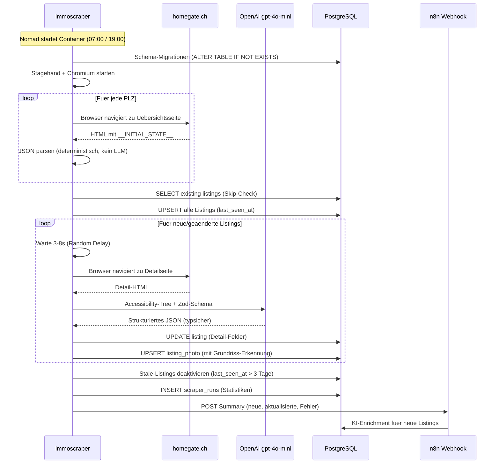

# Immobilien-Monitoring

## Uebersicht

| Attribut | Wert |
| :--- | :--- |
| **Status** | Aktiv (v3 -- Stagehand) |
| **Zweck** | Mietmarkt-Monitoring fuer MFH-Neubau Dottikon AG |
| **Scraper** | Docker Container (Node.js + Stagehand + Chromium) |
| **n8n** | [n8n.ackermannprivat.ch](https://n8n.ackermannprivat.ch) |
| **Metabase** | [metabase.ackermannprivat.ch](https://metabase.ackermannprivat.ch) |
| **Nomad Job** | `services/immoscraper.nomad` (Periodic Batch, 07:00 + 19:00) |
| **Datenbank** | PostgreSQL `n8n` (Tabellen: `listing`, `listing_photo`, `scraper_runs`) |
| **Repo** | `nomad-jobs/services/n8n-workflows/scraper/` |

## Beschreibung

Automatisiertes Monitoring von Mietinseraten in der Region Dottikon/Wohlen AG. Ein KI-gesteuerter Browser-Agent (Stagehand + Playwright) besucht Immobilienportale, extrahiert strukturierte Daten via Zod-Schema und schreibt direkt in PostgreSQL. n8n uebernimmt das Post-Processing (KI-Enrichment, Stale-Deaktivierung).

## Architektur (v3)

```mermaid
flowchart TB
    subgraph nomad ["Nomad (Periodic Batch 07:00 + 19:00)"]
        SC:::entry["immoscraper Container<br/>(Node.js + Stagehand + Chromium)"]
    end

    subgraph portale ["Immobilienportale"]
        HG:::ext[Homegate]
        IS:::ext[ImmoScout24]
        CP:::ext[Comparis]
        FF:::ext[Flatfox]
        EB:::ext[erstbezug.ch]
    end

    subgraph ai ["KI (extern)"]
        GPT:::accent[OpenAI gpt-4o-mini<br/>Strukturierte Outputs]
    end

    subgraph pg ["PostgreSQL (Nomad)"]
        LS:::db[(listing)]
        LP:::db[(listing_photo)]
        SR:::db[(scraper_runs)]
    end

    subgraph n8n ["n8n (Post-Processing)"]
        WH:::svc[Webhook Trigger]
        KI:::accent[KI Enrichment<br/>Sub-Workflow]
        ST:::svc[Stale-Deaktivierung]
    end

    MB:::accent[Metabase Dashboard]

    SC -->|1. Browser besucht| portale
    SC -->|2. Stagehand extract()| GPT
    GPT -->|3. Strukturierte JSON| SC
    SC -->|4. UPSERT| LS
    SC -->|4. UPSERT| LP
    SC -->|4. INSERT| SR
    SC -->|5. POST Summary| WH
    WH --> KI
    WH --> ST
    KI -->|Enrichment| LS
    ST -->|Deaktivierung| LS

    LS --> MB
    LP --> MB
    SR --> MB

    classDef ext fill:#fef2f2,stroke:#e11d48,stroke-width:1.5px,color:#1e293b
    classDef db fill:#eff6ff,stroke:#3b82f6,stroke-width:1.5px,color:#1e293b
    classDef svc fill:#ecfdf5,stroke:#10b981,stroke-width:1.5px,color:#1e293b
    classDef entry fill:#fefce8,stroke:#eab308,stroke-width:1.5px,color:#1e293b
    classDef accent fill:#ede9fe,stroke:#7c3aed,stroke-width:2px,color:#1e293b
```

## Kernkonzept: Smart Skipping

Statt jedes Listing bei jedem Run komplett zu scrapen:

1. **Uebersichtsseite** liefert: `external_id`, Preis, Zimmer, Titel (Vorschau-Daten)
2. **DB-Abgleich** pro Listing:
   - `external_id` NICHT in DB -- NEU -- Detail-Scrape + Insert
   - `external_id` in DB, Preis GLEICH -- BEKANNT -- nur `last_seen_at` updaten
   - `external_id` in DB, Preis ANDERS -- GEAENDERT -- Detail-Re-Scrape + Update
   - `external_id` in DB, `detail_scraped_at IS NULL` -- FEHLEND -- Detail-Scrape nachholen

Erster Tag: ~200 Detail-Scrapes. Danach: ~5-20 pro Tag. Massiv guenstigere LLM-Kosten.

## Datenquellen

| Portal | Uebersichts-Extractor | Detail-Extractor | Anti-Bot |
| :--- | :--- | :--- | :--- |
| **Homegate** | `__INITIAL_STATE__` (deterministisch, 0 LLM) | Stagehand + gpt-4o-mini | DataDome (Browser umgeht) |
| **ImmoScout24** | Stagehand (geplant) | Stagehand + gpt-4o-mini | DataDome |
| **Comparis** | Stagehand (geplant) | Stagehand + gpt-4o-mini | DataDome |
| **Flatfox** | Stagehand (geplant) | Stagehand + gpt-4o-mini | Keines |
| **erstbezug.ch** | HTML Parsing (geplant) | Stagehand + gpt-4o-mini | Keines |

### Region / PLZ

Dottikon (5605), Hendschiken (5604), Othmarsingen (5504), Haegglingen (5607), Villmergen (5612), Wohlen AG (5610)

## Ablauf pro Scraper-Run



## Komponenten

### 1. immoscraper (Docker Container)

TypeScript-Projekt mit Stagehand (KI Browser Agent) und Playwright.

**Warum Stagehand statt Cookie-Relay:**
- Echter Browser umgeht DataDome ohne Cookie-Management
- KI-Extraktion mit Zod-Schema liefert typsichere, strukturierte Daten
- Selector-Caching spart ~80% LLM-Kosten bei Wiederholungen
- Accessibility-Tree statt Screenshots: 10x guenstiger als Vision

**Konfiguration:** Portal-Definitionen in `src/config/portals.ts`

**LLM:** OpenAI gpt-4o-mini ($0.15/1M Input, $0.60/1M Output) -- strukturierte Outputs via Zod-Schema garantieren valides JSON.

### 2. n8n Workflows

| Workflow | Trigger | Funktion |
| :--- | :--- | :--- |
| **Scraper Post-Processing** | Webhook POST `/webhook/scraper-summary` | Empfaengt Summary, startet KI-Enrichment, deaktiviert Stale |
| **KI Enrichment** | Sub-Workflow | OpenAI gpt-4o-mini analysiert Beschreibung (Stockwerk, Balkon, Minergie, etc.) |

::: info Deprecated Workflows
Die folgenden Workflows aus v2 werden nicht mehr benoetigt:
- `01-cookie-receiver.json` -- Cookie-Management entfaellt
- `02-homegate-scraper.json` -- Durch immoscraper ersetzt
- `04-erstbezug-scraper.json` -- Wird in immoscraper integriert
- `cookie-refresh.mjs` -- Playwright laeuft direkt im Container
:::

### 3. Metabase

BI-Dashboard fuer die Visualisierung der gesammelten Daten.

- **Datenquelle:** PostgreSQL `n8n`, User `metabase_reader` (read-only)
- **Dashboards:** Uebersicht (Scorecards), Karte (Pin Map), Detailtabelle, Preisvergleich, Scraper-Statistiken

## Datenbank-Schema

### listing

Haupttabelle fuer alle Inserate. Unique Constraint auf `(portal, external_id)` fuer UPSERT-Logik.

Basis-Felder: `portal`, `external_id`, `url`, `title`, `description`, `listing_type`, `address_raw`, `zip_code`, `city`, `canton`, `latitude`, `longitude`, `rooms`, `area_m2`, `rent_net`, `rent_gross`, `costs_additional`, `available_from`, `raw_data` (JSONB), `first_seen_at`, `last_seen_at`, `is_active`

Detail-Felder (v3, via Stagehand): `floor`, `year_built`, `year_renovated`, `heating_type`, `energy_label`, `pets_allowed`, `laundry`, `amenities` (JSONB), `detail_scraped_at`

### listing_photo

Foto-URLs zu Inseraten, verknuepft via `listing_id` Foreign Key (CASCADE DELETE).

v3 Erweiterungen: `is_floorplan` (boolean), `caption` (text)

### scraper_runs (neu in v3)

Zusammenfassung pro Scraper-Lauf fuer Monitoring.

Felder: `portal`, `started_at`, `finished_at`, `listings_new`, `listings_updated`, `listings_skipped`, `details_scraped`, `errors`, `error_details` (JSONB), `duration_ms`

## Betrieb

### Normalbetrieb

Alles laeuft automatisch via Nomad Periodic Batch:

1. **07:00** -- Nomad startet immoscraper Container
2. Container: Chromium starten, Uebersichtsseiten besuchen, Smart Skipping, Detail-Scrapes
3. Container: Summary an n8n Webhook senden
4. n8n: KI-Enrichment + Stale-Deaktivierung
5. Container beendet sich, Nomad raeaumt auf
6. **19:00** -- Zweiter Lauf

### Monitoring

| Ebene | Was | Wo sichtbar |
| :--- | :--- | :--- |
| **Nomad Logs** | Strukturierte JSON-Logs pro Lauf | `nomad alloc logs <alloc-id>` |
| **n8n Executions** | Post-Processing Workflow | n8n UI -- Executions Tab |
| **DB: scraper_runs** | Statistiken pro Lauf | Metabase Dashboard |
| **Metabase** | Listings/Tag, Fehlerrate, Portal-Vergleich | Metabase UI |

### Troubleshooting

**Container startet nicht:**
- `nomad job status immoscraper` -- Allocation-Status pruefen
- `nomad alloc logs <alloc>` -- Fehlerlogs lesen

**DataDome blockiert Stagehand:**
- Unwahrscheinlich (echter Chromium-Browser), aber moeglich bei Fingerprint-Aenderungen
- Pruefe ob `__INITIAL_STATE__` in den Logs erscheint
- Fallback: User-Agent oder Viewport in `localBrowserLaunchOptions` anpassen

**Keine neuen Listings:**
- `SELECT * FROM scraper_runs ORDER BY id DESC LIMIT 5` -- Lauf-Statistiken pruefen
- Wenn `listings_new = 0` und `listings_skipped > 0`: Smart Skipping funktioniert korrekt, keine neuen Inserate

**Detail-Extraktion schlaegt fehl:**
- Stagehand-Cache loeschen: NFS Volume `/nfs/docker/immoscraper/cache/` leeren
- Pruefe ob sich die Seitenstruktur von Homegate geaendert hat

### Vault Secrets

| Pfad | Keys |
| :--- | :--- |
| `kv/data/n8n` | `db_password`, `encryption_key` |
| `kv/data/immoscraper` | `openai_api_key` |
| `kv/data/metabase` | `db_password`, `n8n_reader_password` |

### Kostenabschaetzung

| Posten | Berechnung | Kosten/Monat |
| :--- | :--- | :--- |
| Neue Detail-Scrapes | ~20/Tag x 30 x $0.003 | ~$1.80 |
| Re-Scrapes (geaenderte) | ~10/Tag x 30 x $0.003 | ~$0.90 |
| KI-Enrichment (neue) | ~20/Tag x 30 x $0.002 | ~$1.20 |
| **Total** | | **~$3.90 (~CHF 3.50)** |

Deutlich unter CHF 10/Monat dank Smart Skipping und Stagehand Selector-Caching.

## Verwandte Seiten

- [n8n](../n8n/index.md) -- Workflow-Automation für Post-Processing und KI-Enrichment
- [Metabase](../metabase/index.md) -- BI-Dashboard für die Visualisierung der Daten
- [ChangeDetection](../changedetection/index.md) -- Ergänzende Website-Überwachung
- [Datenbank-Architektur](../_querschnitt/datenbank-architektur.md) -- PostgreSQL Shared Cluster
