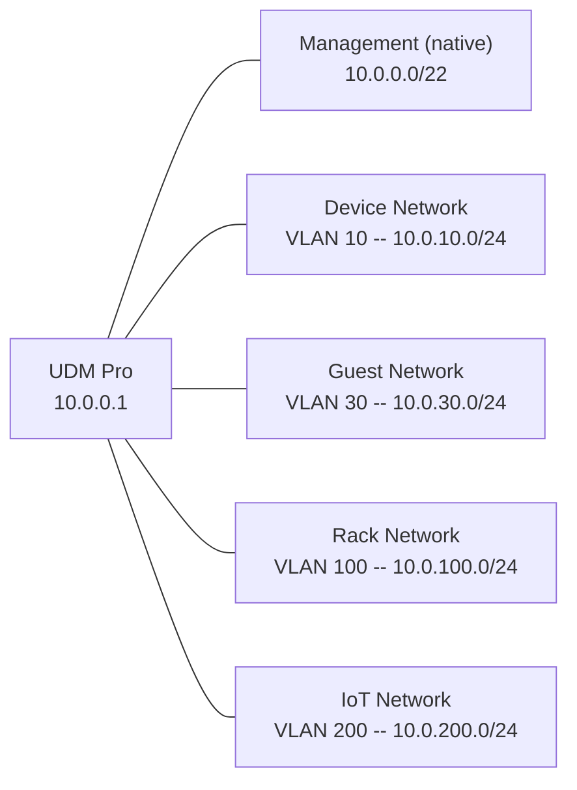

# Netzwerk

## Übersicht

Das Homelab ist in mehrere Netzwerk-Segmente (VLANs) aufgeteilt, die über einen UniFi Dream Machine Pro geroutet werden. Der WAN-Uplink läuft über SFP+ (eth9) via ISP-Router, die öffentliche IP ist dynamisch.

::: warning Unvollständig
Folgende Details fehlen noch:
- Firewall-Regeln zwischen VLANs
- Inter-VLAN Routing-Konfiguration
- Tailscale Exit-Node Konfiguration
:::

## Netzwerk-Diagramm

```mermaid
flowchart TB
    subgraph WAN["WAN / Internet"]
        ISP:::ext["ISP Router"]
    end

    subgraph Core["Core Network"]
        UDMPRO:::accent["UDM Pro (Router)"]
        USL8A:::accent["USL8A (10G Aggregation)"]
    end

    subgraph MGMT["Management (native) 10.0.0.0/22"]
        PVE00:::svc["pve00 - 10.0.2.40"]
        PVE01:::svc["pve01 - 10.0.2.41"]
        PVE02:::svc["pve02 - 10.0.2.42"]
        DNS01:::entry["lxc-dns-01 - 10.0.2.1"]
        DNS02:::entry["lxc-dns-02 - 10.0.2.2"]
        TRF01:::svc["vm-traefik-01 - 10.0.2.21"]
        TRF02:::svc["vm-traefik-02 - 10.0.2.22"]
        NS04:::svc["vm-nomad-server-04 - 10.0.2.104"]
        NS05:::svc["vm-nomad-server-05 - 10.0.2.105"]
        NS06:::svc["vm-nomad-server-06 - 10.0.2.106"]
        NC04:::svc["vm-nomad-client-04 - 10.0.2.124"]
        NC05:::svc["vm-nomad-client-05 - 10.0.2.125"]
        NC06:::svc["vm-nomad-client-06 - 10.0.2.126"]
        PBS:::svc["pbs-backup-server - 10.0.2.50"]
        CMK:::svc["checkmk - 10.0.2.150"]
        DCM:::svc["datacenter-manager - 10.0.2.60"]
    end

    subgraph DEV["Device Network VLAN 10"]
        DEVGW:::entry["Gateway - 10.0.10.1"]
    end

    subgraph GUEST["Guest Network VLAN 30"]
        GUESTGW:::entry["Gateway - 10.0.30.1"]
    end

    subgraph RACK["Rack Network VLAN 100"]
        RACKGW:::entry["Gateway - 10.0.100.1"]
    end

    subgraph IOT["IoT Network VLAN 200"]
        NAS:::db["Synology NAS - 10.0.0.200"]
        HA:::svc["Home Assistant"]
        ZIG:::svc["Zigbee Node"]
    end

    subgraph TB["Thunderbolt P2P 10.99.1.0/24"]
        TB01:::accent["pve01-tb - 10.99.1.1"]
        TB02:::accent["pve02-tb - 10.99.1.2"]
    end

    subgraph TS["Tailscale Overlay 100.64.0.0/10"]
        TAIL:::ext["Tailscale CGNAT"]
    end

    ISP -->|"SFP+ (eth9)"| UDMPRO
    UDMPRO --> USL8A
    USL8A --> MGMT
    USL8A --> DEV
    USL8A --> GUEST
    USL8A --> RACK
    USL8A --> IOT
    TB01 <-->|"~20 Gbps DRBD + Migration"| TB02
    TAIL -.->|"VPN Overlay"| UDMPRO

    classDef ext fill:#fef2f2,stroke:#e11d48,stroke-width:1.5px,color:#1e293b
    classDef db fill:#eff6ff,stroke:#3b82f6,stroke-width:1.5px,color:#1e293b
    classDef svc fill:#ecfdf5,stroke:#10b981,stroke-width:1.5px,color:#1e293b
    classDef entry fill:#fefce8,stroke:#eab308,stroke-width:1.5px,color:#1e293b
    classDef accent fill:#ede9fe,stroke:#7c3aed,stroke-width:2px,color:#1e293b
```

## VLAN-Diagramm



## Netzwerk-Segmente

| Segment | Subnetz | VLAN | Verwendung | Gateway |
|---------|---------|------|------------|---------|
| **Management** | 10.0.0.0/22 | native | VMs, Proxmox, Services | 10.0.0.1 |
| **Device Network** | 10.0.10.0/24 | 10 | Endgeräte | 10.0.10.1 |
| **Guest Network** | 10.0.30.0/24 | 30 | Gäste-WLAN | 10.0.30.1 |
| **Rack Network** | 10.0.100.0/24 | 100 | Rack-Infrastruktur | 10.0.100.1 |
| **IoT Network** | 10.0.200.0/24 | 200 | Home Assistant, Zigbee, NAS | 10.0.200.1 |
| **Docker Proxy** | 192.168.90.0/24 | - | Traefik Proxy Network (intern) | - |
| **Thunderbolt** | 10.99.1.0/24 | - | Peer-to-Peer DRBD-Replikation, VM-Migration | - |
| **Tailscale** | 100.64.0.0/10 | - | Remote Access (CGNAT Overlay) | - |

## DNS

| Rolle | IP | Host | Beschreibung |
|-------|-----|------|-------------|
| Primärer DNS | 10.0.2.1 | lxc-dns-01 | Pi-hole v6 + Unbound + Consul DNS |
| Sekundärer DNS | 10.0.2.2 | lxc-dns-02 | Pi-hole v6 + Unbound + Consul DNS |
| Traefik VIP | 10.0.2.20 | Keepalived | Reverse Proxy HA (vm-traefik-01/02) |

Vollständige DNS-Architektur: [DNS](../dns/)

## Thunderbolt-Netzwerk

Zwei Thunderbolt 4 Kabel verbinden pve01 und pve02 direkt für High-Speed Datenverkehr. Ein Linux Bond (`bond-tb`, active-backup) aggregiert beide Interfaces.

| Funktion | Details |
|----------|---------|
| Bandbreite | ~20 Gbps |
| Bonding Mode | active-backup |
| Bridge | vmbr-tb |
| Zweck | DRBD-Replikation, VM-Migration |

Details zur Konfiguration und IP-Zuordnung: [Proxmox](../proxmox/)

## Tailscale

Tailscale wird für den Remote-Zugang verwendet. Geräte erhalten IPs aus dem CGNAT-Bereich 100.64.0.0/10.

::: warning Unvollständig
- Exit-Node Konfiguration
- Welche Nodes sind Tailscale-Mitglieder
- Subnet-Router Konfiguration
- ACL-Regeln
:::

## Externe Erreichbarkeit

Alle externen Services sind über `*.ackermannprivat.ch` erreichbar. Traefik (VIP 10.0.2.20, Keepalived HA) terminiert TLS mit Cloudflare-Zertifikaten.

Middleware-Chains und Zugangssteuerung: [Traefik](../traefik/)

## Hardware

### Router

| Eigenschaft | Wert |
|-------------|------|
| Modell | UniFi Dream Machine Pro (UDMPRO) |
| Firmware | 5.0.16 |
| WAN | SFP+ (eth9) via ISP-Router, öffentliche IP dynamisch |
| LAN-Ports | 8x RJ45 1G, 1x RJ45 WAN (nicht verbunden), 1x SFP+ WAN (aktiv), 1x SFP+ LAN |
| Controller | Integriert (UniFi Network 5.0.16) |
| URL | `https://10.0.0.1` |

### Switches

| Switch | Modell | Ports | PoE | Standort |
|--------|--------|-------|-----|----------|
| 10G-Switch-Rack | USL8A (Aggregation) | 8x SFP+ | - | Rack |
| POE-Switch-Keller | US-8-60W | 8 | 60W | Keller |
| 1G-Switch-Kammerli | US-24 | 24 | - | Kämmerli |
| US-24 | US-24 | 24 | - | unbekannt |
| US-8-150W | US-8-150W | 8 | 150W | unbekannt |
| USW-Flex-Mini-Dani | USW Flex Mini | 5 | - | Zimmer Dani |
| USW-Flex-Mini-Gaeste | USW Flex Mini | 5 | - | Gästezimmer |

### Access Points

| AP | Modell | Standort | Band | PoE |
|----|--------|----------|------|-----|
| AP-AC-LR-Werkstadt | UAP-AC-LR | Werkstatt | 2.4+5 GHz | ja |
| AP-AC-LR-Dani | UAP-AC-LR | Zimmer Dani | 2.4+5 GHz | ja |
| AP-AC-LR-Gaste | UAP-AC-LR | Gästezimmer | 2.4+5 GHz | ja |
| AP-AC-LR-Koffer | UAP-AC-LR | Kofferraum(?) | 2.4+5 GHz | ja |
| AP-AC-LR-Garage | UAP-AC-LR | Garage | 2.4+5 GHz | ja |
| AP-U6-PRO-Nina | UAP-U6-Pro | Zimmer Nina | 2.4+5 GHz | ja |
| AP-U6-PRO-Kuche | UAP-U6-Pro | Küche | 2.4+5 GHz | ja |

### VLAN-Konfiguration

| VLAN ID | Name | Subnetz | Gateway | Beschreibung |
|---------|------|---------|---------|--------------|
| native | Management | 10.0.0.0/22 | 10.0.0.1 | VMs, Proxmox, Services |
| 10 | Device Network | 10.0.10.0/24 | 10.0.10.1 | Endgeräte |
| 30 | Guest Network | 10.0.30.0/24 | 10.0.30.1 | Gäste-WLAN |
| 100 | Rack Network | 10.0.100.0/24 | 10.0.100.1 | Rack-Infrastruktur |
| 200 | IoT Network | 10.0.200.0/24 | 10.0.200.1 | Home Assistant, Zigbee, NAS |

### Verkabelung

| Strecke | Kabeltyp | Länge | Bemerkung |
|---------|----------|-------|-----------|
| pve01 -- pve02 | 2x Thunderbolt 4 | unbekannt | DRBD + Migration |
| Server -- Switch | unbekannt | unbekannt | - |

## Verwandte Seiten

- [UniFi](../unifi/) -- Controller, Geräte, WLAN, Firewall-Konfiguration
- [Proxmox](../proxmox/) -- Cluster-Knoten und VM-Übersicht
- [DNS](../dns/) -- Pi-hole, Unbound, Consul DNS
- [Traefik](../traefik/) -- Reverse Proxy und Middleware Chains
- [Hosts und IPs](../_referenz/hosts-und-ips.md) -- Vollständige IP-Zuordnung
