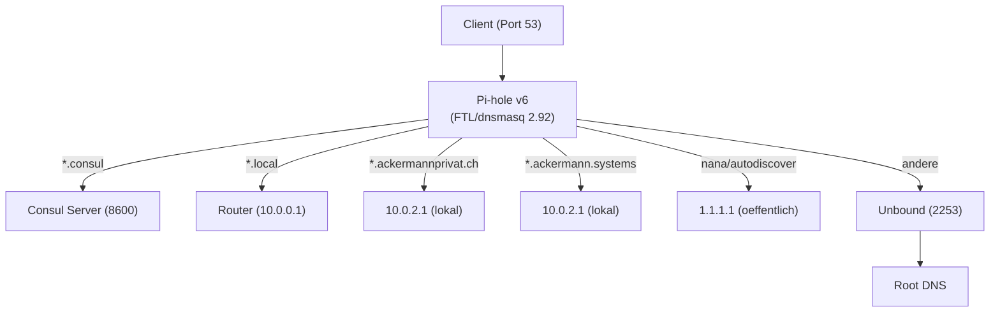
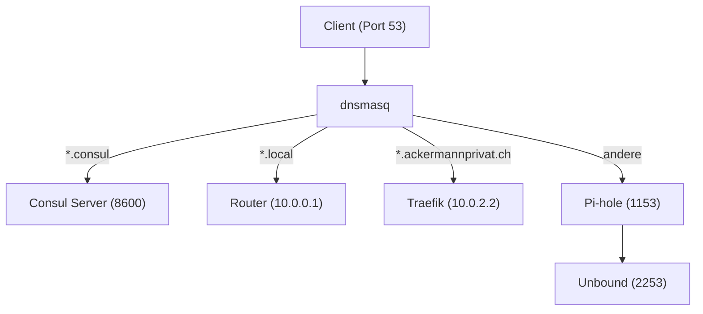

# DNS-Architektur

## Uebersicht

| Eigenschaft | Wert |
|-------------|------|
| Primaerer DNS | 10.0.2.1 (vm-proxy-dns-01) |
| Sekundaerer DNS | 10.0.2.2 (vm-vpn-dns-01) |
| Deployment | Docker Compose (Ansible-managed) |
| Blocklists | ~709K unique Domains (29 Listen inkl. OISD Big) |

## DNS-Kette

### Primaer (10.0.2.1) — Pi-hole direkt

### Sekundaer (10.0.2.2) — Legacy-Stack

::: info Migration 22.02.2026
Der primaere DNS (10.0.2.1) wurde am 22.02.2026 von einem separaten dnsmasq + Pi-hole Stack auf **Pi-hole v6 direkt auf Port 53** migriert. Pi-hole v6 (FTL v6.5) enthaelt ein eingebettetes dnsmasq 2.92, das alle bisherigen dnsmasq-Regeln (Conditional Forwarding, lokale Records, Wildcards) uebernimmt. Der sekundaere DNS (10.0.2.2) laeuft noch auf dem alten Stack.
:::

## Komponenten

### Pi-hole v6 (Primaer)

Pi-hole v6 mit eingebettetem dnsmasq 2.92 (FTL v6.5) uebernimmt auf 10.0.2.1 die Rolle des DNS-Eingangs-Routers **und** des Ad-Blockers in einem.

| Eigenschaft | Wert |
|-------------|------|
| Port | **53** (direkt, kein vorgelagerter dnsmasq) |
| Web-UI | Port 5480 (`/admin`) |
| Upstream | Unbound (Port 2253) |
| Blocklists | 29 Listen, ~709K unique Domains |
| Groesste Liste | OISD Big |
| dnsmasq-Version | 2.92 (eingebettet in FTL v6.5) |
| Custom Config | `/etc/dnsmasq.d/05-custom.conf` (via Volume) |

**Lokale DNS-Records** (in `05-custom.conf`):

| Record | Ziel-IP |
|--------|---------|
| `*.ackermannprivat.ch` (Wildcard) | 10.0.2.1 |
| `*.ackermann.systems` (Wildcard) | 10.0.2.1 |
| `vpn.ackermannprivat.ch` | 10.0.2.2 |
| `pve00/01/02.ackermannprivat.ch` | 10.0.2.40/41/42 |
| `pbs.ackermannprivat.ch` | 10.0.2.50 |
| `coturn.ackermannprivat.ch` | 10.0.2.80 |
| `meeting.ackermannprivat.ch` | 10.0.2.81 |
| `login.ackermannprivat.ch` | 10.0.0.200 |
| `HomeServer` / `homeserver.local` | 10.0.0.200 |

**Conditional Forwarding:**

| Domain-Muster | Upstream | Port |
|---------------|----------|------|
| `*.consul` | Consul Server (104/105/106) | 8600 |
| `*.local` | Router (10.0.0.1) | 53 |
| `nana.ackermannprivat.ch` | 1.1.1.1 | 53 |
| `autodiscover.ackermannprivat.ch` | 1.1.1.1 | 53 |
| `autodiscovery.ackermannprivat.ch` | 1.1.1.1 | 53 |

**Konfiguration:** Die Pi-hole TOML-Config (`/etc/pihole/pihole.toml`) muss `etc_dnsmasq_d = true` enthalten, damit die Custom-Config in `/etc/dnsmasq.d/` geladen wird.

### dnsmasq (nur noch Sekundaer)

Auf 10.0.2.2 laeuft noch der alte dnsmasq (jpillora/dnsmasq mit webproc UI) als Eingangs-Router auf Port 53.

::: warning Veraltete Software
jpillora/dnsmasq ist seit 2018 nicht mehr gepflegt und liefert dnsmasq v2.80. Dieses Setup soll mittelfristig ebenfalls auf Pi-hole direkt migriert werden.
:::

### Unbound

Rekursiver Resolver mit DNSSEC-Validierung. Loest Anfragen direkt gegen die Root-Server auf, ohne oeffentliche DNS-Forwarder (Google, Cloudflare) zu verwenden.

| Eigenschaft | Wert |
|-------------|------|
| Port | 2253 |
| DNSSEC | Aktiv |
| Modus | Rekursiv (kein Forwarding) |

### Consul DNS

Service Discovery fuer den HashiCorp-Cluster. Jeder Consul Server stellt DNS auf Port 8600 bereit.

| Eigenschaft | Wert |
|-------------|------|
| Port | 8600 |
| Record-Typen | A, SRV |
| Format | `<service>.service.consul` |

SRV-Records liefern neben der IP auch den dynamischen Port des Services, was fuer Nomad-Jobs mit dynamischer Port-Zuweisung relevant ist.

## Consul-Forwarding

Pi-hole (10.0.2.1) bzw. dnsmasq (10.0.2.2) leiten alle `.consul`-Anfragen an alle drei Consul Server weiter. Die Konfiguration liegt in `/etc/dnsmasq.d/05-custom.conf` (Pi-hole) bzw. `/opt/dnsmasq.conf` (dnsmasq):

| Consul Server | IP | Port |
|---------------|-----|------|
| vm-nomad-server-04 | 10.0.2.104 | 8600 |
| vm-nomad-server-05 | 10.0.2.105 | 8600 |
| vm-nomad-server-06 | 10.0.2.106 | 8600 |

DNSSEC ist fuer die `.consul`-Zone deaktiviert, da Consul dies nicht unterstuetzt.

## Standorte und Failover

Die DNS-Infrastruktur laeuft auf zwei VMs:

| Standort | VM | IP | Stack | Rolle |
|----------|-----|-----|-------|-------|
| Primaer | vm-proxy-dns-01 | 10.0.2.1 | Pi-hole v6 direkt (:53) + Unbound | Hauptstandort (mit Traefik, CrowdSec) |
| Sekundaer | vm-vpn-dns-01 | 10.0.2.2 | dnsmasq + Pi-hole + Unbound | Failover (mit ZeroTier VPN) |

Alle Netzwerk-Clients haben beide IPs als DNS-Server konfiguriert.

## Historie

| Datum | Aenderung |
|-------|-----------|
| ~2025 | Initialer Stack: dnsmasq → Pi-hole → Unbound auf beiden VMs |
| 22.02.2026 | 10.0.2.1: dnsmasq (jpillora, v2.80) entfernt — deadlocked regelmaessig. Pi-hole v6 direkt auf Port 53 mit Custom dnsmasq.d Config |

## Verwandte Seiten

- [HashiCorp Stack](hashicorp-stack.md) — Consul-Cluster Details
- [Sicherheit](security.md) — CrowdSec-Integration auf vm-proxy-dns-01
- [Netzwerk-Tuning](network-tuning.md) — TCP/IP-Optimierungen

