# Batch Jobs

Konsolidierte Übersicht aller periodischen Nomad Jobs. Die Job-Dateien liegen im Repository unter `nomad-jobs/batch-jobs/` und `nomad-jobs/monitoring/`.

## Zeitplan

```mermaid
gantt
    title Täglicher Ablauf der Batch Jobs
    dateFormat HH:mm
    axisFormat %H:%M

    section Bereinigung
    docker_prune           :01:00, 15min
    daily_cleanup          :05:00, 30min

    section Backup
    postgres-backup        :03:00, 15min

    section Neustart
    daily_reboot           :04:00, 35min
    daily_restart_jellyfin :04:00, 5min
    watchtower (intern)    :04:15, 30min

    section Monitoring
    iperf3-to-influxdb     :05:00, 5min

    section Container
    daily_container_restart:06:00, 5min
```

## Job-Übersicht

### Wartung

| Job | Typ | Schedule | Zweck | Node Constraint | Besonderheiten |
|:----|:----|:---------|:------|:----------------|:---------------|
| `daily_cleanup` | sysbatch | Täglich 05:00 | APT-Bereinigung, Journal-Vacuum, Jellyfin-Caches, /tmp, Docker Prune | Alle Nodes (count=3, distinct_hosts) | raw_exec, Priorität 100 |
| `docker_prune` | sysbatch | Täglich 01:00 | Docker System Prune (Images, Volumes, Container) | Alle Nodes | raw_exec, aggressiv (`-a --volumes`) |
| `daily_reboot` | sysbatch | Täglich 04:00 | Kontrollierter Node-Neustart mit Drain | Alle Nodes | Random Sleep 0-30min, Drain → Wait 4min → Disable → Reboot |

::: warning Überlappung daily_cleanup und docker_prune
`daily_cleanup` enthält ebenfalls `docker system prune -f --volumes`. `docker_prune` läuft zusätzlich mit `-a` (entfernt auch ungenutzte Images). Beide Jobs sind bewusst getrennt, da `docker_prune` aggressiver ist.
:::

### Neustart

| Job | Typ | Schedule | Zweck | Node Constraint | Besonderheiten |
|:----|:----|:---------|:------|:----------------|:---------------|
| `daily_container_restart` | sysbatch | Täglich 06:00 | Jellyfin via `nomad job restart` neustarten | Alle Nodes | raw_exec, Priorität 100 |
| `daily_restart_jellyfin` | batch | Täglich 04:00 | Jellyfin via Nomad HTTP API neustarten | Nur `vm-nomad-client-05` | exec, `curl POST /v1/job/jellyfin/restart` |

::: danger Duplikat: Jellyfin-Neustart
`daily_container_restart` und `daily_restart_jellyfin` starten beide Jellyfin täglich neu -- mit unterschiedlichen Methoden und Zeitpunkten. Zusätzlich startet `daily_reboot` um 04:00 alle Nodes neu, was Jellyfin ebenfalls betrifft. Diese Redundanz sollte konsolidiert werden.
:::

### Backup

| Job | Typ | Schedule | Zweck | Node Constraint | Besonderheiten |
|:----|:----|:---------|:------|:----------------|:---------------|
| `postgres-backup` | batch | Täglich 03:00 | pg_dumpall mit GFS-Rotation nach NFS | `vm-nomad-client-0[456]` (regexp) | Docker, Vault Secrets, Uptime Kuma Push, Retry 2x |

Details zur Backup-Architektur und zum Restore-Konzept: [Backup-Strategie](../services/core/backup-strategy.md)

### Updates

| Job | Typ | Schedule | Zweck | Node Constraint | Besonderheiten |
|:----|:----|:---------|:------|:----------------|:---------------|
| `watchtower` | service | Intern 04:15 (WATCHTOWER_SCHEDULE) | Automatische Docker-Image-Updates | Alle Nodes (count=3, distinct_hosts) | Telegram-Benachrichtigung via Shoutrrr, Cleanup, lokale Registry |

::: info Watchtower ist ein Service, kein Batch Job
Watchtower läuft als Dauerservice (Typ `service`), der intern seinen eigenen Cron-Schedule verwaltet. Er wird hier aufgeführt, weil er funktional ein periodischer Job ist.
:::

### Monitoring

| Job | Typ | Schedule | Zweck | Node Constraint | Besonderheiten |
|:----|:----|:---------|:------|:----------------|:---------------|
| `iperf3-to-influxdb` | batch | Täglich 05:00 | Netzwerk-Speedtest, Metriken nach InfluxDB | Affinität `vm-nomad-client-0[56]` | exec, Line Protocol nach InfluxDB v2 |

## Reihenfolge und Abhängigkeiten

Die Jobs laufen unabhängig voneinander, aber die zeitliche Staffelung ist bewusst gewählt:

1. **01:00** -- `docker_prune`: Bereinigt Docker-Ressourcen vor den Neustarts
2. **03:00** -- `postgres-backup`: Datenbank-Backup vor dem täglichen Reboot
3. **04:00** -- `daily_reboot`: Node-Neustart (Random Sleep 0-30min für gestaffelte Reboots)
4. **04:15** -- `watchtower`: Image-Updates nach Reboot
5. **05:00** -- `daily_cleanup`: System-Bereinigung auf frisch gestarteten Nodes
6. **05:00** -- `iperf3-to-influxdb`: Netzwerk-Messung nach Stabilisierung
7. **06:00** -- `daily_container_restart`: Finaler Jellyfin-Neustart

## Konsolidierungspotenzial

- **Jellyfin-Neustarts:** Drei Jobs starten Jellyfin neu (`daily_reboot`, `daily_container_restart`, `daily_restart_jellyfin`). Einer davon würde genügen.
- **Docker Prune:** Läuft sowohl in `docker_prune` als auch in `daily_cleanup`. Könnte in einem Job zusammengefasst werden.

## Verwandte Seiten

- [Backup-Strategie](../services/core/backup-strategy.md) -- PostgreSQL Backup Architektur und Restore-Konzept
- [Kontrolliertes Herunterfahren](./smart-shutdown.md) -- Drain-Prozess der durch daily_reboot ausgelöst wird
- [Monitoring Stack](../services/monitoring/stack.md) -- Uptime Kuma Push-Monitore für Backup-Status
- [Zot Container Registry](../services/core/docker-registry.md) -- Watchtower aktualisiert Images via Zot
