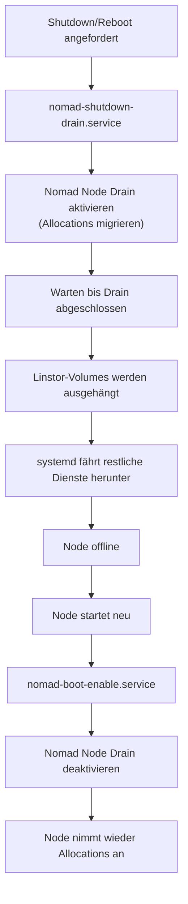

# Kontrolliertes Herunterfahren (Nomad & Linstor)

Dieses Runbook beschreibt den unterbrechungsfreien Shutdown-Prozess für Nomad-Clients mit Linstor/DRBD Storage.

## Problemstellung

Beim Standard-Shutdown beendet systemd Dienste oft parallel. Wenn der Nomad-Agent oder das Netzwerk beendet werden, bevor die Storage-Volumes (DRBD/Linstor) ausgehängt sind, entstehen "Stale Locks" und Filesystem-Fehler (Read-Only). Das betrifft insbesondere die Client-Nodes 05 und 06, auf denen Linstor CSI Volumes für PostgreSQL, Grafana und Loki gemountet sind.

## Ablauf

## Lösung (Version v9.0)

Die Lösung basiert auf zwei spezialisierten systemd-Units, die sich in den Shutdown- bzw. Boot-Prozess einhängen.

### 1. Nomad Shutdown Drain (`nomad-shutdown-drain.service`)

Diese Unit wird beim Shutdown/Reboot ausgeführt, solange Nomad und das Netzwerk noch aktiv sind. Sie aktiviert den Node Drain, der alle laufenden Allocations ordentlich beendet und auf andere Nodes migriert. Erst danach werden die Linstor-Volumes sicher ausgehängt.

- **Typ:** `oneshot`
- **Trigger:** `WantedBy=shutdown.target reboot.target halt.target`
- **Aktion:** `nomad node drain -enable -self -ignore-system`
- **Wichtig:** Die `-ignore-system` Flag sorgt dafür, dass System-Jobs (z.B. Zot Registry, Alloy) nicht gedrained werden -- sie laufen bis zum tatsächlichen Shutdown weiter

### 2. Nomad Boot Enable (`nomad-boot-enable.service`)

Nach dem Hochfahren wird der Drain automatisch wieder deaktiviert, damit der Node neue Allocations annimmt.

- **Typ:** `oneshot`
- **Trigger:** `After=nomad.service`
- **Aktion:** `nomad node drain -disable -self`

## Skript-Speicherort

Das zentrale Steuerungsskript liegt auf den Nomad-Client-Nodes unter `/usr/local/bin/nomad-smart-shutdown.sh`.

## Logs prüfen

Der Verlauf des letzten Shutdowns/Boots wird unter `/var/log/nomad-shutdown.log` protokolliert. Bei Problemen nach einem Neustart dort prüfen, ob der Drain korrekt durchlief und alle Volumes sauber ausgehängt wurden.

## Verifikation nach Neustart

1. Prüfen ob der Node als `ready` in Nomad erscheint (`nomad node status`)
2. Prüfen ob DRBD-Ressourcen synchron sind (kein `Outdated` Status)
3. Prüfen ob alle Services die auf dem Node laufen sollten, korrekt allokiert wurden

## Verwandte Seiten

- [Cluster-Neustart](./cluster-restart.md) -- Vollständiger Neustart des gesamten HashiCorp Stacks
- [Linstor/DRBD](../platforms/linstor-drbd.md) -- Storage-Cluster und DRBD-Ressourcen
- [HashiCorp Stack](../platforms/hashicorp-stack.md) -- Nomad Node Lifecycle und Drain-Konzept
- [Batch Jobs](./batch-jobs.md) -- Täglicher Reboot-Job der den Smart Shutdown nutzt
