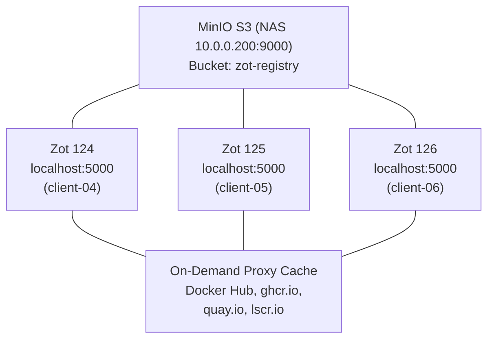

# Zot Container Registry

## Übersicht
| Attribut | Wert |
| :--- | :--- |
| **Status** | Produktion |
| **Version** | Zot v2.1.14 (ghcr.io/project-zot/zot-linux-amd64:latest) |
| **Primary URL** | localhost:5000 (jeder Node) |
| **External URL** | [registry.ackermannprivat.ch](https://registry.ackermannprivat.ch) |
| **Deployment** | Nomad System Job (`infrastructure/zot-registry.nomad`) |
| **Storage Backend** | MinIO S3 auf NAS (10.0.0.200:9000) |
| **UI** | Eingebaut (Zot UI Extension) |

## Warum Zot statt Docker Registry v2?

| Aspekt | Docker Registry v2 | Zot |
| :--- | :--- | :--- |
| **Pull-Through Cache** | Nur Docker Hub | Docker Hub, ghcr.io, quay.io, lscr.io |
| **UI** | Keines | Eingebaut |
| **Search** | Nein | Ja (GraphQL API) |
| **OCI-native** | Nein (Docker Schema) | Ja |
| **Docker-Kompatibilität** | Native | Via `compat: ["docker2s2"]` |

## Architektur

**Vorteile:**
- Alle Instanzen teilen S3 Storage (kein Sync nötig)
- Ein Push auf Node A ist sofort auf B/C verfügbar
- On-Demand Proxy Cache für 4 Upstream-Registries
- Fallback zu Docker Hub wenn Registry nicht erreichbar

## Konfiguration

Die vollständige Konfiguration (Zot Config, S3 Storage, Proxy Cache, Docker Hub Credentials) ist im Nomad Job definiert: `infrastructure/zot-registry.nomad`

**Wichtig:** `compat: ["docker2s2"]` in der HTTP-Konfiguration ist nötig, damit Docker-Format Manifeste (v2 Schema 2) akzeptiert werden. Ohne dieses Setting schlägt der Push von Multi-Arch Images fehl mit `manifest invalid`.

### Proxy Cache Registries

| Registry | URL | Beschreibung |
| :--- | :--- | :--- |
| Docker Hub | registry-1.docker.io | Mit Docker Hub Credentials (Rate Limit 200/6h) |
| GitHub CR | ghcr.io | On-Demand |
| Quay.io | quay.io | On-Demand |
| LinuxServer | lscr.io | On-Demand |

### On-Demand Sync Verhalten

Zot synchronisiert Images bei `onDemand: true` bei jedem Request mit dem Upstream. Das bedeutet:

- **Gecachte Images mit unverändertem Tag:** Zot prüft kurz beim Upstream ob eine neuere Version existiert ("already synced") und liefert sofort aus dem S3-Cache.
- **Rate Limiting:** Wenn der Upstream (z.B. Docker Hub) ein 429 zurückgibt, blockiert der Request bis zum nächsten Retry.
- **Konfiguration:** `maxRetries: 1`, `retryDelay: 15s` — maximale Blockierzeit pro Image ca. 15 Sekunden (statt bis zu 15 Minuten bei der alten Konfiguration mit `maxRetries: 3`, `retryDelay: 5m`).

::: warning Nach Zot-Restart
Nach einem Restart aller 3 Zot-Instanzen versuchen die Docker-Daemons auf allen Nodes gleichzeitig, ihre Images via Zot zu aktualisieren. Da alle Instanzen die gleichen Docker Hub Credentials nutzen, wird das Rate Limit schnell erreicht. Die Queue arbeitet sich mit den neuen Retry-Werten aber deutlich schneller ab (~15s statt ~5min pro Rate-Limited Request).
:::

### S3 Storage

| Parameter | Wert |
| :--- | :--- |
| Endpoint | http://10.0.0.200:9000 |
| Bucket | zot-registry |
| Root Directory | /zot |
| Credentials | Vault `kv/data/zot-s3` (Workload Identity) |

### Docker daemon.json

Auf allen Nodes ist `localhost:5000` als Registry-Mirror konfiguriert (verwaltet durch Ansible). Docker versucht erst localhost:5000 (Zot), bei Nichterreichbarkeit automatisch Docker Hub direkt.

## Backup

| Pfad | Inhalt |
| :--- | :--- |
| MinIO: zot-registry/* | Alle Registry Blobs und Manifeste |

**Restore:** MinIO Bucket wiederherstellen, dann Nomad Job starten.

### DNS-Abhängigkeit

Zot läuft mit `network_mode = "host"` im Nomad Job. Das bedeutet:

- `dns_servers` in der Nomad Docker-Config wird **ignoriert** — Zot nutzt die DNS-Konfiguration des Hosts (systemd-resolved).
- Wenn der DNS-Server (10.0.2.1) nicht erreichbar ist, können keine Upstream-Registries aufgelöst werden.
- systemd-resolved hat eingebaute Fallback-DNS (1.1.1.1, 8.8.8.8) die bei DNS-Ausfall greifen, aber mit Verzögerung.

## Troubleshooting

### Langsame Image Pulls (>15s)

1. **DNS prüfen:** `dig @10.0.2.1 registry-1.docker.io +short +timeout=3` — muss sofort antworten
2. **Rate Limit prüfen:** `docker logs <zot-container> 2>&1 | grep TOOMANYREQUESTS` — wenn Docker Hub 429 zurückgibt, warten bis Rate Limit abläuft
3. **Zot Health prüfen:** `curl -s http://localhost:5000/v2/` — muss 200 zurückgeben

### Nach Cluster-Restart

Nach einem Restart aller Nodes können Image-Pulls temporär langsam sein (Docker Hub Rate Limiting). Das normalisiert sich nach 10-15 Minuten.

## Historie

| Datum | Änderung |
| :--- | :--- |
| ~2025-11 | Harbor (3-way Replication, 8 Container pro Instanz) |
| 29.12.2025 | Migration zu Docker Registry v2 (Zwischenlösung) |
| 29.12.2025 | Migration zu Zot Registry (OCI-native, On-Demand Cache) |
| 21.02.2026 | Fix: `compat: ["docker2s2"]` für Multi-Arch Push Support |
| 22.02.2026 | Fix: `retryDelay: 5m → 15s`, `maxRetries: 3 → 1` — verhindert 5min+ Blockierungen bei DNS- oder Rate-Limit-Problemen |
| 18.03.2026 | S3-Credentials aus Nomad-Job in Vault migriert (`kv/data/zot-s3`), Vault Workload Identity aktiviert |

