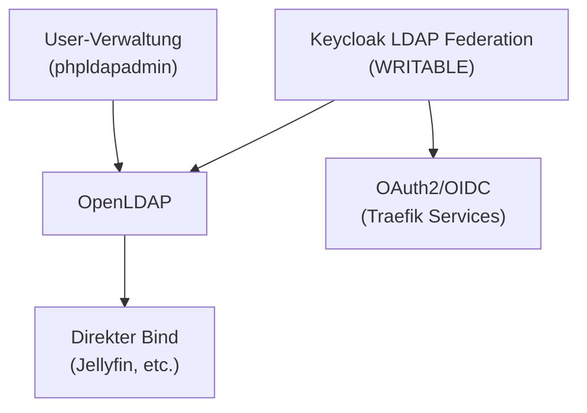

# OpenLDAP & Benutzerverwaltung

## Übersicht

| Attribut | Wert |
| :--- | :--- |
| **Status** | Produktion |
| **Deployment** | Docker Compose auf vm-proxy-dns-01 |
| **Consul Service** | `ldap.service.consul` |
| **Base DN** | `dc=ackermannprivat,dc=ch` |
| **Users DN** | `ou=users,dc=ackermannprivat,dc=ch` |
| **Admin Bind DN** | `cn=admin,dc=ackermannprivat,dc=ch` |
| **Web-UI** | phpldapadmin (`admin-chain-v2@file`) |

## Rolle im Stack

OpenLDAP ist das zentrale Benutzerverzeichnis. Alle User-Accounts (Name, E-Mail, Gruppenzugehörigkeit) werden hier verwaltet. Keycloak importiert diese Daten und nutzt LDAP als Identity Store.

## Keycloak LDAP Federation

Keycloak ist mit OpenLDAP über eine User Federation verbunden. Die wichtigsten Parameter:

| Parameter | Wert | Bedeutung |
|-----------|------|-----------|
| **Edit Mode** | WRITABLE | Änderungen in Keycloak werden nach LDAP zurückgeschrieben |
| **Import Enabled** | Ja | User werden beim ersten Login aus LDAP importiert |
| **Sync Interval** | 86400s (24h) | Periodischer Changed-Sync (Änderungen aus LDAP nach Keycloak) |
| **Connection** | `ldap://ldap.service.consul` | Über Consul DNS aufgelöst |
| **Bind DN** | `cn=admin,dc=ackermannprivat,dc=ch` | Admin-Zugriff für Lese- und Schreiboperationen |

### Edit Modes erklärt

| Mode | Verhalten | Passwort-Sync |
|------|-----------|---------------|
| **READ_ONLY** | Keycloak liest nur aus LDAP, keine Änderungen möglich | Nur LDAP-Passwort gilt |
| **WRITABLE** (aktiv) | Änderungen in Keycloak werden nach LDAP geschrieben | Passwort geht in beide Systeme |
| **UNSYNCED** | Änderungen bleiben nur in Keycloak DB | Passwörter können divergieren |

**Wichtig:** Im WRITABLE-Modus werden Passwort-Änderungen über die Keycloak Admin-UI oder den Account-Self-Service sofort nach LDAP synchronisiert. Services die direkt gegen LDAP authentifizieren (z.B. Jellyfin) erhalten dadurch automatisch das aktuelle Passwort.

## Authentifizierungswege

Es gibt zwei verschiedene Wege, wie Services User authentifizieren:

### 1. Über Keycloak (OAuth2/OIDC)

Die meisten Services nutzen Traefik Middleware Chains mit oauth2-proxy → Keycloak. Keycloak prüft die Credentials und die Gruppenzugehörigkeit.

**Betroffene Services:** Alle Services mit `public-*-chain-v2` oder `intern-*-chain-v2` Middleware.

### 2. Direkt gegen LDAP (LDAP Bind)

Einige Services authentifizieren direkt gegen OpenLDAP mit eigenem LDAP-Client. Dafür ist es essentiell, dass die Passwörter in LDAP aktuell sind.

**Betroffene Services:** Jellyfin und weitere Services mit nativer LDAP-Integration.

## Benutzergruppen

Die Gruppenverwaltung erfolgt in Keycloak (Realm `traefik`), nicht in LDAP. Siehe [Zugriffsgruppen](../../platforms/security.md#zugriffsgruppen) für die Gruppenstruktur.

## Technische Details

### Container

| Container | Image | Funktion |
|-----------|-------|----------|
| `openldap` | `osixia/openldap` | LDAP Server (Port 389) |
| `phpldapadmin` | `osixia/phpldapadmin` | Web-UI für LDAP-Administration |

### Persistenz

Die Daten liegen auf NFS:
- **Datenbank:** `/nfs/docker/ldap/ldap/` (die eigentlichen LDAP-Einträge)
- **Konfiguration:** `/nfs/docker/ldap/slapd.d/` (slapd Backend-Konfiguration im LDIF-Format)

### TLS

TLS ist deaktiviert (`LDAP_TLS=false`). Der Zugriff erfolgt ausschliesslich intern über das Management-Netzwerk. Die Env-Variable wirkt nur beim ersten Bootstrap — bei bestehender Konfiguration zählt der Inhalt von `slapd.d/cn=config.ldif`.

### slapd.d Backend

OpenLDAP speichert seine Konfiguration im LDIF-Format unter `slapd.d/`. Jede LDIF-Datei enthält eine CRC32-Prüfsumme in der zweiten Zeile. Manuelle Änderungen an diesen Dateien erfordern eine Neuberechnung der Prüfsumme, da slapd sonst den Start verweigert.

**Empfehlung:** Konfigurationsänderungen wenn möglich über `ldapmodify` statt direkte Dateibearbeitung.

## Konfiguration

Verwaltet durch Docker Compose. Siehe `standalone-stacks/traefik-proxy/templates/docker-compose.yml.j2` im Repository.

---
