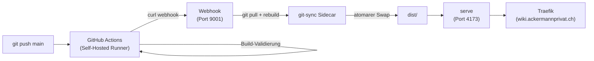

# VitePress Wiki

## Übersicht

| Attribut | Wert |
| :--- | :--- |
| **Status** | Produktion |
| **URL** | [wiki.ackermannprivat.ch](https://wiki.ackermannprivat.ch) |
| **Source** | GitHub: `derever/homelab-wiki` (Branch: main) |
| **Deployment** | Nomad Job (`services/vitepress-wiki.nomad`) |
| **Auth** | OAuth2 Admin (`admin-chain-v2@file`) |
| **Auto-Update** | GitHub Webhook (sofort) + git pull alle 5 Min (Fallback) |

## Architektur



## Nomad Job (3-Task-Architektur)

| Task | Lifecycle | Funktion |
|------|-----------|----------|
| **git-clone-and-build** | Prestart | Klont Repo, `npm ci`, `vitepress build docs` |
| **git-sync** | Sidecar | Webhook-Empfänger + 5-Min-Polling + atomarer Rebuild |
| **vitepress** | Main | Serviert statische Dateien via `serve` auf Port 4173 |

### Webhook-Mechanismus

Der git-sync Sidecar betreibt einen BusyBox httpd auf Port 9001 mit CGI-Script:
- **Endpoint:** `/_webhook/cgi-bin/pull?token=<token>`
- **Token:** Aus Vault (`kv/vitepress-wiki/webhook_token`)
- **Lock:** `flock` verhindert parallele Builds
- **Atomarer Swap:** Build in `dist-build/`, bei Erfolg Rename zu `dist/`
- **Status:** `/_webhook/status.json` zeigt `ready`/`building`/`failed` + Commit + Timestamp

### Build-Status-Anzeige

Die NavBar zeigt einen Timestamp ("Stand: DD.MM. HH:MM") der alle 10 Sekunden von `/_webhook/status.json` aktualisiert wird. Custom Vue-Komponente `BuildStatus.vue`.

## GitHub Actions Workflow

| Eigenschaft | Wert |
|-------------|------|
| **Trigger** | Push auf `main` |
| **Runner** | Self-hosted (`homelab-runner-0`) |
| **Node** | 22 |

### Ablauf

1. `npm ci` + `vitepress build docs`
2. Bei Dead Links: Fallback-Build mit `VITEPRESS_IGNORE_DEAD_LINKS=true`
3. GitHub Issue erstellt/aktualisiert bei Dead Links (Label: `dead-links`)
4. Issue wird geschlossen wenn nächster Build erfolgreich
5. Webhook-Trigger an `wiki.ackermannprivat.ch/_webhook/cgi-bin/pull`

## GitHub Runner

| Attribut | Wert |
|----------|------|
| **Nomad Job** | `infrastructure/github-runner.nomad` |
| **Image** | `myoung34/github-runner:2.332.0` |
| **Name** | `homelab-runner-0` |
| **Labels** | `self-hosted`, `homelab`, `docker`, `linux`, `x64` |
| **Scope** | Repo (`derever/homelab-wiki`) |
| **Auth** | Access Token aus Vault (`kv/github-runner`) |
| **Netzwerk** | Host-Modus (für ZOT Registry localhost:5000) |

## VitePress-Konfiguration

| Feature | Details |
|---------|---------|
| **Sidebar** | Auto-generiert via `vitepress-sidebar` (Frontmatter `order` für Sortierung) |
| **Suche** | Lokale Suche (eingebaut) |
| **Diagramme** | Mermaid via `vitepress-plugin-mermaid` |
| **Edit-Links** | Jede Seite hat "Seite bearbeiten" Link zu GitHub |
| **Last Updated** | Automatisch aus Git-History |

## Vault Secrets

| Pfad | Keys | Beschreibung |
|------|------|--------------|
| `kv/vitepress-wiki` | `ssh_key` | Ed25519 Deploy Key (read-only) |
| `kv/vitepress-wiki` | `webhook_token` | Token für Webhook-Authentifizierung |
| `kv/github-runner` | `access_token` | GitHub Token für Runner-Registrierung |

## Lokale Entwicklung

```bash
cd wiki
npm ci
npm run dev    # Dev-Server auf http://localhost:5173
npm run build  # Produktions-Build
```

## Richtlinien

Inhaltliche Regeln und Formatierungs-Konventionen: [Wiki-Richtlinien](../../wiki-richtlinien.md)
