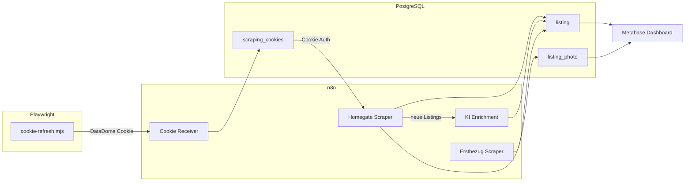

# Immobilien-Monitoring

## Übersicht

| Attribut | Wert |
| :--- | :--- |
| **Status** | Aufbau |
| **Zweck** | Mietmarkt-Monitoring für MFH-Neubau Dottikon AG |
| **n8n** | [n8n.ackermannprivat.ch](https://n8n.ackermannprivat.ch) |
| **Metabase** | [metabase.ackermannprivat.ch](https://metabase.ackermannprivat.ch) |
| **Deployment** | Nomad Jobs (`services/n8n.nomad`, `services/metabase.nomad`) |
| **Datenbank** | PostgreSQL `n8n` (Tabellen: `listing`, `listing_photo`, `scraping_cookies`) |

## Beschreibung

Automatisiertes Monitoring von Mietinseraten in der Region Dottikon/Wohlen AG. Das System sammelt Daten von Immobilienportalen, reichert sie mit KI-Analyse an und stellt sie in Metabase-Dashboards dar.

## Architektur



## Datenquellen

| Portal | Methode | Anti-Bot | Frequenz |
| :--- | :--- | :--- | :--- |
| **Homegate** | Playwright Cookie-Refresh + n8n HTTP | DataDome (automatisiert) | 2x täglich (07:00, 19:00) |
| **erstbezug.ch** | Direkter HTTP Request | Keines | 1x täglich (08:00) |

### Region / PLZ

Dottikon (5605), Hendschiken (5604), Othmarsingen (5504), Hägglingen (5607), Villmergen (5612), Wohlen AG (5610)

## Komponenten

### Playwright Cookie-Refresh (Primär)

Das Script `cookie-refresh.mjs` läuft als Cron-Job vor jedem Scraper-Lauf:

- Öffnet Homegate in einem headless Chromium-Browser
- Extrahiert den DataDome-Cookie automatisch
- Sendet ihn an den n8n Webhook (`/webhook/cookie-refresh`)
- Cron-Schedule: `50 6,18 * * *` (10 Minuten vor dem Scraper)

Repo-Pfad: `services/n8n-workflows/cookie-refresh.mjs`

Voraussetzung: `npm install playwright` im Verzeichnis, Chromium muss installiert sein (`npx playwright install chromium`).

### n8n Workflows

Die Workflow-Definitionen liegen als JSON-Export im Repo unter `services/n8n-workflows/`. Import via n8n UI.

| Workflow | Trigger | Funktion |
| :--- | :--- | :--- |
| Cookie Receiver | Webhook GET | Empfängt DataDome-Cookies (von Playwright oder Bookmarklet) |
| Homegate Scraper | Schedule 07:00 + 19:00 | Scraping der `__INITIAL_STATE__` Daten |
| KI Enrichment | Sub-Workflow | OpenAI-Analyse neuer Listings |
| Erstbezug Scraper | Schedule 08:00 | Neubauprojekte aus HTML parsen |

### Metabase Dashboards

- **Übersicht:** Scorecards (aktive Inserate, Durchschnittsmiete, neue pro Woche)
- **Karte:** Pin Map mit Geo-Koordinaten aus Homegate
- **Detailtabelle:** Alle Inserate mit Filter, CHF/m2, Links
- **Preisvergleich:** CHF/m2 nach Stadt und Zimmerzahl

## Datenbank-Schema

### listing

Haupttabelle für alle Inserate. Unique Constraint auf `(portal, external_id)` für UPSERT-Logik. Feld `raw_data` (JSONB) speichert das komplette Portal-JSON plus KI-Enrichment.

### listing_photo

Foto-URLs zu Inseraten, verknüpft via `listing_id` Foreign Key.

### scraping_cookies

DataDome-Cookies pro Portal. Wird automatisch via Playwright aktualisiert. Scraper prüfen `updated_at < 24h` vor Verwendung.

## Betrieb

### Cookie-Refresh

Läuft automatisch via Cron. Bei Problemen (Playwright blockiert, Browser-Crash):

1. Prüfen: `node cookie-refresh.mjs` manuell ausführen
2. Falls Playwright geblockt wird: Fallback auf manuelles Bookmarklet (siehe unten)

### Monitoring

- **n8n Execution Log:** Zeigt Erfolg/Fehler pro Workflow-Run
- **Metabase:** Fehlende Daten (keine neuen Listings seit >2 Tagen) deuten auf Cookie-Problem hin

### Vault Secrets

| Pfad | Keys |
| :--- | :--- |
| `kv/data/n8n` | `db_password`, `encryption_key` |
| `kv/data/metabase` | `db_password`, `n8n_reader_password` |

## Fallback: Manuelles Bookmarklet

::: details Falls Playwright von DataDome geblockt wird

Falls DataDome irgendwann Playwright erkennt und blockiert, gibt es einen manuellen Fallback. Die n8n Workflows brauchen keine Änderung — nur die Cookie-Quelle wechselt.

**Bookmarklet einrichten:**

Neues Lesezeichen im Browser erstellen mit folgendem Code als URL:

```
javascript:(function(){var dd=document.cookie.match(/datadome=([^;]+)/);if(!dd){alert('Kein DataDome Cookie!');return;}var img=new Image();img.src='https://n8n.ackermannprivat.ch/webhook/cookie-refresh?portal='+location.hostname.replace('www.','')+'&datadome='+encodeURIComponent(dd[1]);alert('Cookie gesendet!');})()
```

**Verwendung:**

1. Im Browser auf [homegate.ch](https://www.homegate.ch) navigieren
2. Bookmarklet klicken
3. "Cookie gesendet!" bestätigen

Muss ca. 1x pro Tag ausgeführt werden (DataDome-Cookie ist ~24h gültig). Bei abgelaufenem Cookie stoppt der Homegate Scraper sauber (kein Crash, nur Log-Eintrag).

Das Bookmarklet nutzt ein Image-Tag statt fetch, um CORS-Probleme zu vermeiden.

:::
