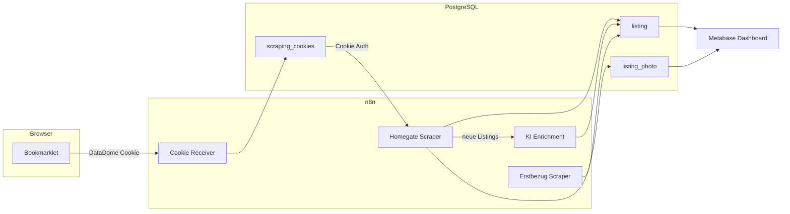

# Immobilien-Monitoring

## Uebersicht

| Attribut | Wert |
| :--- | :--- |
| **Status** | Aufbau |
| **Zweck** | Mietmarkt-Monitoring fuer MFH-Neubau Dottikon AG |
| **n8n** | [n8n.ackermannprivat.ch](https://n8n.ackermannprivat.ch) |
| **Metabase** | [metabase.ackermannprivat.ch](https://metabase.ackermannprivat.ch) |
| **Deployment** | Nomad Jobs (`services/n8n.nomad`, `services/metabase.nomad`) |
| **Datenbank** | PostgreSQL `n8n` (Tabellen: `listing`, `listing_photo`, `scraping_cookies`) |

## Beschreibung

Automatisiertes Monitoring von Mietinseraten in der Region Dottikon/Wohlen AG. Das System sammelt Daten von Immobilienportalen, reichert sie mit KI-Analyse an und stellt sie in Metabase-Dashboards dar.

## Architektur

## Datenquellen

| Portal | Methode | Anti-Bot | Frequenz |
| :--- | :--- | :--- | :--- |
| **Homegate** | Cookie-Relay + HTTP | DataDome (Cookie noetig) | 2x taeglich (07:00, 19:00) |
| **erstbezug.ch** | Direkter HTTP Request | Keines | 1x taeglich (08:00) |

### Region / PLZ

Dottikon (5605), Hendschiken (5604), Othmarsingen (5504), Haegglingen (5607), Villmergen (5612), Wohlen AG (5610)

## Komponenten

### n8n Workflows

Die Workflow-Definitionen liegen als JSON-Export im Repo unter `services/n8n-workflows/`. Import via n8n UI.

| Workflow | Trigger | Funktion |
| :--- | :--- | :--- |
| Cookie Receiver | Webhook GET | Empfaengt DataDome-Cookies via Bookmarklet |
| Homegate Scraper | Schedule 07:00 + 19:00 | Scraping der `__INITIAL_STATE__` Daten |
| KI Enrichment | Sub-Workflow | OpenAI-Analyse neuer Listings |
| Erstbezug Scraper | Schedule 08:00 | Neubauprojekte aus HTML parsen |

### Metabase Dashboards

- **Uebersicht:** Scorecards (aktive Inserate, Durchschnittsmiete, neue pro Woche)
- **Karte:** Pin Map mit Geo-Koordinaten aus Homegate
- **Detailtabelle:** Alle Inserate mit Filter, CHF/m2, Links
- **Preisvergleich:** CHF/m2 nach Stadt und Zimmerzahl

### Cookie-Relay (DataDome-Workaround)

Homegate, ImmoScout24 und Comparis nutzen DataDome als Anti-Bot-Schutz. Headless Browser werden blockiert. Workaround: DataDome-Cookie aus echtem Browser via Bookmarklet an n8n senden. Cookie ist ca. 24h gueltig.

## Datenbank-Schema

### listing

Haupttabelle fuer alle Inserate. Unique Constraint auf `(portal, external_id)` fuer UPSERT-Logik. Feld `raw_data` (JSONB) speichert das komplette Portal-JSON plus KI-Enrichment.

### listing_photo

Foto-URLs zu Inseraten, verknuepft via `listing_id` Foreign Key.

### scraping_cookies

DataDome-Cookies pro Portal. Wird vom Bookmarklet via Webhook aktualisiert. Scraper pruefen `updated_at < 24h` vor Verwendung.

## Betrieb

### Cookie-Refresh

Das Bookmarklet muss ca. 1x pro Tag auf homegate.ch ausgefuehrt werden. Bei abgelaufenem Cookie stoppt der Homegate Scraper sauber (kein Crash, nur Log-Eintrag).

### Monitoring

- **n8n Execution Log:** Zeigt Erfolg/Fehler pro Workflow-Run
- **Metabase:** Fehlende Daten (keine neuen Listings seit >2 Tagen) deuten auf Cookie-Problem hin

### Vault Secrets

| Pfad | Keys |
| :--- | :--- |
| `kv/data/n8n` | `db_password`, `encryption_key` |
| `kv/data/metabase` | `db_password`, `n8n_reader_password` |
