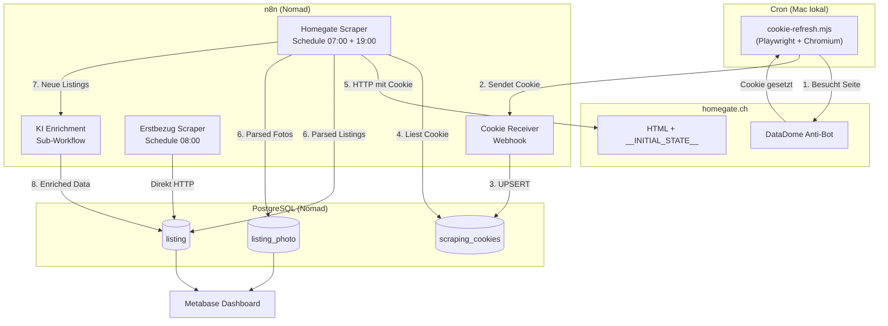
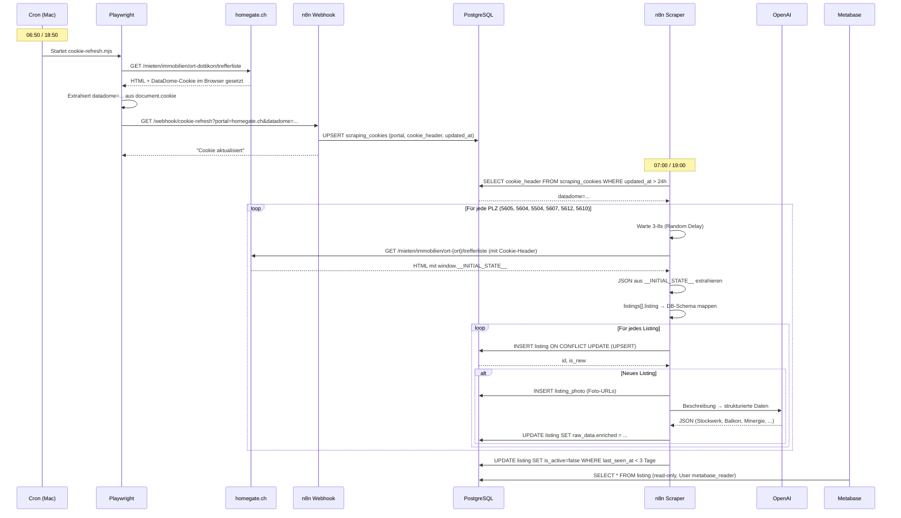

# Immobilien-Monitoring

## Übersicht

| Attribut | Wert |
| :--- | :--- |
| **Status** | Aufbau |
| **Zweck** | Mietmarkt-Monitoring für MFH-Neubau Dottikon AG |
| **n8n** | [n8n.ackermannprivat.ch](https://n8n.ackermannprivat.ch) |
| **Metabase** | [metabase.ackermannprivat.ch](https://metabase.ackermannprivat.ch) |
| **Deployment** | Nomad Jobs (`services/n8n.nomad`, `services/metabase.nomad`) |
| **Datenbank** | PostgreSQL `n8n` (Tabellen: `listing`, `listing_photo`, `scraping_cookies`) |
| **Repo** | `nomad-jobs/services/n8n-workflows/` |

## Beschreibung

Automatisiertes Monitoring von Mietinseraten in der Region Dottikon/Wohlen AG. Das System sammelt Daten von Immobilienportalen, reichert sie mit KI-Analyse an und stellt sie in Metabase-Dashboards dar.

## Gesamtablauf

### Übersichtsdiagramm



### Ablauf Schritt für Schritt



## Datenquellen

| Portal | Methode | Anti-Bot | Frequenz |
| :--- | :--- | :--- | :--- |
| **Homegate** | Playwright Cookie-Refresh + n8n HTTP | DataDome (automatisiert) | 2x täglich (07:00, 19:00) |
| **erstbezug.ch** | Direkter HTTP Request | Keines | 1x täglich (08:00) |

### Region / PLZ

Dottikon (5605), Hendschiken (5604), Othmarsingen (5504), Hägglingen (5607), Villmergen (5612), Wohlen AG (5610)

### Homegate __INITIAL_STATE__ Feld-Mapping

| Homegate JSON Pfad | DB-Feld |
| :--- | :--- |
| `listing.id` | `external_id` |
| `listing.localization.de.text.title` | `title` |
| `listing.localization.de.text.description` | `description` |
| `listing.address.postalCode` | `zip_code` |
| `listing.address.locality` | `city` |
| `listing.address.geoCoordinates.latitude` | `latitude` |
| `listing.address.geoCoordinates.longitude` | `longitude` |
| `listing.characteristics.numberOfRooms` | `rooms` |
| `listing.characteristics.livingSpace` | `area_m2` |
| `listing.prices.rent.gross` | `rent_gross` |
| `listing.prices.rent.net` | `rent_net` |
| `listing.localization.de.attachments[]` | `listing_photo.url` |
| Ganzes `listing` Objekt | `raw_data` (JSONB) |

## Komponenten

### 1. Playwright Cookie-Refresh

**Was:** Headless Chromium besucht Homegate, extrahiert den DataDome-Cookie, sendet ihn an n8n.

**Warum:** Homegate nutzt DataDome Anti-Bot. Normale HTTP Requests ohne gültigen Cookie werden geblockt. Playwright wird (Stand März 2026) nicht von DataDome erkannt und erhält automatisch einen gültigen Cookie.

**Wo:** Läuft lokal auf dem Mac als Cron-Job.

**Wann:** 06:50 und 18:50 (10 Minuten vor dem n8n Scraper).

**Datei:** `services/n8n-workflows/cookie-refresh.mjs`

**Cron:** `50 6,18 * * * cd /path/to/n8n-workflows && node cookie-refresh.mjs`

**Log:** `~/.local/log/cookie-refresh.log`

### 2. n8n Workflows

Alle Workflow-Definitionen liegen als JSON-Export im Repo unter `services/n8n-workflows/`. Import via n8n UI.

| Workflow | Trigger | Funktion |
| :--- | :--- | :--- |
| **Cookie Receiver** | Webhook GET `/webhook/cookie-refresh` | Empfängt DataDome-Cookie, UPSERT in `scraping_cookies` |
| **Homegate Scraper** | Schedule 07:00 + 19:00 | Liest Cookie aus DB, scrapet 6 PLZ, UPSERT Listings + Fotos |
| **KI Enrichment** | Sub-Workflow (von Homegate Scraper) | OpenAI gpt-4o-mini analysiert Beschreibung neuer Listings |
| **Erstbezug Scraper** | Schedule 08:00 | Neubauprojekte aus erstbezug.ch HTML parsen |

### 3. Metabase

BI-Dashboard für die Visualisierung der gesammelten Daten.

- **Datenquelle:** PostgreSQL `n8n`, User `metabase_reader` (read-only)
- **Geplante Dashboards:** Übersicht (Scorecards), Karte (Pin Map), Detailtabelle, Preisvergleich

## Datenbank-Schema

### listing

Haupttabelle für alle Inserate. Unique Constraint auf `(portal, external_id)` für UPSERT-Logik.

Wichtige Felder: `portal`, `external_id`, `title`, `description`, `zip_code`, `city`, `latitude`, `longitude`, `rooms`, `area_m2`, `rent_net`, `rent_gross`, `raw_data` (JSONB), `first_seen_at`, `last_seen_at`, `is_active`

Das Feld `raw_data` enthält das komplette Portal-JSON plus KI-Enrichment unter dem Key `enriched`.

### listing_photo

Foto-URLs zu Inseraten, verknüpft via `listing_id` Foreign Key (CASCADE DELETE).

### scraping_cookies

DataDome-Cookies pro Portal. Unique auf `portal`. Wird automatisch via Playwright aktualisiert. Der Homegate Scraper prüft `updated_at > NOW() - 24h` und stoppt sauber wenn kein gültiger Cookie vorhanden ist.

## Betrieb

### Normalbetrieb

Alles läuft automatisch:

1. **06:50** — Cron startet `cookie-refresh.mjs`, Cookie wird in DB geschrieben
2. **07:00** — n8n Homegate Scraper liest Cookie, scrapet 6 PLZ, speichert Listings
3. **08:00** — n8n Erstbezug Scraper scrapet Neubauprojekte
4. **18:50** — Cron: zweiter Cookie-Refresh
5. **19:00** — n8n: zweiter Homegate Scraper-Lauf

### Troubleshooting

**Kein Cookie / Scraper stoppt:**
- Log prüfen: `cat ~/.local/log/cookie-refresh.log`
- Manuell testen: `cd n8n-workflows && node cookie-refresh.mjs`
- DB prüfen: `SELECT updated_at FROM scraping_cookies WHERE portal = 'homegate.ch'`

**Playwright wird von DataDome geblockt:**
- Fallback auf manuelles Bookmarklet (siehe unten)

**n8n Workflow-Fehler:**
- n8n UI: Executions-Tab prüfen
- Häufigste Ursache: Cookie abgelaufen oder `__INITIAL_STATE__` Struktur geändert

### Vault Secrets

| Pfad | Keys |
| :--- | :--- |
| `kv/data/n8n` | `db_password`, `encryption_key` |
| `kv/data/metabase` | `db_password`, `n8n_reader_password` |

## Fallback: Manuelles Bookmarklet

::: details Falls Playwright von DataDome geblockt wird

Falls DataDome irgendwann Playwright erkennt und blockiert, gibt es einen manuellen Fallback. Die n8n Workflows brauchen keine Änderung — nur die Cookie-Quelle wechselt.

**Bookmarklet einrichten:**

Neues Lesezeichen im Browser erstellen mit folgendem Code als URL:

```
javascript:(function(){var dd=document.cookie.match(/datadome=([^;]+)/);if(!dd){alert('Kein DataDome Cookie!');return;}var img=new Image();img.src='https://n8n.ackermannprivat.ch/webhook/cookie-refresh?portal='+location.hostname.replace('www.','')+'&datadome='+encodeURIComponent(dd[1]);alert('Cookie gesendet!');})()
```

**Verwendung:**

1. Im Browser auf [homegate.ch](https://www.homegate.ch) navigieren
2. Bookmarklet klicken
3. "Cookie gesendet!" bestätigen

Muss ca. 1x pro Tag ausgeführt werden (DataDome-Cookie ist ~24h gültig). Bei abgelaufenem Cookie stoppt der Homegate Scraper sauber (kein Crash, nur Log-Eintrag).

Das Bookmarklet nutzt ein Image-Tag statt fetch, um CORS-Probleme zu vermeiden.

:::
