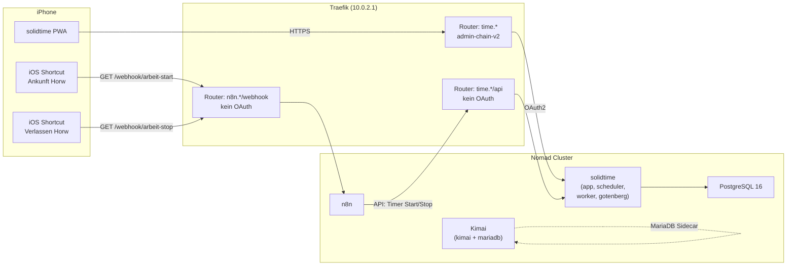
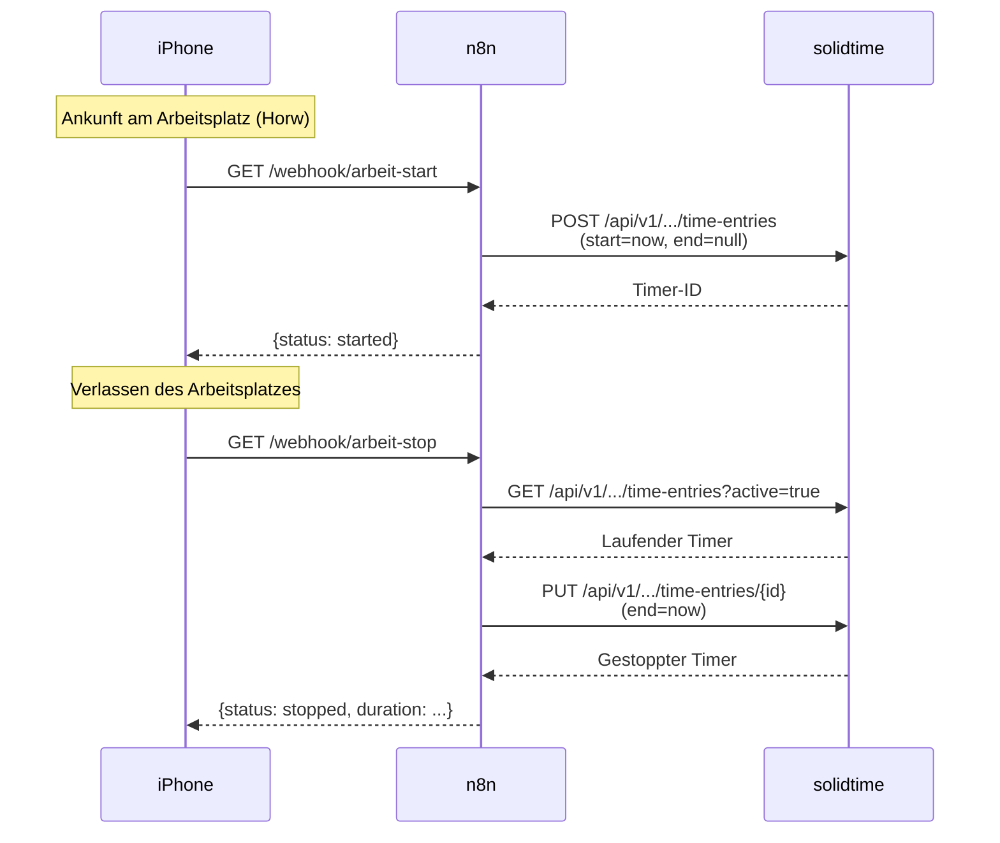

# Zeiterfassung

## Übersicht

Selbstgehostete Zeiterfassung als Ersatz für Toggl Track. Zwei Tools parallel im Einsatz, solidtime als Haupttool.

| Attribut | solidtime | Kimai |
| :--- | :--- | :--- |
| **Status** | Produktion (Haupttool) | Produktion (Backup) |
| **URL** | [time.ackermannprivat.ch](https://time.ackermannprivat.ch) | [kimai.ackermannprivat.ch](https://kimai.ackermannprivat.ch) |
| **Deployment** | Nomad Job (`services/solidtime.nomad`) | Nomad Job (`services/kimai.nomad`) |
| **Datenbank** | PostgreSQL `solidtime` (Shared Cluster) | MariaDB 11 (Sidecar-Container) |
| **Storage** | NFS `/nfs/docker/solidtime/storage` | NFS `/nfs/docker/kimai/{data,plugins,mariadb}` |
| **Mobile** | PWA (Homescreen) | Native App (iOS/Android, kostenpflichtig) |
| **Auth** | OAuth2 via Keycloak (`admin-chain-v2`) | OAuth2 via Keycloak (`admin-chain-v2`) |
| **API** | Bearer Token (Passport JWT) | API-Key (`X-AUTH-TOKEN`) |

## Architektur

## Geofence-Automation

Automatisches Starten und Stoppen des solidtime-Timers basierend auf dem Standort (Geofencing via iOS).

### Ablauf

### Einrichtung iOS

1. **Kurzbefehle-App** auf dem iPhone oeffnen
2. **Automation** erstellen: "Wenn ich ankomme" → Standort Horw
3. **Aktion:** "URL abrufen" → `https://n8n.ackermannprivat.ch/webhook/arbeit-start`
4. Zweite Automation: "Wenn ich verlasse" → gleicher Standort
5. **Aktion:** "URL abrufen" → `https://n8n.ackermannprivat.ch/webhook/arbeit-stop`
6. "Sofort ausfuehren" aktivieren (ohne Bestaetigung)

### n8n Workflows

Zwei Workflows in n8n importieren (Dateien im Repo unter `configs/n8n/`):

- `workflow-arbeit-start.json` -- Webhook empfaengt GET-Request, startet solidtime-Timer
- `workflow-arbeit-stop.json` -- Webhook empfaengt GET-Request, findet aktiven Timer, stoppt ihn

::: warning Credential einrichten
In n8n muss ein **HTTP Header Auth Credential** namens "solidtime API" erstellt werden:
- Header Name: `Authorization`
- Header Value: `Bearer <solidtime-api-token>`
:::

## API-Zugriff

Beide Tools haben dedizierte Traefik-Router fuer API-Pfade ohne OAuth2-Middleware. Die Apps authentifizieren selbst.

| Tool | API-Pfad | Auth-Methode |
| :--- | :--- | :--- |
| solidtime | `time.ackermannprivat.ch/api/*` | Bearer Token (JWT) |
| Kimai | `kimai.ackermannprivat.ch/api/*` | `Authorization: Bearer <api-key>` |
| n8n Webhooks | `n8n.ackermannprivat.ch/webhook/*` | Kein Auth (Webhook-URLs als Secret) |

## Vault Secrets

| Pfad | Keys |
| :--- | :--- |
| `kv/data/solidtime` | `postgres_password`, `app_key`, `passport_private_key`, `passport_public_key` |
| `kv/data/kimai` | `mariadb_password`, `app_secret`, `admin_password` |

## solidtime Plugins

Keine Plugins installiert. GPS-Tracking ist nicht verfuegbar (weder nativ noch via Plugin).

## Kimai Plugins

| Plugin | Version | Beschreibung |
| :--- | :--- | :--- |
| KimaiMobileGPSInfoBundle | 1.1.0 | GPS-Standort-Aufzeichnung fuer Kimai Mobile App (nur Android) |

## Entscheidungslog

- **2026-03-18:** solidtime und Kimai deployed zum Vergleich. solidtime als Haupttool gewaehlt wegen moderner UI, PWA, und Toggl-Aehnlichkeit. Kimai bleibt als Backup.
- **2026-03-18:** Kimai Docker-Image unterstuetzt nur MySQL/MariaDB im Startup-Script. PostgreSQL ging nicht out-of-the-box, darum MariaDB-Sidecar statt Shared PostgreSQL Cluster.
- **2026-03-18:** Geofence-Automation via n8n Webhooks + iOS Shortcuts implementiert, da solidtime und Kimai kein natives iOS-Geofencing bieten.
