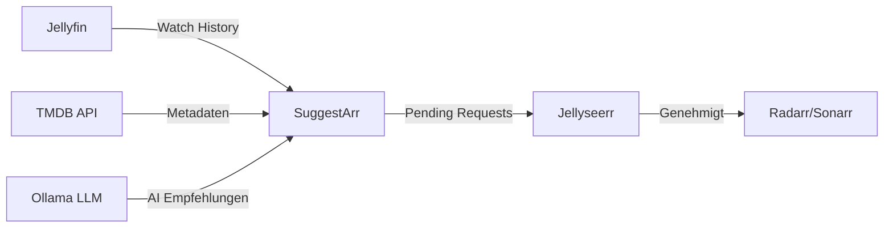

# SuggestArr

## Übersicht

| Attribut | Wert |
| :--- | :--- |
| **Status** | Produktion |
| **URL** | [suggest.ackermannprivat.ch](https://suggest.ackermannprivat.ch) |
| **Deployment** | Nomad Job (`media/suggestarr.nomad`) |
| **Image** | `ciuse99/suggestarr:latest` |
| **Storage** | NFS `/nfs/docker/suggestarr/config/` |
| **Auth** | `intern-noauth@file` |
| **Consul Service** | `suggestarr` |
| **1Password** | "SuggestArr" + "TMDB (The Movie Database)" in PRIVAT Agent |

## Rolle im Stack

SuggestArr analysiert die Watch-History aus Jellyfin und generiert personalisierte Film-/Serien-Empfehlungen. Die Empfehlungen werden als **Pending Requests** in Jellyseerr erstellt -- ein Admin muss sie manuell genehmigen, bevor Radarr/Sonarr den Download starten.



## Konfiguration

### Externe Services

| Service | Adresse | Zweck |
| :--- | :--- | :--- |
| Jellyfin | `jellyfin.service.consul:8096` | Watch-History lesen |
| Jellyseerr | `jellyseerr.service.consul:5055` | Requests erstellen |
| Ollama | `ollama.service.consul:11434` | LLM (gemma4:e2b) |
| TMDB | `api.themoviedb.org` | Film-/Serien-Metadaten |

### Jellyseerr-Integration

SuggestArr nutzt einen **dedizierten lokalen User** `suggestarr@local` in Jellyseerr:

- Permission: nur **Request** (kein Auto-Approve, kein Manage-Requests)
- Alle Empfehlungen landen als "Pending" und müssen manuell genehmigt werden
- Damit wird verhindert, dass SuggestArr unkontrolliert Downloads auslöst

### LLM

- **Modell:** gemma4:e2b (kleinstes Gemma 4 Modell)
- **Provider:** Ollama (lokal im Cluster)
- **API:** OpenAI-kompatibel (`/v1/chat/completions`)
- Beta-Feature "Advanced Suggestion Algorithm" aktiviert

### Filter

- Genre-Ausschluss: Horror
- Rating-Quelle: TMDB
- Bereits heruntergeladene und angefragte Titel werden ausgeschlossen

### Cron

- Automatische Empfehlungen: **Sonntags 06:00 Uhr**

## Betrieb

### Health Check

```
curl https://suggest.ackermannprivat.ch/api/health
```

Erwartete Antwort: `{"db":"ok","llm":"ok","seer":"ok","status":"ok","tmdb":"ok"}`

### Manueller Lauf

Im Web-UI unten rechts den Button "Force Run" klicken, oder über die Requests-Seite.

### AI Search

Unter dem Tab "AI Search" können natürlichsprachige Suchanfragen an das LLM gestellt werden (z.B. "ein Dokumentarfilm im Stil von David Attenborough").

### Logs

- **Anwendungs-Log:** `/nfs/docker/suggestarr/config/app.log`
- **Nomad:** `nomad alloc logs <alloc-id>`

### Bekannte Issues

- Watch-History-Abfrage schlägt für Jellyfin-User ohne Playback-Daten fehl (`'NoneType' object has no attribute 'values'`). Nicht kritisch, Empfehlungen funktionieren trotzdem.
