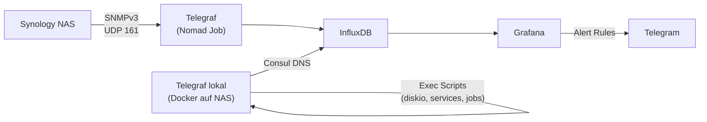

# Synology NAS Monitoring

## Übersicht

| Attribut | Wert |
| :--- | :--- |
| **Status** | Produktion |
| **Dashboard** | [graf.ackermannprivat.ch](https://graf.ackermannprivat.ch) (UID: `synology-nas-health`) |
| **Deployment** | Telegraf SNMP (Nomad) + Telegraf lokal (Docker auf NAS) |
| **Alerting** | Grafana Unified Alerting via Telegram |

## Rolle im Stack

Das NAS ist als zentraler Speicherknoten kritische Infrastruktur. Deshalb wird es auf drei Ebenen überwacht: Telegraf sammelt Hardware-Metriken via SNMP (remote) und System-Metriken via lokalem Container, Grafana visualisiert alles in einem dedizierten Dashboard mit 21 Panels, und 10 Alert Rules benachrichtigen via Telegram bei Problemen. Ergänzend überwacht [CheckMK](../checkmk/index.md) den Host-Level-Status.

## Architektur

## Datenquellen

Das Monitoring nutzt zwei Telegraf-Instanzen, die unterschiedliche Metriken sammeln:

### SNMP (remote, via bestehender Telegraf Nomad Job)

Der zentrale Telegraf Nomad Job fragt das NAS via SNMPv3 (authPriv) ab. Die Telegraf-Config wird in Git verwaltet (`nomad-jobs/monitoring/telegraf/telegraf.conf`) und via NFS bereitgestellt.

**Measurements:**

- `snmp.Synology.disk` -- Disk-Status, Temperatur, Bad Sectors, Remaining Life
- `snmp.Synology.raid` -- RAID-Status, Free Size
- `snmp.Synology.storageio` -- I/O-Durchsatz und -Latenz pro Disk (storageIOLA)
- `snmp.Synology.smart` -- SMART-Attribute (Reallocated, Pending, PowerOn Hours)
- `snmp.Synology.spaceio` -- Volume-I/O und Cache-Load
- `snmp.Synology.services` -- NFS, CIFS, HTTP Connections
- `snmp.Synology.network` -- Netzwerk-Interface-Durchsatz (ifHCInOctets/ifHCOutOctets via IF-MIB)
- `snmp.Synology` -- Uptime, System-Temperatur, Volume-Kapazität

### Telegraf lokal (Docker Container auf NAS)

Ein separater Telegraf-Container läuft direkt auf dem NAS und sammelt Metriken, die via SNMP nicht zugänglich sind.

**Measurements:**

- `diskio` -- I/O Await pro Disk (aus `/proc/diskstats`)
- `nas_background_jobs` -- Status von Hintergrundprozessen (RAID Rebuild, Scrub, S.M.A.R.T. Tests)
- `nfs_server_threads` -- Anzahl aktiver NFS-Server-Threads
- `cpu`, `mem`, `system`, `net` -- Standard-System-Metriken

::: warning Privilegierter Container
Der lokale Telegraf-Container läuft als `--privileged` mit `/proc:/host/proc:ro`, da er `/proc/diskstats` direkt lesen muss.
:::

::: warning Nach NAS-Reboot
Container Manager und NFS müssen nach einem NAS-Reboot manuell gestartet werden (über DSM UI).
:::

## Grafana Dashboard

Das Dashboard `synology-nas-health` ist in drei Zonen aufgebaut, nach dem Prinzip "Alarm, Kontext, Detail":

**Zone A -- Status-Bar (8 Stat-Panels):**
RAID-Status, Volume belegt, Bad Sectors, IO Wait, Hintergrund-Jobs, System-Temperatur, Uptime, SSD Remaining Life

**Zone B -- Performance (7 Timeseries):**
Disk Latenz (Await), Disk Utilization %, Throughput R+W, CPU, RAM, Load + Background Jobs, Netzwerk + Service Connections

**Zone C -- Detail (4 Panels + collapsed Benchmark Row):**
SMART Health Table, Disk-Temperatur, SSD Cache I/O, Volume Trend. RAID Benchmark Panels in collapsed Row (pausiert bis Bay 6 Disk ersetzt).

Die Dashboard-JSON wird via Git verwaltet und per NFS-Mount als File Provisioning bereitgestellt (read-only).

## Alerting

10 Alert Rules in Grafana Unified Alerting, alle via Telegram:

| Rule | Bedingung | For | Schwere |
| :--- | :--- | :--- | :--- |
| RAID Status | Status != Normal | sofort | Critical |
| Bad Sectors | > 0 | sofort | Warning |
| Disk Health | diskStatus != 1 | sofort | Critical |
| Await | > 50 ms | 5 min | Warning |
| Await | > 500 ms | 2 min | Critical |
| IO Wait | > 30% | 10 min | Warning |
| IO Wait | > 60% | 5 min | Critical |
| Temperatur | > 45 C | 5 min | Warning |
| Temperatur | > 55 C | sofort | Critical |
| Volume | > 90% belegt | sofort | Warning |

::: info
RAID-Degraded und Bad-Sector Alerts feuern aktuell korrekt (eine Disk in Bay 6 ist degraded mit 1 Bad Sector).
:::

## RAID Benchmark

Ein optionales fio-Script auf dem NAS misst die RAID-Performance (Sequential Read und Random 4K Read) und schreibt die Ergebnisse direkt an InfluxDB. Die Ergebnisse erscheinen in zwei dedizierten Dashboard-Panels.

::: warning Benchmark pausiert
Der Benchmark ist aktuell deaktiviert und soll erst nach dem Ersatz der defekten Disk (Bay 6) als regelmässiger Task aktiviert werden (DSM Task Scheduler, alle 10 Minuten).
:::

## Verwandte Seiten

- [NAS-Speicher](../nas-storage/index.md) -- NFS-Exports, MinIO, Hardware-Details
- [Monitoring Stack](../monitoring/index.md) -- Grafana, Loki, Alloy, Alerting-Architektur
- [CheckMK](../checkmk/index.md) -- Host-Level Monitoring (Agent-basiert)
- [Hardware-Inventar](../_referenz/hardware-inventar.md#nas) -- NAS-Hardware-Spezifikationen
