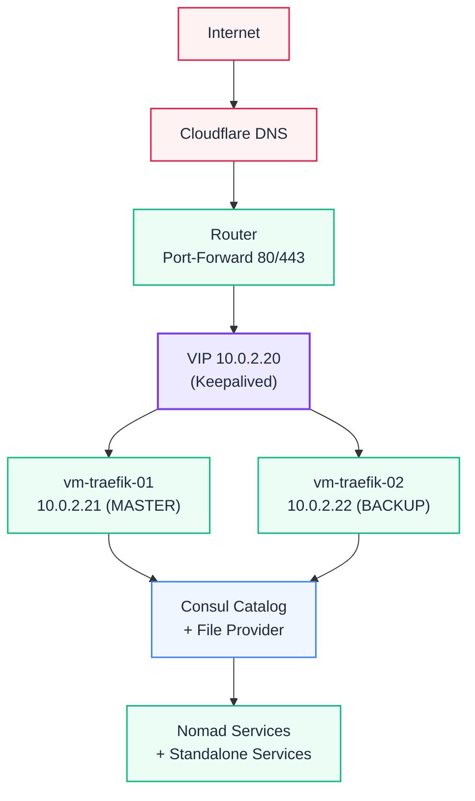

# Traefik Reverse Proxy

## Übersicht

| Attribut | Wert |
| :--- | :--- |
| **Status** | Produktion (HA) |
| **Version** | traefik:v3.4 (gepinnt) |
| **Deployment** | Docker Compose auf vm-traefik-01 + vm-traefik-02 (Ansible rolling deployed) |
| **VIP** | 10.0.2.20 (Keepalived) |
| **Dashboard** | [traefik.ackermannprivat.ch](https://traefik.ackermannprivat.ch) |
| **Auth** | `intern-auth@file` (Authentik) |

## Architektur



Traefik läuft im HA-Setup auf zwei VMs mit Keepalived VIP. Bei Ausfall eines Nodes übernimmt der andere automatisch. Beide Nodes sind identisch konfiguriert und werden per Ansible rolling deployed.

## Hochverfügbarkeit (Keepalived)

| Eigenschaft | Wert |
|-------------|------|
| VIP | 10.0.2.20 |
| MASTER | vm-traefik-01 (10.0.2.21, pve01, Priorität 150) |
| BACKUP | vm-traefik-02 (10.0.2.22, pve02, Priorität 100) |
| Health-Check | `curl -sf http://localhost:8080/ping` |

Keepalived prüft per VRRP-Script ob Traefik antwortet. Bei Ausfall wechselt die VIP automatisch zum BACKUP-Node.

## SSL-Terminierung

Wildcard-Zertifikate für `*.ackermannprivat.ch` und `*.ackermann.systems` werden automatisch via Let's Encrypt (ACME, Cloudflare DNS Challenge, EC256) bezogen. Beide Nodes haben eigene `acme.json` mit gültigen Zertifikaten.

Der `traefik-certs-dumper` exportiert Zertifikate im PEM-Format nach `/nfs/cert/` für andere Services.

TLS ist mit expliziten Cipher Suites und `minVersion: TLS 1.2` gehärtet. Details: [Traefik Referenz -- TLS-Options](./referenz.md#tls-options)

## Consul Catalog Integration

Traefik nutzt den Consul Catalog Provider für automatische Service Discovery. Nomad-Jobs registrieren sich in Consul und Traefik erkennt sie automatisch als Backend. Routing (Host-Regel, Middleware-Chain) erfolgt über Consul Service Tags im Nomad Job.

Für Standalone-Services (nicht in Nomad) wird der File-Provider verwendet (`services-external.yml`).

## Authentifizierung (Middlewares)

Authentifizierung läuft über Authentik als Identity Provider mit ForwardAuth. Vollständige Dokumentation: [Traefik Middleware Chains](./referenz.md)

Kurzübersicht:
- **intern-auth:** Authentik ForwardAuth + IP-Allowlist (interner Zugriff mit Login)
- **intern-api:** Nur IP-Allowlist (interne API-Endpunkte ohne Login)
- **public-auth:** CrowdSec + Authentik ForwardAuth (externer Zugriff mit Login)
- **public-noauth:** CrowdSec + secure-headers (öffentliche Services ohne Login)

## Security

CrowdSec läuft als natives Traefik-Plugin (`crowdsec-bouncer-traefik-plugin`, Stream-Modus) und blockiert automatisch IP-Adressen bei erkannten Angriffen. Details: [CrowdSec](../crowdsec/index.md)

## Deployment

Traefik wird per Ansible-Rolle `traefik-ha` deployed (rolling, serial: 1):

```
ansible-playbook standalone-stacks/traefik-ha/deploy.yml --ask-vault-pass
```

Das Playbook:
1. Synchronisiert Templates (docker-compose, traefik.yml, keepalived.conf)
2. Synchronisiert dynamische Konfiguration aus `traefik-proxy/configurations/`
3. Startet Docker Compose Stack neu
4. Verifiziert Traefik Health + Keepalived Status

### Härtungen (aktiv auf vm-traefik-01 + vm-traefik-02)

- Docker Provider eliminiert (kein `docker.sock`-Mount)
- Images gepinnt: `traefik:v3.4`, `nginx:1.28`, `crowdsec:v1.7.7`, `certs-dumper:v2.10`
- VRRP-Authentifizierung aktiv (keepalived `auth_pass`)
- Dashboard-Port 8080 nur auf localhost gebunden
- CrowdSec als natives Traefik-Plugin (kein separater ForwardAuth-Bouncer)

### Konfigurationsstruktur

| Datei | Inhalt |
|-------|--------|
| `middlewares.yml` | Middleware-Definitionen (CrowdSec Plugin, Authentik, Headers, Rate-Limits) |
| `middleware-chains.yml` | Authentik-basierte Chains |
| `tls-options.yml` | TLS-Mindestversion, Cipher Suites, Curves |
| `servers-transports.yml` | `insecureSkipVerify` Transport für interne Backends |
| `auth-routes.yml` | Authentik-Callback-Routen (Priority 1000) |
| `services-external.yml` | File-Provider-Routen (checkmk, dns, pihole, linstor etc.) |
| `tcp-meeting.yml` | TCP Passthrough für meeting.ackermannprivat.ch |
| `wildcard-certs.yml` | ACME Wildcard-Cert Router |

Dynamische Config wird live geloaded (`watch: true`). Die Quelldateien liegen unter `standalone-stacks/traefik-proxy/configurations/` und werden per Ansible synchronisiert.

### Statische Konfiguration

Template: `standalone-stacks/traefik-ha/templates/traefik.yml.j2` → deployed nach `/opt/traefik/traefik.yml` (Modus 0600, enthält Consul-Token).

## Storage (lokal, kein NFS)

Traefik nutzt ausschliesslich lokalen Storage. NFS für den Reverse Proxy ist ein Anti-Pattern (Boot-Abhängigkeit, inotify funktioniert nicht über NFS).

| Pfad | Inhalt |
|------|--------|
| `/opt/traefik/traefik.yml` | Statische Konfiguration (readonly, 0600) |
| `/opt/traefik/acme/acme.json` | Let's Encrypt Zertifikate (read-write, 0600) |
| `/opt/traefik/configurations/` | Dynamische Config (readonly) |

`acme.json` wird bei Verlust automatisch neu generiert (Let's Encrypt stellt innerhalb von Minuten neu aus).

::: warning Traefik startet nicht nach Reboot
Falls Traefik nach einem Reboot nicht läuft: `docker compose up -d`. Danach Authentik-Outpost prüfen — er braucht Traefik für OIDC Discovery.
:::

## Verwandte Seiten

- [Traefik Middleware Chains](./referenz.md) — Vollständige Middleware-Dokumentation
- [CrowdSec](../crowdsec/index.md) — IP-Blocking und Threat Intelligence
- [DNS-Architektur](../dns/index.md) — DNS-Auflösung für *.ackermannprivat.ch
- [Authentik](../authentik/index.md) — Identity Provider für ForwardAuth
- [Netzwerk-Topologie](../netzwerk/index.md) — Netzwerkarchitektur und Routing
