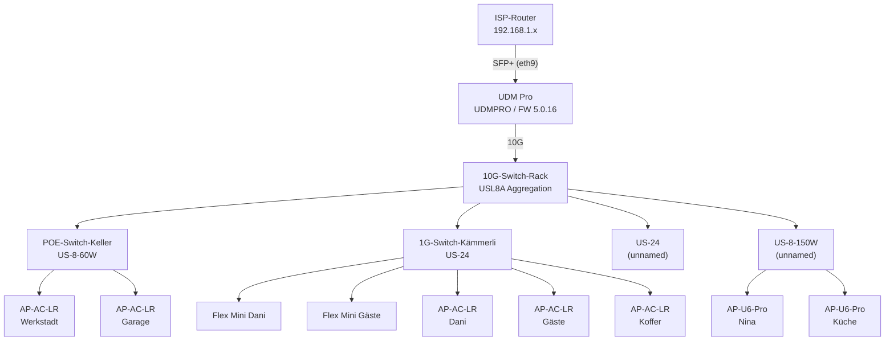
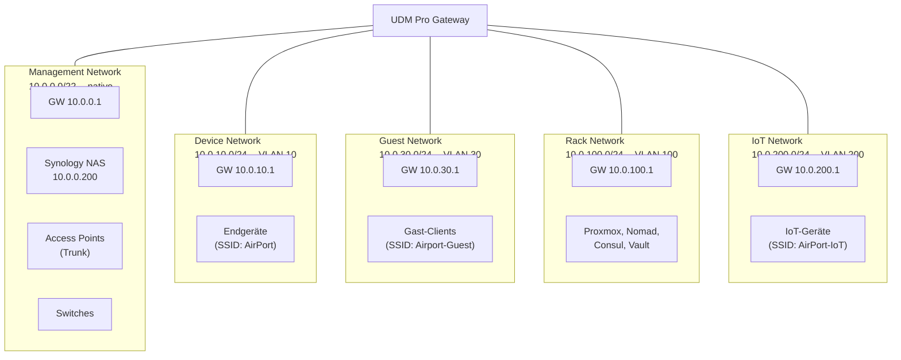

# UniFi

| Attribut | Wert |
|----------|------|
| Status | Produktion |
| URL | 10.0.0.1 (Controller Web-UI) |
| Deployment | UDM Pro integriert |

## Rolle im Stack

Das UniFi Dream Machine Pro ist das zentrale Gateway und verwaltet das gesamte Netzwerk -- Routing, Switching, WLAN und Firewall. Der Controller läuft integriert auf dem UDM Pro. Fünf VLAN-Segmente trennen Management, Endgeräte, Gäste, Rack-Infrastruktur und IoT voneinander.

## Architektur

### Physische Topologie

### Logische Topologie / VLANs

## Geräte

### Access Points

| Name | Modell | Standort | Firmware |
|------|--------|----------|----------|
| AP-AC-LR-Werkstadt | UAP-AC-LR | Werkstadt | 6.8.2 |
| AP-AC-LR-Dani | UAP-AC-LR | Dani | 6.8.2 |
| AP-AC-LR-Gaste | UAP-AC-LR | Gäste | 6.8.2 |
| AP-AC-LR-Koffer | UAP-AC-LR | Koffer | 6.8.2 |
| AP-AC-LR-Garage | UAP-AC-LR | Garage | 6.8.2 |
| AP-U6-PRO-Nina | UAP-U6-Pro | Nina | 6.8.2 |
| AP-U6-PRO-Kuche | UAP-U6-Pro | Küche | 6.8.2 |

### Switches

| Name | Modell | Standort | Firmware |
|------|--------|----------|----------|
| 10G-Switch-Rack | USL8A (Aggregation) | Rack | 7.2.123 |
| POE-Switch-Keller | US-8-60W | Keller | 7.2.123 |
| 1G-Switch-Kammerli | US-24 | Kämmerli | 7.2.123 |
| (unnamed) | US-24 | -- | 7.2.123 |
| (unnamed) | US-8-150W | -- | 7.2.123 |
| USW-Flex-Mini-Dani | Flex Mini | Dani | 2.1.6 |
| USW-Flex-Mini-Gaeste | Flex Mini | Gäste | 2.1.6 |

## Netzwerk-Segmente

| Segment | Subnetz | VLAN | Gateway | Zweck |
|---------|---------|------|---------|-------|
| Management | 10.0.0.0/22 | native | 10.0.0.1 | NAS, APs, Switches, Netzwerk-Infrastruktur |
| Device | 10.0.10.0/24 | 10 | 10.0.10.1 | Endgeräte (Laptops, Phones, Tablets) |
| Guest | 10.0.30.0/24 | 30 | 10.0.30.1 | Gast-WLAN, isoliert |
| Rack | 10.0.100.0/24 | 100 | 10.0.100.1 | Server-Infrastruktur (Proxmox, Nomad, Vault) |
| IoT | 10.0.200.0/24 | 200 | 10.0.200.1 | IoT-Geräte, eingeschränkter Zugriff |

::: info
Die kanonische Quelle für alle IP-Adressen ist die [Hosts und IPs](../_referenz/hosts-und-ips.md) Referenzseite. Die kanonische Quelle für Port-Forwards und Firewall-Regeln ist die [Ports und Dienste](../_referenz/ports-und-dienste.md) Referenzseite.
:::

## WAN-Anbindung

Der UDM Pro ist über den SFP+-Port (eth9) mit dem ISP-Router verbunden. Der RJ45-WAN-Port (eth8) ist nicht angeschlossen. Die öffentliche IP ist statisch.

::: warning Root-Disk fast voll
Die Root-Partition des UDM Pro ist zu 99% belegt (2.0 GB). Das kann zu Problemen bei Firmware-Updates und Logs führen.
:::

## Verwandte Seiten

- [Netzwerk](../netzwerk/) -- Gesamtübersicht Netzwerk-Topologie inkl. Thunderbolt und Tailscale
- [DNS](../dns/) -- Pi-hole, Unbound, Consul DNS
- [Traefik](../traefik/) -- Reverse Proxy (Port-Forwards zeigen auf Traefik VIP)
- [Hosts und IPs](../_referenz/hosts-und-ips.md) -- Vollständige IP-Zuordnung
- [Ports und Dienste](../_referenz/ports-und-dienste.md) -- Port-Forwards und Firewall-Regeln
- [NAS-Speicher](../nas-storage/) -- Synology NAS im Management-Netzwerk
