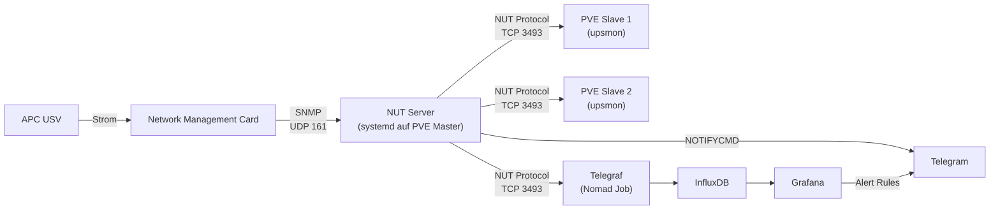
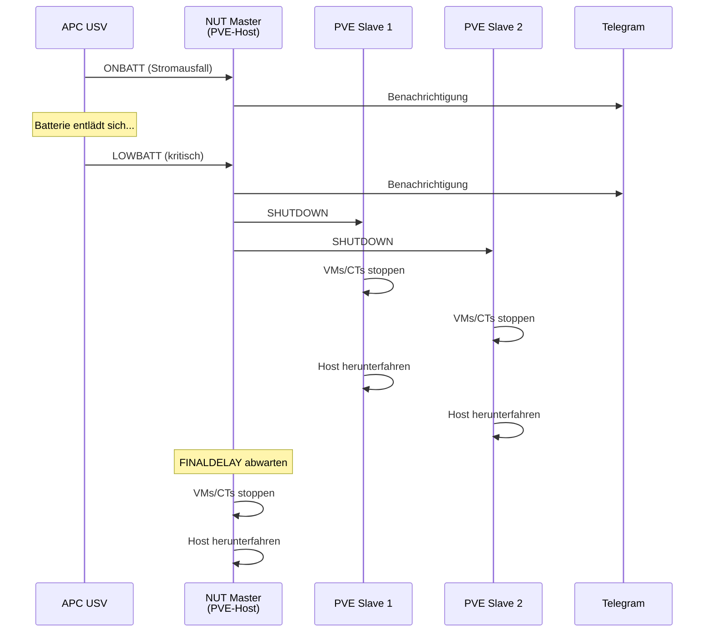

# USV (APC)

## Übersicht

| Attribut | Wert |
| :--- | :--- |
| **Status** | In Aufbau |
| **Dashboard** | [graf.ackermannprivat.ch](https://graf.ackermannprivat.ch) (UID: `ups-apc-dashboard`) |
| **Deployment** | NUT Server (systemd auf PVE-Host), Telegraf `inputs.upsd` (Nomad) |
| **Alerting** | Grafana Unified Alerting + direkte Telegram-Benachrichtigung via NUT |
| **Protokoll** | SNMP (NMC-Karte) |

## Rolle im Stack

Die APC USV versorgt das gesamte Homelab (Proxmox-Hosts, Netzwerk, NAS) bei Stromausfall mit Batteriestrom. NUT (Network UPS Tools) kommuniziert per SNMP mit der NMC-Karte der USV und koordiniert den geordneten Shutdown aller Hosts bei kritischem Batteriestand. Parallel sammelt Telegraf die USV-Metriken via NUT-Protokoll für das Grafana-Dashboard.

## Architektur

::: warning NUT muss auf dem PVE-Host laufen
NUT darf nicht als Nomad-Container betrieben werden. Bei einem Shutdown fährt Proxmox die Nomad-VMs herunter -- ein NUT-Container würde dabei sterben, bevor er die anderen Hosts benachrichtigen kann.
:::

## Shutdown-Ablauf

**Reihenfolge:** Slaves fahren zuerst herunter, der Master wartet (`FINALDELAY`) und fährt als Letzter herunter. Proxmox stoppt bei `shutdown -h` automatisch alle VMs und Container graceful.

## NUT-Konfiguration

NUT ist direkt auf den Proxmox-Hosts installiert (kein Container):

- **Master-Host:** `nut` + `nut-snmp` Pakete, Treiber `snmp-ups`, Mode `netserver`
- **Slave-Hosts:** `nut-client` Paket, Mode `netclient`
- **Konfigurationsdateien:** `/etc/nut/` auf den jeweiligen Hosts

Der NUT-Server kommuniziert per SNMP mit der APC NMC-Karte und stellt die USV-Daten auf Port 3493 (NUT-Protokoll) bereit.

::: info NMC-Treiber
Je nach NMC-Modell wird `snmp-ups` (ältere NMC) oder `netxml-ups` (neuere NMC AP9631/AP9641, HTTP/XML) verwendet.
:::

## Monitoring

### Telegraf

Der bestehende Telegraf Nomad Job sammelt USV-Metriken via `inputs.upsd`-Plugin direkt vom NUT-Server. Keine OID-Konfiguration nötig -- NUT normalisiert die SNMP-Werte.

**Measurements:**

- `upsd` -- Batterie-Ladung, Laufzeit, Last, Ein-/Ausgangsspannung, Temperatur, Status

### Grafana Dashboard

Das Dashboard `ups-apc-dashboard` zeigt:

**Status-Bar:** USV-Status, Batterie-Ladung (Gauge), Verbleibende Laufzeit, USV-Last (Gauge), Batterie-Zustand, Temperatur

**Verlauf:** Eingangsspannung, Ausgangsspannung, USV-Last, Batterie-Temperatur, Batterie-Ladung

## Alerting

Zweistufiges Alerting -- direkt via NUT (unabhängig von Nomad-Stack) und via Grafana:

### NUT-Alerts (direkt, via NOTIFYCMD)

Auf jedem Host sendet `/usr/local/bin/ups-notify.sh` Telegram-Nachrichten bei USV-Events. Funktioniert auch wenn der Nomad-Stack bereits heruntergefahren ist.

### Grafana Alert Rules

| Rule | Bedingung | For | Schwere |
| :--- | :--- | :--- | :--- |
| USV auf Batterie | Status enthält "OB" | sofort | Warning |
| Laufzeit < 10 min | battery_runtime < 600s | 1 min | Warning |
| Laufzeit < 5 min | battery_runtime < 300s | sofort | Critical |
| Batterie ersetzen | replace_indicator > 1 | 5 min | Warning |
| USV nicht erreichbar | keine Daten | 2 min | Critical |

::: tip Alerts auf Laufzeit, nicht Prozent
Alerts basieren auf der verbleibenden Laufzeit in Sekunden statt auf Batterie-Prozent. 20% einer degradierten Batterie können nur 30 Sekunden bedeuten.
:::

## Verwandte Seiten

- [Monitoring Stack](../monitoring/index.md) -- Grafana, Telegraf, InfluxDB, Alerting-Architektur
- [Synology NAS Monitoring](../synology-monitoring/index.md) -- Ähnliches Setup (SNMP via Telegraf)
- [Proxmox](../proxmox/index.md) -- Virtualisierungsplattform (Hosts, VMs)
