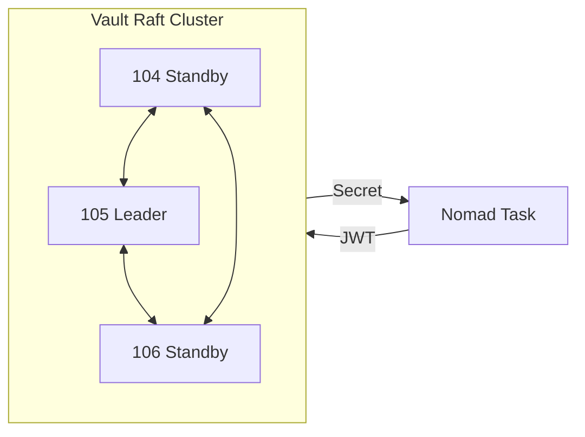
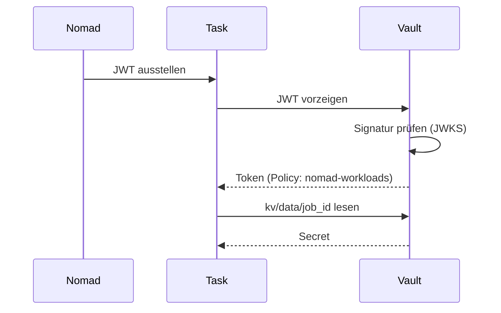

# Vault

## Übersicht

| Eigenschaft | Wert |
|-------------|------|
| Version | v1.18.3 |
| Cluster | 3-Node Raft (vm-nomad-server-04/05/06) |
| Storage | Integrated Storage (Raft) |
| Audit Log | `/opt/vault/audit/vault-audit.log` |
| IPs | Siehe [Proxmox Cluster](../proxmox/index.md#hashicorp-stack-vms) |

## Rolle im Stack

Vault ist das zentrale Secrets Management. Alle Passwörter, Tokens und API-Keys werden hier gespeichert und versioniert. Kein Service im Cluster speichert Secrets lokal -- alles kommt aus Vault. Nomad Jobs authentifizieren sich über Workload Identity (JWT) und erhalten Secrets zur Laufzeit, ohne dass statische Tokens in Job-Definitionen stehen.

::: danger Kritischer Service
Bei Vault-Ausfall können laufende Dienste keine Secrets mehr erneuern und neue Jobs nicht starten (Workload Identity schlägt fehl). Vault benötigt mindestens 2 von 3 Servern für Quorum.
:::

## Architektur

Vault läuft als 3-Node Raft Cluster. Jeder Server führt einen eigenen Vault-Prozess aus. Die Leader-Election erfolgt über das Raft-Konsensprotokoll: es gibt immer genau einen Leader, die anderen beiden sind Standby-Nodes.

Daten werden automatisch zwischen allen drei Nodes repliziert. Bei einem Schreibvorgang muss der Leader die Bestätigung von mindestens einem weiteren Node erhalten (Quorum), bevor der Vorgang als erfolgreich gilt.

## Designentscheide

| Entscheidung | Begründung |
|-------------|-------------|
| Integrated Storage (Raft) statt Consul-Backend | Weniger Abhängigkeiten: Vault verwaltet seinen eigenen Zustand |
| TLS deaktiviert | Homelab-Entscheidung: kein Expiry-Risiko |
| Auto-Unseal Service | Minimiert manuelle Eingriffe nach Neustarts oder Stromausfällen |
| KV v2 Secret Engine | Versionierung von Secrets, Soft-Delete möglich |

## Workload Identity

Nomad-Jobs authentifizieren sich bei Vault über JWT-basierte Workload Identity. Dadurch brauchen Jobs keine statischen Tokens -- die Identität ergibt sich aus dem Job selbst.

Jeder Task, der Vault-Secrets benötigt, braucht eine `vault {}` Stanza und einen `identity` Block mit `env = true` und `file = true`. Technische Details zu Auth Methods, JWKS URL und Policies: [Vault Referenz](referenz.md)

::: warning Pfad-Konvention
Secrets für einen Nomad-Job liegen immer unter `kv/<job_id>`. Der Job `postgres-linstor` liest also aus `kv/postgres`. Diese Konvention ist in der Policy festgelegt und darf nicht abgeändert werden.
:::

## Verwandte Seiten

- [Vault Referenz](referenz.md) -- Auth Methods, Policies, Secret-Pfade
- [Vault Betrieb](betrieb.md) -- Unseal, Secret-Verwaltung, Troubleshooting
- [Nomad](../nomad/) -- Workload Scheduler mit Vault-Integration
- [Consul](../consul/) -- Service Discovery im selben Cluster
