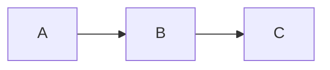

# Wiki-Richtlinien

Diese Seite definiert die Regeln für Inhalt, Struktur und Pflege dieses Wikis.

## Grundprinzip

Das Wiki erklärt das **Warum** und **Wie es zusammenhängt**. Das Git-Repository enthält das **Was** (Code, Config, Jobs).

## Inhalt

### Was ins Wiki gehört

- Architektur-Entscheidungen und deren Begründung
- Konzeptionelle Erklärungen (wie Komponenten zusammenspielen)
- Tabellen mit Übersichtsdaten (Hosts, IPs, Services, URLs)
- Mermaid-Diagramme für Architektur und Datenflüsse
- Runbooks mit knappen Schritt-Beschreibungen

### Was NICHT ins Wiki gehört

- **Keine Code-Blöcke** (HCL, YAML, JSON, TOML, INI) -- stattdessen Verweis auf die Repo-Datei
- **Keine CLI-Befehle** in Bash-Blöcken -- höchstens als Inline-Code (`befehl`) wenn unverzichtbar
- **Keine Konfigurationsdateien** -- "Verwaltet durch Ansible" oder "Siehe `pfad/zur/datei`"
- **Keine Installationsanleitungen** -- gehören ins Repo (README, Ansible Roles)

## Single Source of Truth (SSOT)

Jede Information existiert an genau **einem** Ort. Andere Stellen verlinken mit 1-2 Sätzen Kontext dorthin -- keine Kopien.

**Verlinkungsregel:** Von System-Seiten auf `_referenz/` verlinken, keine IPs/URLs/Ports duplizieren.

| Daten | Kanonische Quelle | Nicht duplizieren in |
|-------|-------------------|----------------------|
| Hosts, VMs, IPs | [Hosts und IPs](./_referenz/hosts-und-ips.md) | System-Seiten |
| Hardware-Specs | [Hardware-Inventar](./_referenz/hardware-inventar.md) | proxmox/, netzwerk/ |
| Service-URLs (Verzeichnis) | [Web-Interfaces](./_referenz/web-interfaces.md) | System-Seiten (eigene URL in Übersicht OK) |
| Ports und Protokolle | [Ports und Dienste](./_referenz/ports-und-dienste.md) | System-Seiten |
| Zugangsdaten (Speicherorte) | [Zugangsdaten](./_referenz/credentials.md) | System-Seiten |
| SSH-Zugang | [SSH-Zugang](./_referenz/ssh-zugang.md) | System-Seiten |
| Nomad Job-Verzeichnis | [Nomad Jobs](./_referenz/nomad-jobs.md) | System-Seiten (eigener Job-Pfad OK) |
| TLS-Zertifikate | [TLS-Zertifikate](./_referenz/tls-zertifikate.md) | System-Seiten |
| Datenbank-Zuordnung | [Datenbanken](./_referenz/datenbanken.md) | System-Seiten |
| Middleware Chains | [Traefik Referenz](./traefik/referenz.md) | System-Seiten |
| DNS-Architektur | [DNS](./dns/) | netzwerk/ |
| Backup-Architektur | [Backup](./backup/) | System-Seiten |
| LDAP & Benutzerverwaltung | [OpenLDAP](./ldap/) | security/, System-Seiten |
| CrowdSec | [CrowdSec](./crowdsec/) | security/, traefik/ |
| Service-Abhängigkeiten | [Service-Abhängigkeiten](./_querschnitt/service-abhaengigkeiten.md) | System-Seiten |
| NFS-Exports, Mount-Pfade | [NAS-Speicher](./nas-storage/) | System-Seiten |

::: tip SSOT-Regel anwenden
Wenn du eine Information schreibst, prüfe: Steht sie schon anderswo? Falls ja, verlinke statt kopieren. Beispiel: Statt die Middleware-Chain-Tabelle in einer System-Seite zu wiederholen, schreibe "Authentifizierung über `admin-chain-v2@file` (Details: [Traefik Referenz](./traefik/referenz.md))".
:::

## Struktur

### Verzeichnisse

```
docs/
  _referenz/        -- Zentrale Nachschlagetabellen (SSOT)
  _querschnitt/     -- Systemübergreifende Anleitungen
  <system>/         -- Ein Ordner pro System (flach, nicht verschachtelt)
  index.md          -- Startseite
  wiki-richtlinien.md
```

Jedes System hat einen eigenen Ordner direkt unter `docs/`. Keine Verschachtelung in Kategorien wie `services/` oder `platforms/` -- die Struktur ist flach.

### 3-Datei-Muster

Jedes System folgt einem einheitlichen Muster aus bis zu drei Dateien:

| Datei | Inhalt |
|-------|--------|
| `index.md` | Architektur, Konzept, Rolle im Stack |
| `referenz.md` | Technische Details, Konfigurationstabellen |
| `betrieb.md` | Betriebsanleitungen, Troubleshooting |

Nicht jedes System braucht alle drei Dateien. Einfache Systeme kommen mit `index.md` allein aus.

### Spezialordner

| Ordner | Zweck |
|--------|-------|
| `_referenz/` | Zentrale Nachschlagetabellen (IP-Adressen, Ports, Credentials, Hardware) |
| `_querschnitt/` | Systemübergreifende Anleitungen (Service-Abhängigkeiten, Cluster Bootstrap) |

### Dateinamen

- Kleinbuchstaben mit Bindestrichen: `nas-storage`, `tls-zertifikate.md`
- Keine Leerzeichen, keine Umlaute im Dateinamen
- Index-Dateien heissen immer `index.md`

## Frontmatter

Jede Markdown-Datei beginnt mit einem YAML-Frontmatter-Block:

```yaml
---
title: Seitentitel auf Deutsch
description: Kurze Beschreibung des Inhalts
tags:
  - relevantes-tag
  - weiteres-tag
---
```

- `title` und `description` sind Pflichtfelder
- `tags` als YAML-Liste (nicht als kommaseparierter String)
- Tags in Kleinbuchstaben, Bindestrich als Trenner

## Seitenstruktur

### Übersicht-Tabelle

Jede System-Seite (`index.md`) beginnt nach dem H1-Titel mit einer Übersicht-Tabelle:

| Attribut | Wert |
|----------|------|
| Status | Produktion / Planung / Veraltet |
| URL | service.ackermannprivat.ch |
| Deployment | Nomad Job / Systemd / VM |
| Storage | NFS / Linstor CSI / Lokal |
| Auth | Middleware Chain Name |

Nicht alle Felder sind für jedes System relevant. Nur zutreffende Attribute aufführen.

### Aufbau einer Inhaltsseite

1. **Frontmatter** (title, description, tags)
2. **H1 Titel** (identisch mit Frontmatter title)
3. **Übersicht-Tabelle** (Status, URL, Deployment, Storage, Auth)
4. **Rolle im Stack** -- 1-3 Sätze, wie der Service ins Gesamtbild passt
5. **Architektur** -- Mermaid-Diagramm (wenn sinnvoll)
6. **Service-spezifische Sektionen** -- keine SSOT-Duplikate
7. **Verwandte Seiten** (Pflicht) -- Aufzählungsliste mit Links am Ende

### Verwandte Seiten

Jede Inhaltsseite endet mit einer `## Verwandte Seiten` Sektion. Aufzählungsliste mit relativen Links und Kurzbeschreibung nach `--`:

```markdown
## Verwandte Seiten

- [Traefik Referenz](../traefik/referenz.md) -- Middleware Chains für Authentifizierung
- [OpenLDAP](../ldap/) -- Zentrales Benutzerverzeichnis
```

### Titel

- **Sprache:** Deutsch
- **Gross-/Kleinschreibung:** Wie im normalen Satz (kein Title Case)
- **Schweizer Rechtschreibung:** Kein Eszett, immer `ss`

## Formatierung

### Custom Containers

VitePress unterstützt folgende Container-Typen. Sparsam einsetzen -- maximal 3-4 Container pro Seite.

| Typ | Verwendung | Titel |
|-----|------------|-------|
| `::: danger` | Destruktive Operationen, Datenverlust-Gefahr | Pflicht |
| `::: warning` | Gotchas, häufige Fehler, Fallstricke | Pflicht |
| `::: info` | SSOT-Klärungen, Kontext, Erklärungen | Optional |
| `::: tip` | Best Practices, Empfehlungen | Optional |
| `::: details` | Optionale Vertiefungen (klappbar) | Pflicht |

Beispiele für den korrekten Einsatz:

```markdown
::: danger Vault Unseal nach Restart
Nach einem Neustart des Vault-Clusters muss manuell unsealt werden.
Ohne Unseal sind alle Secrets unzugänglich -- auch für Nomad Jobs.
:::
```

```markdown
::: warning Port-Konflikt mit Consul
Der Default-Port 8500 wird bereits von Consul belegt.
Diesen Service auf einem alternativen Port konfigurieren.
:::
```

```markdown
::: info
Die kanonische Quelle für alle IP-Adressen ist die
[Hosts und IPs](./_referenz/hosts-und-ips.md) Referenzseite.
:::
```

```markdown
::: tip
Workload Identity statt statischer Vault-Tokens verwenden.
Details in der [Vault Referenz](./vault/referenz.md).
:::
```

```markdown
::: details Technischer Hintergrund: Raft Consensus
Vault, Consul und Nomad verwenden alle das Raft-Protokoll
für Leader Election und Log-Replikation im Cluster.
:::
```

::: info Hinweis zur Container-Syntax
Die Admonition-Syntax von MkDocs (`!!! note`) wird **nicht** verwendet. Stattdessen immer die VitePress-Syntax (`::: info`, `::: warning`, `::: danger`, `::: details`) einsetzen.
:::

### Diagramme

Mermaid-Diagramme sind unterstützt für Workflows und Architektur:

````markdown

````

## Verlinkung

- Relative Pfade verwenden: `[Text](../traefik/referenz.md)`
- Bei Verweisen auf spezifische Abschnitte: `[Text](datei.md#abschnitt)`
- Lieber einmal verlinken als Inhalte duplizieren
- Jede Seite hat einen "Seite bearbeiten" Link zu GitHub

## Dynamische Daten vermeiden

Informationen, die sich häufig ändern, gehören **nicht** ins Wiki. Stattdessen auf die Live-Quelle verweisen:

| Statt | Besser |
|-------|--------|
| VM-Status-Listen | Auf Proxmox UI verweisen |
| Consul-Service-Listen | Auf Consul UI verweisen |
| Software-Versionsnummern | Veralten sofort -- weglassen oder auf CLI/UI verweisen |
| Listen laufender Container | Ändern sich täglich -- auf Nomad UI verweisen |

**Ausnahmen:** Architektur-relevante Zahlen (z.B. "3 Server im Raft-Cluster") und SSOT-Referenzseiten (Hosts und IPs, Hardware-Inventar) dürfen konkrete Werte enthalten, müssen aber aktiv gepflegt werden.

## Pflege

- **Veraltete Seiten markieren:** Mit `::: warning Veraltet` kennzeichnen, nicht stillschweigend stehen lassen
- **Tote Links prüfen:** `npm run build` meldet tote Links -- regelmässig ausführen
- **Referenzseiten aktuell halten:** `_referenz/`-Seiten regelmässig auf Aktualität prüfen
- **SSOT einhalten:** Keine Information an zwei Stellen pflegen; immer auf die kanonische Quelle verlinken
- **Änderungen sofort dokumentieren:** Wenn sich die Infrastruktur ändert, Wiki aktualisieren
