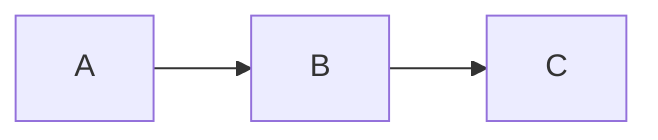

# Wiki-Richtlinien

Diese Seite definiert die Regeln für Inhalt, Struktur und Pflege dieses Wikis.

## Grundprinzip

Das Wiki erklärt das **Warum** und **Wie es zusammenhängt**. Das Git-Repository enthält das **Was** (Code, Config, Jobs).

## Inhalt

### Was ins Wiki gehört

- Architektur-Entscheidungen und deren Begründung
- Konzeptionelle Erklärungen (wie Komponenten zusammenspielen)
- Tabellen mit Übersichtsdaten (Hosts, IPs, Services, URLs)
- Mermaid-Diagramme für Architektur und Datenflüsse
- Runbooks mit knappen Schritt-Beschreibungen

### Was NICHT ins Wiki gehört

- **Keine Code-Blöcke** (HCL, YAML, JSON, TOML, INI) -- stattdessen Verweis auf die Repo-Datei
- **Keine CLI-Befehle** in Bash-Blöcken -- höchstens als Inline-Code (`befehl`) wenn unverzichtbar
- **Keine Konfigurationsdateien** -- "Verwaltet durch Ansible" oder "Siehe `pfad/zur/datei`"
- **Keine Installationsanleitungen** -- gehören ins Repo (README, Ansible Roles)

## Single Source of Truth (SSOT)

Information steht genau **einmal** im Wiki. Andere Seiten verlinken mit 1-2 Sätzen Kontext dorthin -- keine Kopien.

| Daten | Kanonische Quelle | Nicht duplizieren in |
|-------|-------------------|----------------------|
| Hosts, VMs, IPs, Specs | [Proxmox Cluster](./infrastructure/proxmox-cluster.md) | overview.md, network-topology.md, dns-architecture.md |
| Hardware-Specs (CPU, RAM, Disk) | [Server-Hardware](./infrastructure/hardware.md) | proxmox-cluster.md, overview.md |
| NFS-Exports, Mount-Pfade | [NAS-Speicher](./infrastructure/storage-nas.md) | jellyfin.md, arr-stack.md, Service-Seiten |
| Service-Verzeichnis (URLs) | [Infrastruktur-Übersicht](./architecture/overview.md) | Service-Seiten (nur eigene URL in Übersicht-Tabelle) |
| Middleware Chains | [Traefik Middlewares](./platforms/traefik-middlewares.md) | security.md, traefik.md, Service-Seiten |
| DNS-Architektur | [DNS-Architektur](./platforms/dns-architecture.md) | overview.md, network-topology.md |
| Netzwerk-Topologie (VLANs, Subnets) | [Netzwerk-Topologie](./architecture/network-topology.md) | overview.md, proxmox-cluster.md |
| Datenbank-Zuordnung pro Service | [Datenbank-Architektur](./architecture/database-architecture.md) | Service-Seiten (nur "PostgreSQL (Shared Cluster)" in Übersicht-Tabelle) |
| Vault Secret Pfade (DB) | [Datenbank-Architektur](./architecture/database-architecture.md) | Service-Seiten (nur service-spezifische Secrets) |
| Nomad Job-Verzeichnis | [Nomad Architektur](./platforms/nomad-architecture.md) | Service-Seiten (nur eigener Job-Pfad) |
| Service-Abhängigkeiten | [Service-Abhängigkeiten](./architecture/service-dependencies.md) | overview.md, Service-Seiten |
| CrowdSec | [CrowdSec](./platforms/crowdsec.md) | security.md, traefik-middlewares.md |
| Backup-Architektur | [Backup-Strategie](./services/core/backup-strategy.md) | pbs.md, Service-Seiten |
| LDAP & Benutzerverwaltung | [OpenLDAP](./services/core/ldap.md) | security.md, Service-Seiten |

::: tip SSOT-Regel anwenden
Wenn du eine Information schreibst, prüfe: Steht sie schon anderswo? Falls ja, verlinke statt kopieren. Beispiel: Statt die Middleware-Chain-Tabelle in `security.md` zu wiederholen, schreibe "Authentifizierung über `admin-chain-v2@file` (Details: [Traefik Middlewares](./platforms/traefik-middlewares.md))".
:::

## Struktur

### Verzeichnisse

| Ordner | Inhalt |
|--------|--------|
| architecture/ | Gesamtübersicht, Datenstrategie |
| infrastructure/ | Proxmox, Storage, Netzwerk-Hardware |
| platforms/ | HashiCorp Stack, Traefik, Linstor, Security |
| services/ | Einzelne Services (core, media, monitoring, productivity, iot) |
| runbooks/ | Betriebsanleitungen für Wartung und Notfälle |

### Dateinamen

- Kleinbuchstaben mit Bindestrichen: `proxmox-cluster.md`, `backup-strategy.md`
- Keine Leerzeichen, keine Umlaute im Dateinamen

### Frontmatter (Pflichtfelder)

Jede Seite beginnt mit YAML-Frontmatter. Alle drei Felder sind Pflicht:

- **`title`** (Pflicht) -- Seitentitel auf Deutsch
- **`description`** (Pflicht) -- Kurze Beschreibung für Suche und SEO
- **`tags`** (Pflicht) -- YAML-Liste relevanter Tags
- **`order`** (nur Index-Seiten) -- Sortierreihenfolge in der Sidebar

```yaml
---
title: Seitentitel auf Deutsch
description: Kurze Beschreibung des Inhalts
tags:
  - relevantes-tag
  - weiteres-tag
---
```

### Seitenstruktur (Inhaltsseiten)

Jede Inhaltsseite (nicht Index) folgt diesem Aufbau:

1. **Frontmatter** (title, description, tags)
2. **H1 Titel** (identisch mit Frontmatter title)
3. **Übersicht** -- Attribut-Tabelle (Status, URL, Deployment, Storage, DB, Auth)
4. **Rolle im Stack** -- 1-3 Sätze, wie der Service ins Gesamtbild passt
5. **Architektur** -- Mermaid-Diagramm (wenn sinnvoll)
6. **Konfiguration / Service-spezifische Sektionen** -- keine SSOT-Duplikate
7. **Verwandte Seiten** (Pflicht) -- Aufzählungsliste mit Links am Ende

### Verwandte Seiten (Pflicht)

Jede Inhaltsseite endet mit einer `## Verwandte Seiten` Sektion. Aufzählungsliste mit relativen Links und Kurzbeschreibung nach `--`:

```markdown
## Verwandte Seiten

- [Traefik Middlewares](../platforms/traefik-middlewares.md) -- Middleware Chains für Authentifizierung
- [OpenLDAP](../services/core/ldap.md) -- Zentrales Benutzerverzeichnis
```

### Titel

- **Sprache:** Deutsch
- **Gross-/Kleinschreibung:** Wie im normalen Satz (kein Title Case)
- **Kein "ss" statt "ss":** Schweizer Rechtschreibung (kein Eszett)

## Formatierung

### Custom Containers

VitePress unterstützt folgende Container-Typen. Sparsam einsetzen -- maximal 3-4 Container pro Seite.

| Typ | Verwendung |
|-----|------------|
| `::: danger` | Sicherheitsrisiken, Datenverlust-Gefahr |
| `::: warning` | Häufige Fehler, Fallstricke |
| `::: info` | Kontextinformationen, Erklärungen |
| `::: tip` | Best Practices, Empfehlungen |
| `::: details` | Optionale Vertiefungen (klappbar) |

```markdown
::: warning Titel
Warnungstext
:::
```

### Diagramme

Mermaid-Diagramme sind unterstützt für Workflows und Architektur:

````markdown

````

## Verlinkung

- Relative Pfade verwenden: `[Text](../infrastructure/proxmox-cluster.md)`
- Bei Verweisen auf spezifische Abschnitte: `[Text](datei.md#abschnitt)`
- Lieber einmal verlinken als Inhalte duplizieren
- Jede Seite hat einen "Seite bearbeiten" Link zu GitHub
