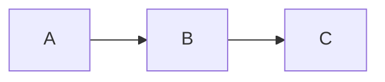

# Wiki-Richtlinien

Diese Seite definiert die Regeln fuer Inhalt, Struktur und Pflege dieses Wikis.

## Grundprinzip

Das Wiki erklaert das **Warum** und **Wie es zusammenhaengt**. Das Git-Repository enthaelt das **Was** (Code, Config, Jobs).

## Inhalt

### Was ins Wiki gehoert

- Architektur-Entscheidungen und deren Begruendung
- Konzeptionelle Erklaerungen (wie Komponenten zusammenspielen)
- Tabellen mit Uebersichtsdaten (Hosts, IPs, Services, URLs)
- Mermaid-Diagramme fuer Architektur und Datenfluesse
- Runbooks mit knappen Schritt-Beschreibungen

### Was NICHT ins Wiki gehoert

- **Keine Code-Bloecke** (HCL, YAML, JSON, TOML, INI) -- stattdessen Verweis auf die Repo-Datei
- **Keine CLI-Befehle** in Bash-Bloecken -- hoechstens als Inline-Code (`befehl`) wenn unverzichtbar
- **Keine Konfigurationsdateien** -- "Verwaltet durch Ansible" oder "Siehe `pfad/zur/datei`"
- **Keine Installationsanleitungen** -- gehoeren ins Repo (README, Ansible Roles)

## Single Source of Truth

Jede Information existiert an genau **einem** Ort. Andere Seiten verlinken dorthin.

| Daten | Kanonische Quelle |
|-------|-------------------|
| Hosts, VMs, IPs, Specs | [Proxmox Cluster](./infrastructure/proxmox-cluster.md) |
| NFS-Exports, Mount-Pfade | [NAS-Speicher](./infrastructure/storage-nas.md) |
| Service-Verzeichnis (URLs) | [Infrastruktur-Uebersicht](./architecture/overview.md) |
| Middleware Chains | [Traefik Middlewares](./platforms/traefik-middlewares.md) |
| DNS-Architektur | [DNS-Architektur](./platforms/dns-architecture.md) |
| CrowdSec | [CrowdSec](./platforms/crowdsec.md) |
| Backup-Architektur | [Backup-Strategie](./services/core/backup-strategy.md) |
| LDAP & Benutzerverwaltung | [OpenLDAP](./services/core/ldap.md) |

## Struktur

### Verzeichnisse

| Ordner | Inhalt |
|--------|--------|
| architecture/ | Gesamtuebersicht, Datenstrategie |
| infrastructure/ | Proxmox, Storage, Netzwerk-Hardware |
| platforms/ | HashiCorp Stack, Traefik, Linstor, Security |
| services/ | Einzelne Services (core, media, monitoring, productivity, iot) |
| runbooks/ | Betriebsanleitungen fuer Wartung und Notfaelle |

### Dateinamen

- Kleinbuchstaben mit Bindestrichen: `proxmox-cluster.md`, `backup-strategy.md`
- Keine Leerzeichen, keine Umlaute im Dateinamen

### Frontmatter

Jede Seite beginnt mit YAML-Frontmatter:

```yaml
---
title: Seitentitel auf Deutsch
description: Kurze Beschreibung
tags:
  - relevantes-tag
---
```

### Titel

- **Sprache:** Deutsch
- **Gross-/Kleinschreibung:** Wie im normalen Satz (kein Title Case)
- **Kein "ss" statt "ss":** Schweizer Rechtschreibung (kein Eszett)

## Formatierung

### Custom Containers

VitePress unterstuetzt folgende Container-Typen:

```markdown
::: info Titel
Informationshinweis
:::

::: warning Titel
Warnung (haeufige Fehler)
:::

::: danger Titel
Sicherheitsrisiken
:::

::: tip Titel
Best Practices
:::

::: details Titel
Optionale Vertiefungen (klappbar)
:::
```

### Diagramme

Mermaid-Diagramme sind unterstuetzt fuer Workflows und Architektur:

````markdown

````

## Verlinkung

- Relative Pfade verwenden: `[Text](../infrastructure/proxmox-cluster.md)`
- Bei Verweisen auf spezifische Abschnitte: `[Text](datei.md#abschnitt)`
- Lieber einmal verlinken als Inhalte duplizieren
- Jede Seite hat einen "Seite bearbeiten" Link zu GitHub
