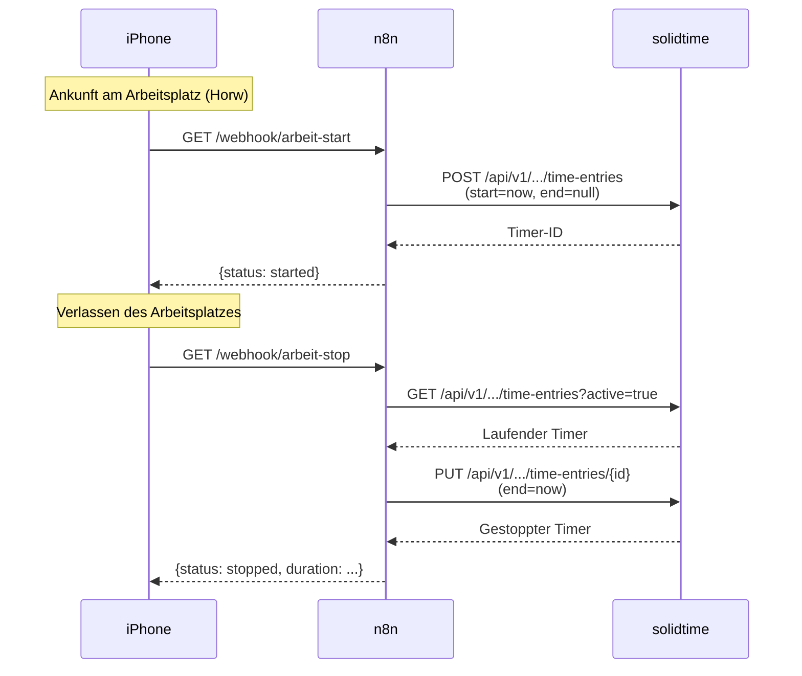
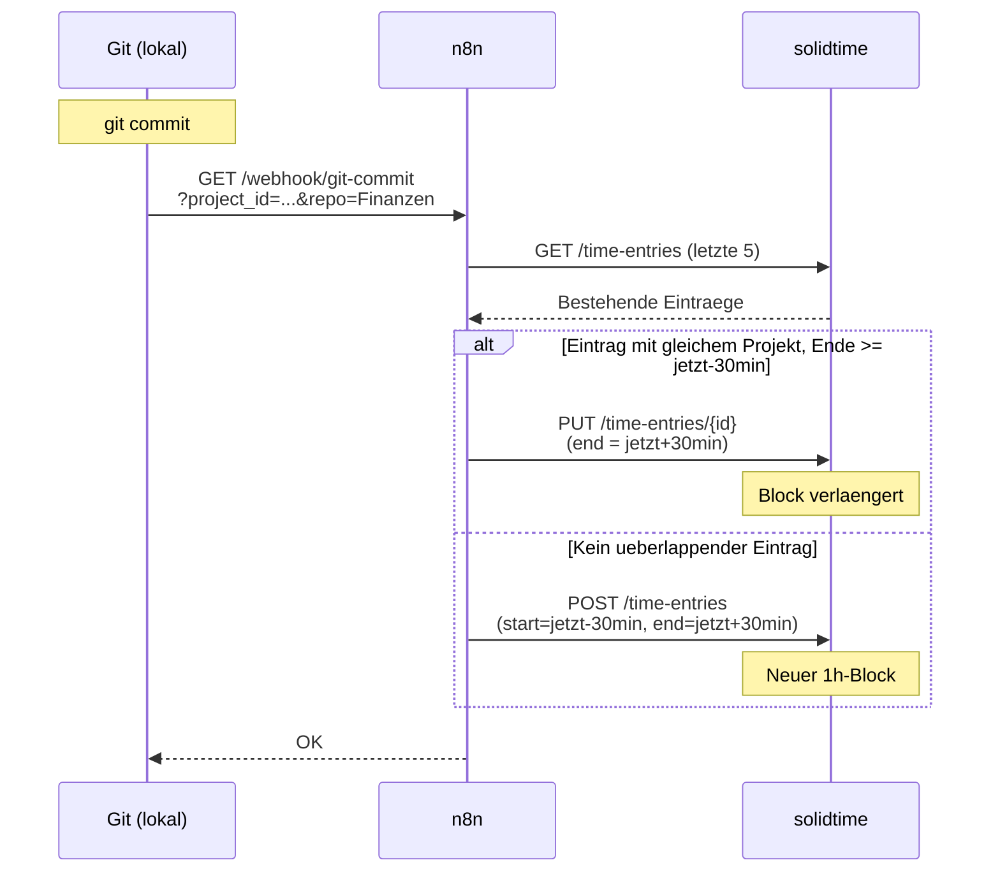

# Zeiterfassung

## Übersicht

Selbstgehostete Zeiterfassung als Ersatz für Toggl Track. Zwei Tools parallel im Einsatz, solidtime als Haupttool.

| Attribut | solidtime | Kimai |
| :--- | :--- | :--- |
| **Status** | Produktion (Haupttool) | Produktion (Backup) |
| **URL** | [time.ackermannprivat.ch](https://time.ackermannprivat.ch) | [kimai.ackermannprivat.ch](https://kimai.ackermannprivat.ch) |
| **Deployment** | Nomad Job (`services/solidtime.nomad`) | Nomad Job (`services/kimai.nomad`) |
| **Datenbank** | PostgreSQL `solidtime` (Shared Cluster) | MariaDB 11 (Sidecar-Container) |
| **Storage** | Redis Sidecar (ephemeral, Cache + Sessions) | Linstor CSI (`kimai-data`) fuer MariaDB, NFS fuer data/plugins |
| **Mobile** | PWA (Homescreen) | Native App (iOS/Android, kostenpflichtig) |
| **Auth** | OAuth2 via Keycloak (`admin-chain-v2`) | OAuth2 via Keycloak (`admin-chain-v2`) |
| **API** | Bearer Token (Passport JWT) | API-Key (`X-AUTH-TOKEN`) |

## Architektur

```mermaid
flowchart LR
    subgraph iPhone["iPhone"]
        PWA:::entry["solidtime PWA"]
        SC1:::entry["iOS Shortcut<br>Ankunft Horw"]
        SC2:::entry["iOS Shortcut<br>Verlassen Horw"]
    end

    subgraph Traefik["Traefik (10.0.2.20)"]
        R1:::svc["Router: time.*<br>admin-chain-v2"]
        R2:::svc["Router: time.*/api<br>kein OAuth"]
        R3:::svc["Router: n8n.*/webhook<br>kein OAuth"]
    end

    subgraph Nomad["Nomad Cluster"]
        ST:::svc["solidtime<br>(app, scheduler,<br>worker, gotenberg)"]
        KI:::svc["Kimai<br>(kimai + mariadb)"]
        N8N:::svc["n8n"]
        PG:::db["PostgreSQL 16"]
    end

    PWA -->|HTTPS| R1
    SC1 -->|GET /webhook/arbeit-start| R3
    SC2 -->|GET /webhook/arbeit-stop| R3
    R1 -->|OAuth2| ST
    R2 --> ST
    R3 --> N8N
    N8N -->|API: Timer Start/Stop| R2
    ST --> PG
    KI -.->|MariaDB Sidecar| KI

    classDef db fill:#eff6ff,stroke:#3b82f6,stroke-width:1.5px,color:#1e293b
    classDef svc fill:#ecfdf5,stroke:#10b981,stroke-width:1.5px,color:#1e293b
    classDef entry fill:#fefce8,stroke:#eab308,stroke-width:1.5px,color:#1e293b
```

## Geofence-Automation

Automatisches Starten und Stoppen des solidtime-Timers basierend auf dem Standort (Geofencing via iOS).

### Ablauf



### Einrichtung iOS

1. **Kurzbefehle-App** auf dem iPhone oeffnen
2. **Automation** erstellen: "Wenn ich ankomme" → Standort Horw
3. **Aktion:** "URL abrufen" → `https://n8n.ackermannprivat.ch/webhook/arbeit-start`
4. Zweite Automation: "Wenn ich verlasse" → gleicher Standort
5. **Aktion:** "URL abrufen" → `https://n8n.ackermannprivat.ch/webhook/arbeit-stop`
6. "Sofort ausfuehren" aktivieren (ohne Bestaetigung)

### n8n Workflows

Zwei Workflows in n8n importieren (Dateien im Repo unter `configs/n8n/`):

- `workflow-arbeit-start.json` -- Webhook empfaengt GET-Request, startet solidtime-Timer
- `workflow-arbeit-stop.json` -- Webhook empfaengt GET-Request, findet aktiven Timer, stoppt ihn

::: warning Credential einrichten
In n8n muss ein **HTTP Header Auth Credential** namens "solidtime API" erstellt werden:
- Header Name: `Authorization`
- Header Value: `Bearer <solidtime-api-token>`
:::

## Git-Commit Tracking

Automatische Zeiterfassung fuer private Repos basierend auf Git-Commits. Jeder Commit erzeugt einen 1h-Zeitblock (30 Min vor, 30 Min nach). Ueberlappende Bloecke desselben Projekts werden zusammengefasst.

### Konfigurierte Repos

| Repo | Pfad | solidtime Projekt | Client |
| :--- | :--- | :--- | :--- |
| Finanzen | `/Users/Shared/git/gitea/finanzen/` | Finanzen | Privat |
| Tieffurt | `/Users/Shared/git/gitea/tieffurt/` | Tieffurt | Privat |
| Immo-Monitor | `/Users/Shared/git/github/PRIVAT/immo-monitor/` | Immo-Monitor | Privat |

### Ablauf



### Technische Details

- **Mechanismus:** Git `post-commit` Hook in `.git/hooks/post-commit`
- **Hook-Inhalt:** `curl -s "https://n8n.ackermannprivat.ch/webhook/git-commit?project_id=...&repo=..." &`
- **Zusammenfassung:** Commits innerhalb von 30 Min nach dem Ende des letzten Blocks verlaengern diesen, statt einen neuen zu erstellen
- **Projekttrennung:** Nur Bloecke des gleichen Projekts werden zusammengefasst -- paralleles Arbeiten an Finanzen und Tieffurt erzeugt separate Eintraege

::: tip Neues Repo hinzufuegen
1. solidtime: Neues Projekt unter Client "Privat" erstellen, Projekt-ID notieren
2. Git Hook: `.git/hooks/post-commit` mit der Projekt-ID erstellen (siehe bestehende Hooks als Vorlage)
3. Traefik: Kein Anpassung noetig (`/webhook/git-commit` ist bereits freigeschaltet)
:::

## API-Zugriff

Beide Tools haben dedizierte Traefik-Router fuer API-Pfade ohne OAuth2-Middleware. Die Apps authentifizieren selbst.

| Tool | API-Pfad | Auth-Methode |
| :--- | :--- | :--- |
| solidtime | `time.ackermannprivat.ch/api/*` | Bearer Token (JWT) |
| Kimai | `kimai.ackermannprivat.ch/api/*` | `Authorization: Bearer <api-key>` |
| n8n Webhooks | `n8n.ackermannprivat.ch/webhook/{arbeit-start,arbeit-stop,git-commit}` | Kein Auth (nur explizite Pfade) |

::: danger Sicherheitskonzept n8n Webhooks
n8n Webhooks haben **keine eigene Authentifizierung**. Die Sicherheit basiert auf zwei Ebenen:

1. **Traefik-Whitelist:** Nur explizit freigegebene Pfade sind extern erreichbar (`/webhook/arbeit-start`, `/webhook/arbeit-stop`, `/webhook/git-commit` und deren `-test` Varianten). Alle anderen Webhooks und die n8n-UI bleiben hinter `intern-chain@file` (IP-Whitelist).
2. **Obscurity:** Die Webhook-URLs sind nicht erratbar, aber auch kein echtes Secret.

Neue Webhooks muessen explizit in der Traefik-Rule im Nomad Job (`services/n8n.nomad`) freigeschaltet werden.
:::

## Vault Secrets

| Pfad | Keys |
| :--- | :--- |
| `kv/data/solidtime` | `postgres_password`, `app_key`, `passport_private_key`, `passport_public_key` |
| `kv/data/kimai` | `mariadb_password`, `app_secret`, `admin_password` |

## solidtime Plugins

Keine Plugins installiert. GPS-Tracking ist nicht verfuegbar (weder nativ noch via Plugin).

## Kimai Plugins

| Plugin | Version | Beschreibung |
| :--- | :--- | :--- |
| KimaiMobileGPSInfoBundle | 1.1.0 | GPS-Standort-Aufzeichnung fuer Kimai Mobile App (nur Android) |

## Entscheidungslog

- **2026-03-18:** solidtime und Kimai deployed zum Vergleich. solidtime als Haupttool gewaehlt wegen moderner UI, PWA, und Toggl-Aehnlichkeit. Kimai bleibt als Backup.
- **2026-03-18:** Kimai Docker-Image unterstuetzt nur MySQL/MariaDB im Startup-Script. PostgreSQL ging nicht out-of-the-box, darum MariaDB-Sidecar statt Shared PostgreSQL Cluster.
- **2026-03-18:** Geofence-Automation via n8n Webhooks + iOS Shortcuts implementiert, da solidtime und Kimai kein natives iOS-Geofencing bieten.
- **2026-03-18:** Git-Commit Tracking fuer Finanzen und Tieffurt Repos. Ansatz: 1h-Bloecke pro Commit mit automatischer Zusammenfassung bei Ueberlappung. Bewusst einfach gehalten statt Editor-Plugin (Wakapi), da Commit-basiert ausreichend genau.
- **2026-03-20:** solidtime Storage von NFS auf Redis Sidecar (ephemeral) migriert -- kein persistenter Storage mehr noetig, Cache und Sessions laufen ueber Redis. Kimai MariaDB von NFS auf Linstor CSI (`kimai-data`) migriert fuer bessere Performance; NFS bleibt nur noch fuer data/plugins.
